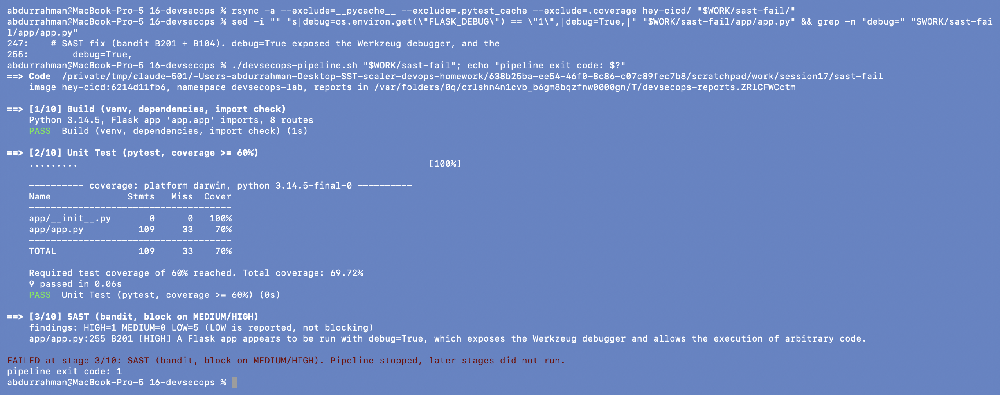
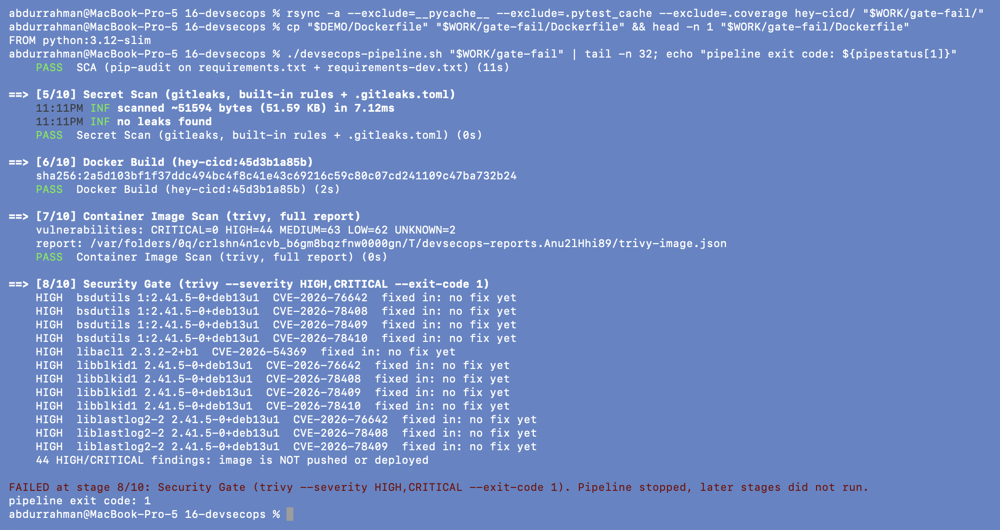
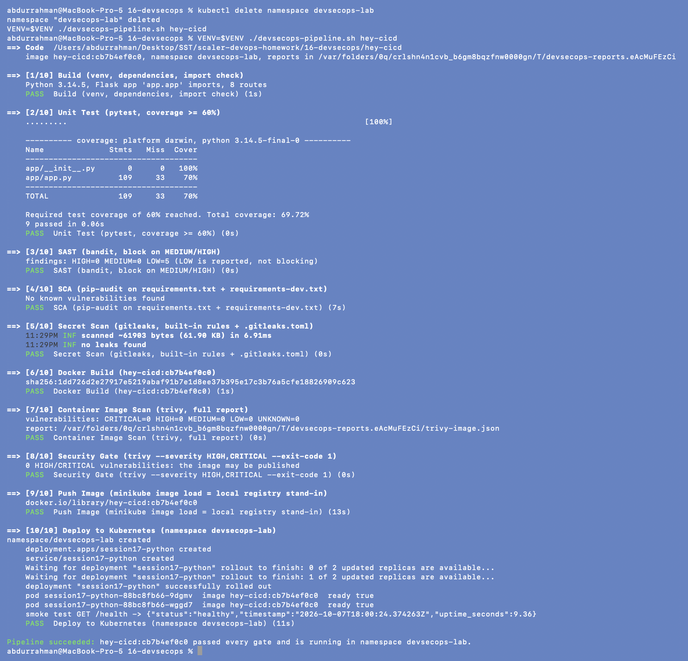

# 8. The Whole Pipeline, Locally: `devsecops-pipeline.sh`

**Name:** Abdur Rahman Ibne Munir
**Enrollment number:** 24BCS10244

Sections 1 to 7 ran each stage by hand. [`../devsecops-pipeline.sh`](../devsecops-pipeline.sh)
chains them in the homework's order and stops at the first stage that fails, the same
way `needs:` chains the GitHub Actions jobs. It is the local proof that the whole flow
works end to end, including the deploy that GitHub's runners can't do against my
laptop's cluster.

```text
Code → Build → Unit Test → SAST → SCA → Secret Scan → Docker Build
     → Container Image Scan → Security Gate → Push Image → Deploy to Kubernetes
```

| # | Stage | Command (inside the script) | Fails the pipeline when |
|---|---|---|---|
| 1 | Build | venv + `pip install -r requirements-dev.txt`, import the Flask app | install or import error |
| 2 | Unit Test | `pytest --cov=app --cov-fail-under=60` | any test fails, coverage < 60% |
| 3 | SAST | `bandit -r app --severity-level medium` | any MEDIUM/HIGH finding |
| 4 | SCA | `pip-audit -r requirements.txt -r requirements-dev.txt` | any known vulnerability |
| 5 | Secret Scan | `gitleaks dir .` (+ `gitleaks git .` when the project is a repo) | any finding |
| 6 | Docker Build | `docker build -t hey-cicd:<tag> .` | build error |
| 7 | Image Scan | `trivy image --format json`, counts per severity | (report only) |
| 8 | Security Gate | `trivy image --severity HIGH,CRITICAL --exit-code 1` | any HIGH/CRITICAL |
| 9 | Push Image | `minikube image load hey-cicd:<tag>` | load error |
| 10 | Deploy | apply manifests with the new tag, `rollout status`, curl `/health` through a port-forward | rollout or smoke test fails |

Details worth knowing:

- **Tag = hash of the image inputs** (`app/`, `requirements.txt`, `Dockerfile`,
  `.dockerignore`). The same code always gets the same tag, and any change gets a new
  one, so the Deployment always rolls when the code changed. (In CI the tag is the
  commit SHA.)
- `set -Eeuo pipefail` plus an `ERR` trap prints which stage failed. Nothing after it
  runs, so nothing is pushed or deployed.
- Reports (bandit JSON, Trivy JSON) go to a temp folder, not into the repo, and
  `PYTHONDONTWRITEBYTECODE` / `-p no:cacheprovider` keep `__pycache__` and
  `.pytest_cache` out of the project.
- "Push" is `minikube image load`, the local stand-in for a registry. Pushing to a real
  registry (GHCR) is what the GitHub Actions workflow does in section 9.
- The smoke test port-forwards on **18175** (my port range) and stops the forward when
  the script exits.
- `VENV` (my venv outside the repo) and `NS` (default `devsecops-lab`) can be overridden.

## 8.1 A gate failing: SAST stops the pipeline

In a throwaway copy, I put `debug=True` back into `app.py` and ran the pipeline on that
copy.

```bash
rsync -a --exclude=__pycache__ --exclude=.pytest_cache --exclude=.coverage hey-cicd/ "$WORK/sast-fail/"
sed -i "" "s|debug=os.environ.get(\"FLASK_DEBUG\") == \"1\",|debug=True,|" "$WORK/sast-fail/app/app.py" && grep -n "debug=" "$WORK/sast-fail/app/app.py"
./devsecops-pipeline.sh "$WORK/sast-fail"; echo "pipeline exit code: $?"
```



Build and tests pass (debug mode doesn't break any test), then bandit reports `B201
[HIGH]` at line 255 and the run ends with `FAILED at stage 3/10`. No image was built.

## 8.2 A gate failing: the image gate stops the pipeline

In a second throwaway copy, I put back the lecture's original Dockerfile (`python:3.12-slim`).

```bash
rsync -a --exclude=__pycache__ --exclude=.pytest_cache --exclude=.coverage hey-cicd/ "$WORK/gate-fail/"
cp "$DEMO/Dockerfile" "$WORK/gate-fail/Dockerfile" && head -n 1 "$WORK/gate-fail/Dockerfile"
./devsecops-pipeline.sh "$WORK/gate-fail" | tail -n 32; echo "pipeline exit code: ${pipestatus[1]}"
```



Stages 1 to 7 pass. The code is fine, so SAST, SCA and secret scanning have nothing to
complain about. The image scan counts `HIGH=44`, and the security gate lists the first
findings (util-linux, `no fix yet`), says `44 HIGH/CRITICAL findings: image is NOT pushed
or deployed`, and stops at **stage 8/10**. This is exactly the case the lecture's workflow
would have let through.

## 8.3 Full successful run, end to end

To show a deploy from nothing, I deleted my namespace first. The pipeline creates it again.

```bash
kubectl delete namespace devsecops-lab
VENV=$VENV ./devsecops-pipeline.sh hey-cicd
```

(`VENV=$VENV` just makes explicit that the script uses my out-of-repo virtualenv; without
it the script creates `hey-cicd/.venv`, which is git-ignored.) I took this run last, after
the digest pin from section 9, so it shows the final state of the project.



All 10 stages pass:

- 9 tests pass with 70% coverage.
- bandit reports 0 HIGH/MEDIUM (5 LOW, accepted).
- pip-audit and gitleaks find nothing.
- The image builds, and the scan reports 0 vulnerabilities at any severity, so the
  gate lets it through.
- The image is loaded into minikube.
- The namespace, Deployment and Service are created, and both Pods run the new tag.
- The smoke test gets `{"status":"healthy"}` back through the cluster.

## What I understood

- A pipeline is a chain of gates. Ordering matters: the cheap, fast checks (tests,
  SAST, SCA, secrets: seconds) run before the expensive ones (image build and scan),
  so a bad commit fails as early and cheaply as possible.
- "Stop at the first failure" is the security property. The interesting test of a
  pipeline is the failing run, not the green one: 8.1 and 8.2 prove that a debug-mode
  app or a vulnerable image can't reach the cluster.
- The image that gets deployed is the one that was scanned: same tag, built once.
- Writing it as one script made the policy explicit. Every threshold (coverage 60%,
  bandit MEDIUM+, Trivy HIGH/CRITICAL) is in one place and the same as in the workflow.
