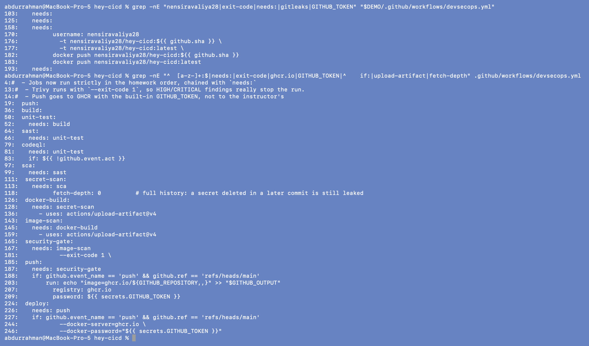
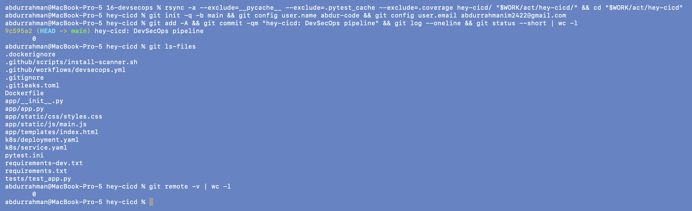
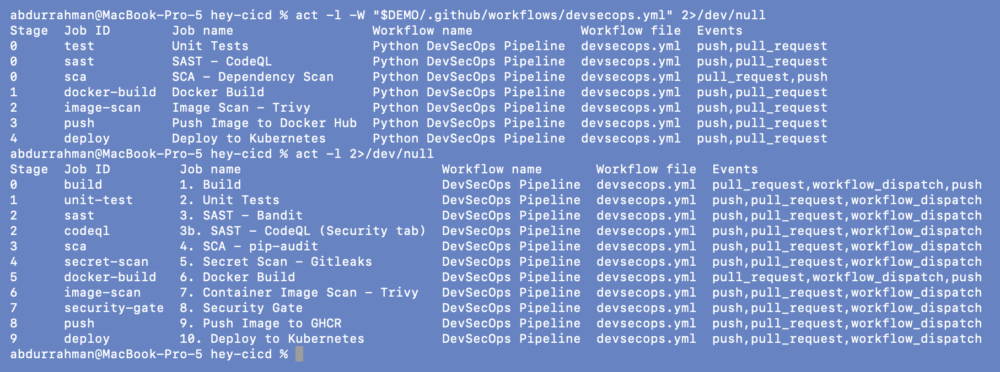
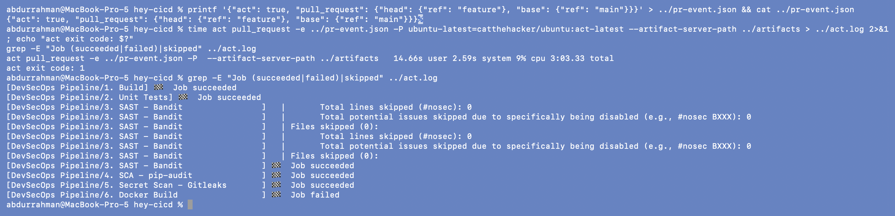
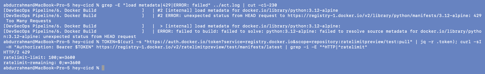
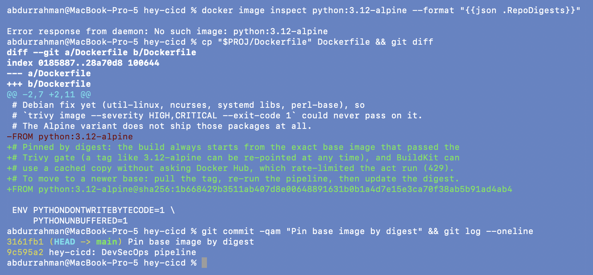
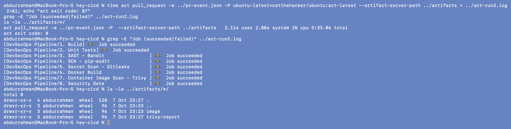
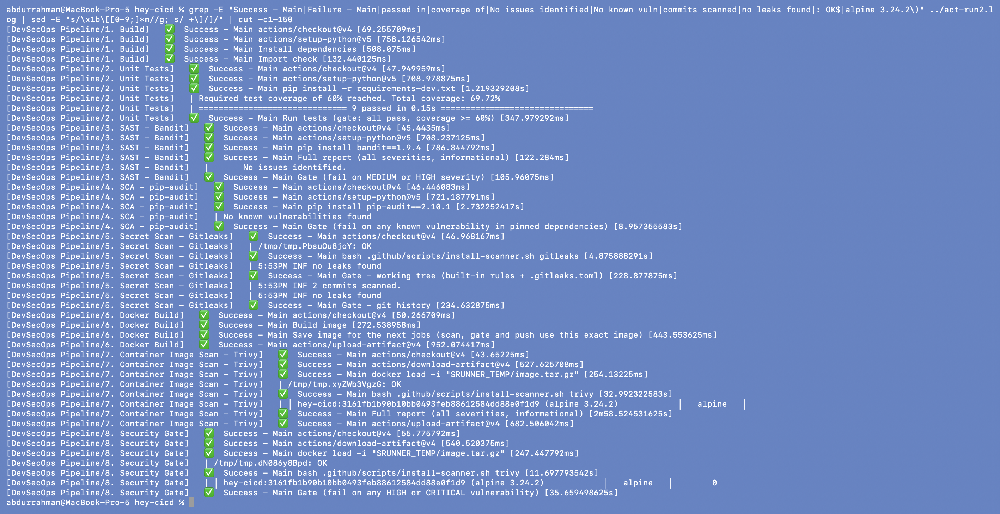

# 9. GitHub Actions: the Corrected Workflow

**Name:** Abdur Rahman Ibne Munir
**Enrollment number:** 24BCS10244

File: [`hey-cicd/.github/workflows/devsecops.yml`](../hey-cicd/.github/workflows/devsecops.yml)

## 9.1 What was wrong with the lecture workflow

| Lecture workflow | Problem | Corrected workflow |
|---|---|---|
| `test`, `sast`, `sca` all start at once; `docker-build` needs all three | not the homework order; a failed test still spends CodeQL minutes | one job per stage, strict chain: `build → unit-test → sast → sca → secret-scan → docker-build → image-scan → security-gate → push → deploy` |
| SAST = CodeQL only | `codeql-action/analyze` uploads alerts but **doesn't fail the job**, so it never blocked anything | **bandit** is the blocking SAST gate (MEDIUM+); CodeQL still runs (`3b`) and reports to the Security tab |
| no secret scanning | homework requires it | `secret-scan` job: gitleaks on the working tree **and** full history (`fetch-depth: 0`) |
| `pip-audit` with no `-r` | audits whatever is installed on the runner | `pip-audit -r requirements.txt -r requirements-dev.txt` |
| image built 3 times (build, scan, push jobs) | the pushed image is **not** the image that was scanned | built **once**, `docker save` → artifact → `docker load` in scan, gate and push |
| `trivy image --severity HIGH,CRITICAL` without `--exit-code 1` | the "gate" can't fail (44 HIGH passed, see section 6) | separate `security-gate` job with `--exit-code 1` |
| Trivy installed from the apt repo (latest) | unpinned scanner | `install-scanner.sh`: pinned version + SHA-256 check (x64 for GitHub, arm64 for `act` on my Mac) |
| pushes to `nensiravaliya28/hey-cicd` on Docker Hub | the instructor's account and secret | **GHCR** `ghcr.io/<owner>/<repo>` with the built-in `GITHUB_TOKEN` (`packages: write`) |
| push runs on pull requests too | a PR could publish an image | `push`/`deploy` only on a push to `main` |
| deploy: kind cluster, `sed __IMAGE_TAG__` on a Docker Hub image | can't work with GHCR (private package) | kind cluster + `ghcr-pull` secret from `GITHUB_TOKEN` patched onto the default ServiceAccount; applies the gated image by SHA, `rollout status`, curls `/health` |
| no `permissions:` at the top | the token gets the repo's default permissions | `contents: read` by default; only `push` gets `packages: write`, only `codeql` gets `security-events: write` |

```bash
grep -nE "nensiravaliya28|exit-code|needs:|gitleaks|GITHUB_TOKEN" "$DEMO/.github/workflows/devsecops.yml"
grep -nE "^  [a-z-]+:$|needs:|exit-code|ghcr.io|GITHUB_TOKEN|^    if:|upload-artifact|fetch-depth" .github/workflows/devsecops.yml
```



The first grep shows the lecture file: Docker Hub user `nensiravaliya28`, no
`--exit-code`, no gitleaks, no `GITHUB_TOKEN`. The second shows the corrected one: every
job `needs:` the previous stage, `--exit-code 1` in the gate, GHCR with `GITHUB_TOKEN`,
and `if:` conditions on push/deploy.

## 9.2 Running the workflow locally with `act`

`act` runs GitHub Actions jobs in Docker containers on my machine. It needs a git
repository, so I made a throwaway one outside the homework repo (repo-local identity,
no remote, nothing pushed).

```bash
rsync -a --exclude=__pycache__ --exclude=.pytest_cache --exclude=.coverage hey-cicd/ "$WORK/act/hey-cicd/" && cd "$WORK/act/hey-cicd"
git init -q -b main && git config user.name abdur-code && git config user.email abdurrahmanim2422@gmail.com
git add -A && git commit -qm "hey-cicd: DevSecOps pipeline" && git log --oneline && git status --short | wc -l
git ls-files
git remote -v | wc -l
```



```bash
act -l -W "$DEMO/.github/workflows/devsecops.yml" 2>/dev/null
act -l 2>/dev/null
```



`act -l` prints the stage each job lands in, based on `needs:`. The lecture workflow
has three jobs in stage 0 (test, SAST and SCA in parallel) and 5 stages in total. The
corrected one has 10 stages in the homework order. Only CodeQL shares stage 2 with
bandit, because it reports and doesn't gate.

**What can't run under act:**

- **CodeQL** needs GitHub's code-scanning service. The job has
  `if: ${{ !github.event.act }}`, and I pass an event file with `"act": true` so it is
  skipped locally.
- **Push** and **deploy** need the real `GITHUB_TOKEN` and GHCR. I ran act with a
  `pull_request` event, and for pull requests the workflow stops after the security
  gate by design. So this local run covers stages 1 to 8.

### First run: Docker Hub rate limit

```bash
printf '{"act": true, "pull_request": {"head": {"ref": "feature"}, "base": {"ref": "main"}}}' > ../pr-event.json && cat ../pr-event.json
time act pull_request -e ../pr-event.json -P ubuntu-latest=catthehacker/ubuntu:act-latest --artifact-server-path ../artifacts > ../act.log 2>&1; echo "act exit code: $?"
grep -E "Job (succeeded|failed)|skipped" ../act.log
```



Stages 1 to 5 passed (the `skipped` matches are just bandit's own "lines skipped"
text). `6. Docker Build` failed.

```bash
grep -E "load metadata|429|ERROR: failed" ../act.log | cut -c1-230
TOKEN=$(curl -s "https://auth.docker.io/token?service=registry.docker.io&scope=repository:ratelimitpreview/test:pull" | jq -r .token); curl -sI -H "Authorization: Bearer $TOKEN" https://registry-1.docker.io/v2/ratelimitpreview/test/manifests/latest | grep -i -E "^HTTP|^ratelimit"
```



**Problem found → root cause → fix.** BuildKit asks Docker Hub what the
`python:3.12-alpine` *tag* currently points to before every build. Docker Hub answered
`429 Too Many Requests`. Docker's rate-limit check endpoint shows why:
`ratelimit-remaining: 0` out of 100 anonymous pulls per hour for my IP (several builds
were running on this machine). The docker CLI inside the act container is anonymous.
**Fix:** pin the base image **by digest** (the digest the gate-passing build resolved in
section 6). A digest is immutable, so BuildKit can use its cached copy without asking
the registry. It's also a supply-chain improvement: the tag `3.12-alpine` can be
re-pointed upstream at any time, but the digest is exactly the base image that passed
Trivy. (GitHub-hosted runners aren't affected by this limit.)

```bash
docker image inspect python:3.12-alpine --format "{{json .RepoDigests}}"
cp "$PROJ/Dockerfile" Dockerfile && git diff
git commit -qam "Pin base image by digest" && git log --oneline
```



(`No such image`: the base image only exists in BuildKit's build cache, not as a tagged
image, so there is nothing for `docker image inspect` to show. That cache is exactly what
the digest reference lets the build reuse offline.)

### Second run

```bash
time act pull_request -e ../pr-event.json -P ubuntu-latest=catthehacker/ubuntu:act-latest --artifact-server-path ../artifacts > ../act-run2.log 2>&1; echo "act exit code: $?"
grep -E "Job (succeeded|failed)" ../act-run2.log
ls -la ../artifacts/*/
```



`act exit code: 0`. All eight stages that can run locally succeeded in order, and the
artifact server holds the two artifacts passed between jobs: `image` (the saved image)
and `trivy-report`. CodeQL was skipped, and push/deploy didn't run because the event is
a pull request.

```bash
grep -E "Success - Main|Failure - Main|passed in|coverage of|No issues identified|No known vuln|commits scanned|no leaks found|: OK$|alpine 3.24.2\)" ../act-run2.log | sed -E "s/\x1b\[[0-9;]*m//g; s/ +\]/]/" | cut -c1-150
```



Step by step, inside Linux containers with Python 3.12 (not my Mac's 3.14):

- 9 tests passed with 69.72% coverage, above the 60% gate.
- bandit: `No issues identified`.
- pip-audit: `No known vulnerabilities found`.
- gitleaks: both downloads pass the SHA-256 check (`: OK`), no leaks in the working
  tree, and no leaks in the `2 commits scanned`.
- The image was built once and uploaded as an artifact.
- The scan and gate jobs `docker load` that same image (`hey-cicd:3161fb1…`, tagged with
  the commit SHA), and the gate finds **0** HIGH/CRITICAL.

## Pending: run it on GitHub

These steps need my GitHub account and weren't run here. `gh` on this machine is
logged in to my work account, so switch to the personal account first.

```bash
# 1. log in as the personal account (adds it next to the work account) and switch
gh auth login --hostname github.com --git-protocol https --web     # sign in as abdur-code
gh auth switch --hostname github.com --user abdur-code
gh auth status                                                     # active account: abdur-code

# 2. make hey-cicd its own repository (the workflow must be at the repo root)
cp -R ~/Desktop/SST/scaler-devops-homework/16-devsecops/hey-cicd ~/hey-cicd
cd ~/hey-cicd
git init -b main
git config user.name abdur-code
git config user.email abdurrahmanim2422@gmail.com
git add -A
git commit -m "hey-cicd: CI/CD + DevSecOps pipeline"
gh repo create abdur-code/hey-cicd --public --source . --push      # the push triggers the workflow

# 3. follow the run
gh run watch
gh run list --workflow devsecops.yml

# 4. afterwards, switch back to the work account if needed
gh auth switch --hostname github.com --user abdurRahman-scaler
```

- **Public repo:** CodeQL code scanning is free for public repositories. On a private
  repo it needs GitHub Advanced Security.
- **No repository secrets needed.** GHCR login and the kind cluster's image pull both use
  the built-in `GITHUB_TOKEN`. The jobs declare their own `permissions:`, so the
  repository's default "read" workflow permission is fine.
- `environment: development` on the deploy job is created automatically on the first run.

**What to check and screenshot on GitHub:**

1. **Actions → the run**: the graph should show 11 jobs (`1. Build` … `10. Deploy to
   Kubernetes` plus `3b. SAST - CodeQL`), all green.
2. **Security → Code scanning**: CodeQL results for `app/app.py`. The debug/bind
   findings are already fixed, so there should be no open high-severity alerts.
3. **Packages** (repo sidebar or `github.com/abdur-code?tab=packages`):
   `hey-cicd` with two tags, the commit SHA and `latest`. It is private by default, which
   is fine; the deploy job pulls it with `GITHUB_TOKEN`.
4. The **`10. Deploy to Kubernetes`** job log: `deployment "session17-python" successfully
   rolled out`, the Pods with image `ghcr.io/abdur-code/hey-cicd:<sha>`, and the
   `/health` response.
5. Optional gate demo on GitHub: open a pull request that changes the Dockerfile's
   `FROM` back to `python:3.12-slim`. `8. Security Gate` should fail with 44 HIGH and
   `push`/`deploy` won't run.
6. Optional: in **Settings → Branches**, add a rule for `main` requiring the status
   checks (`8. Security Gate` and the others) and CodeQL results to pass before merging.
   That's how CodeQL findings become a gate too.

To deploy to a real cluster instead of the throwaway kind cluster, replace the
`helm/kind-action` step with a kubeconfig from a `KUBE_CONFIG` repository secret, as in
the lecture's `03-kubernetes-deployment` notes. A laptop minikube can't be reached from
GitHub's runners.

## What I understood

- `needs:` is what turns a list of jobs into a pipeline with gates: a failed job makes
  everything downstream skip. In the lecture workflow, the parallel start and the
  missing `--exit-code` meant nothing could actually stop a release.
- Build once, promote the same artifact. Rebuilding in every job means the thing you
  scanned isn't the thing you shipped.
- The least privilege idea applies to CI too: a read-only token by default, write
  access only for the one job that pushes, and no long-lived registry password at all.
- `act` is a fast way to test a workflow before pushing, but it's not GitHub: no
  CodeQL, no real `GITHUB_TOKEN`, and the containers share my machine's network and
  Docker Hub rate limit.
