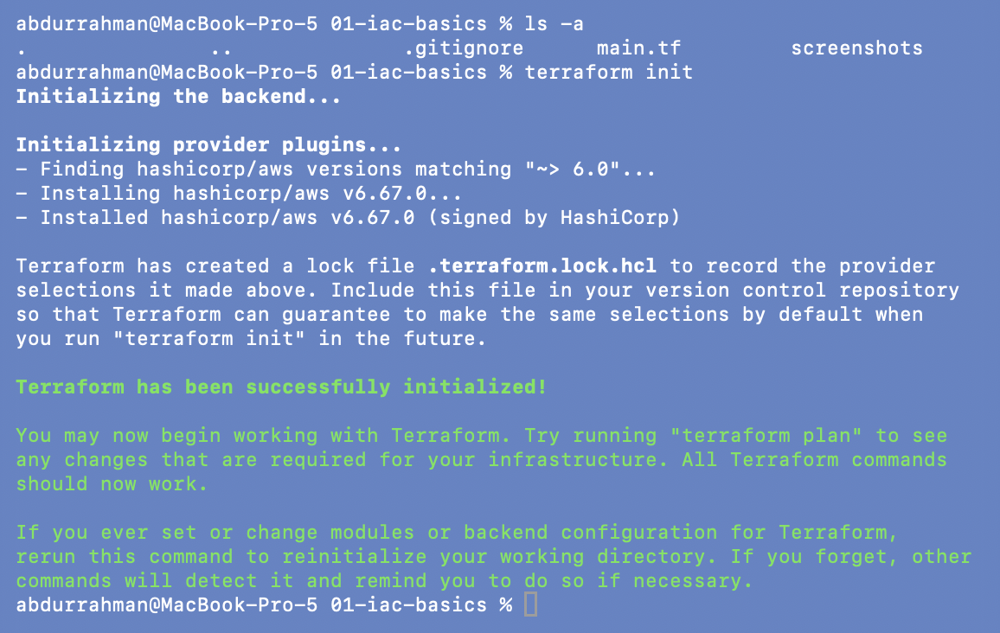
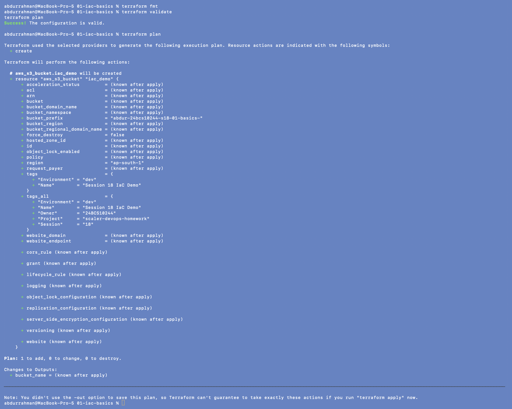
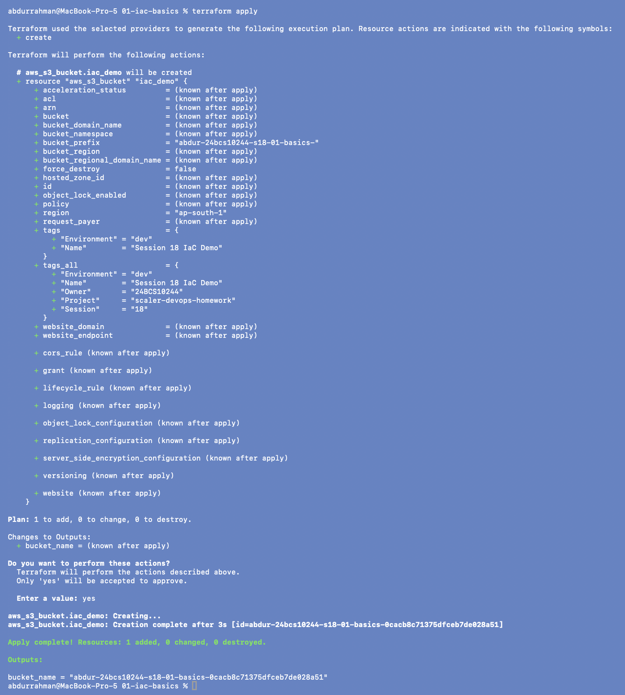
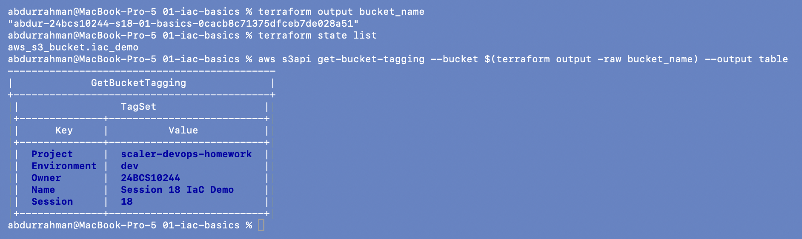
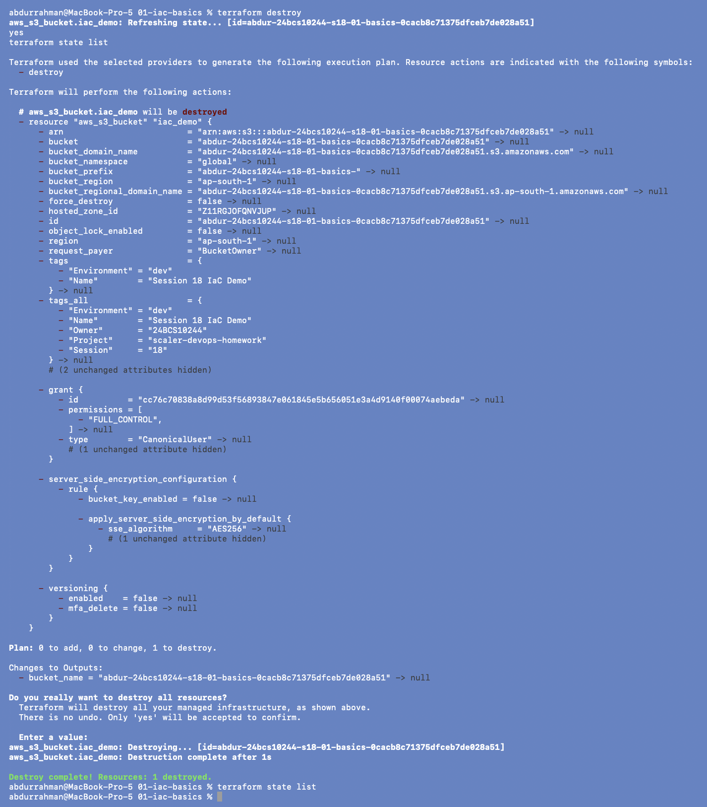

# 01 - What is Infrastructure as Code?

**Name:** Abdur Rahman Ibne Munir
**Enrollment number:** 24BCS10244

Infrastructure as Code (IaC) means describing infrastructure in files instead of
clicking through a cloud console. The files go into Git, get reviewed like any other
code, and a tool (here Terraform) makes the real infrastructure match them.

```text
Console way                         IaC way
-----------                         -------
open AWS console                    write main.tf
click S3 -> Create bucket           terraform plan   (preview)
fill in the form                    terraform apply  (create)
repeat by hand for every env        same file works for dev / test / prod
```

Why it matters: repeatability, automation, version control, consistency between
environments, review through pull requests, easier disaster recovery (re-apply the
code) and easy CI/CD integration.

## Code

`main.tf` is the lecture file with two changes, both marked with comments:

- `bucket_prefix` is `abdur-24bcs10244-s18-01-basics-` instead of `session18-iac-`,
  so every bucket I create can be recognised (and cleaned up) by its name;
- the provider has `default_tags` (`Project`, `Session`, `Owner`) so every resource is
  tagged without touching the resource block.

```hcl
provider "aws" {
  region = "ap-south-1"

  default_tags {
    tags = {
      Project = "scaler-devops-homework"
      Session = "18"
      Owner   = "24BCS10244"
    }
  }
}

resource "aws_s3_bucket" "iac_demo" {
  bucket_prefix = "abdur-24bcs10244-s18-01-basics-"

  tags = {
    Name        = "Session 18 IaC Demo"
    Environment = "dev"
  }
}

output "bucket_name" {
  value = aws_s3_bucket.iac_demo.bucket
}
```

The lecture folder had no `.gitignore` (folders 03-09 do), so I added the same one
here: `.terraform/`, state files, plans and crash logs stay out of Git.

## 1. `terraform init`

```bash
terraform init
```



Terraform read `required_providers`, found that `~> 6.0` currently means
**hashicorp/aws v6.67.0**, installed it and wrote `.terraform.lock.hcl` to pin that
exact version for the next run.

## 2. `terraform fmt`, `terraform validate`, `terraform plan`

```bash
terraform fmt
terraform validate
terraform plan
```



`fmt` printed nothing (the file was already formatted) and `validate` says the
configuration is valid. The plan shows one `+ create` with `bucket_prefix` set and the
real name still `(known after apply)`. Note `tags` (what I wrote on the resource)
versus `tags_all` (resource tags merged with the provider's `default_tags`).
`Plan: 1 to add, 0 to change, 0 to destroy.`

## 3. `terraform apply`

```bash
terraform apply
yes
```



Terraform printed the same plan, waited for `yes`, created the bucket in 3 seconds and
printed the output:
`bucket_name = "abdur-24bcs10244-s18-01-basics-0cacb8c71375dfceb7de028a51"`. The
suffix after my prefix was generated, exactly as the notes say.

## 4. Verify

```bash
terraform output bucket_name
terraform state list
aws s3api get-bucket-tagging --bucket $(terraform output -raw bucket_name) --output table   # added
```



`state list` shows the one resource Terraform manages, `aws_s3_bucket.iac_demo`. I added
the `get-bucket-tagging` call to check from the AWS side that the tags really reached
the bucket: the two from the resource block plus the three `default_tags`.

## 5. Cleanup

```bash
terraform destroy
yes
terraform state list
```



`Plan: 0 to add, 0 to change, 1 to destroy`, then `Destroy complete! Resources: 1
destroyed.` The final `state list` prints nothing: Terraform no longer manages anything
in this folder. (I typed `yes` and `state list` ahead while Terraform was still
refreshing, which is why they appear echoed near the top. Both ran in order.)

## Practice questions

1. **What happens if 10 engineers manually create the same infrastructure?** We get 10
   slightly different setups: different names, settings and tags, and things forgotten
   by some people. Nobody can tell which one is "correct", and problems that appear in
   one environment can't be reproduced in another.
2. **How can Git help with infrastructure?** Every change becomes a commit with an
   author, a message and a diff, and can be reviewed in a pull request before anyone
   runs `apply`. If a change breaks something, I can see exactly what changed and
   revert it.
3. **What if we need the same infrastructure in another environment?** Run the same code
   again with different variable values (see [05-variables](../05-variables/README.md))
   and separate state. Nothing has to be rebuilt by hand.

## What I understood

- With IaC the *file* is the source of truth, and the cloud is made to match it.
- `init` → `fmt` → `validate` → `plan` → `apply` → `destroy` is the basic lifecycle, and
  `plan` is the safety step: it shows what will change before anything changes.
- `bucket_prefix` lets AWS/Terraform generate a unique name. That matters for S3, where
  names are global across all accounts.
- `default_tags` on the provider is an easy way to tag everything a configuration
  creates; `tags_all` shows the merged result.
