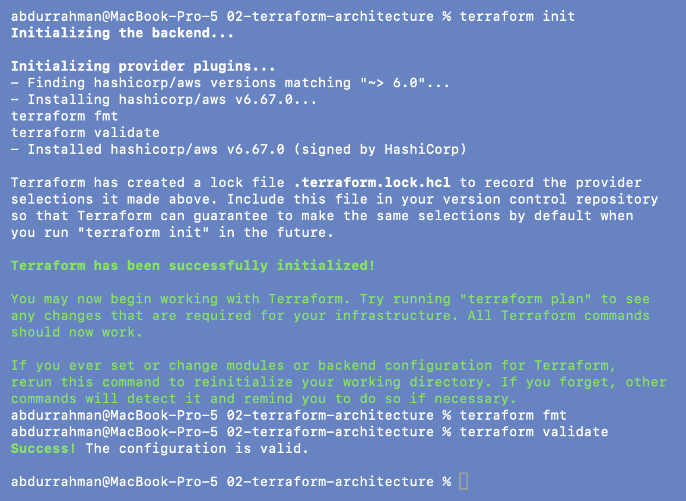
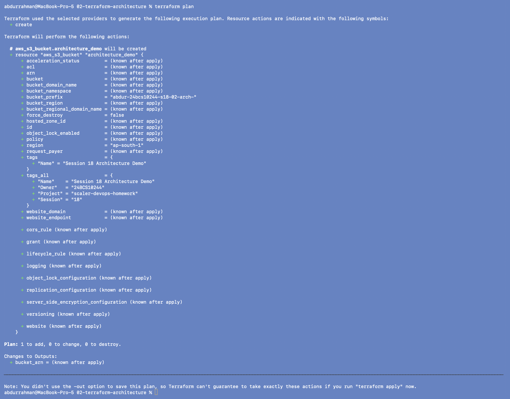
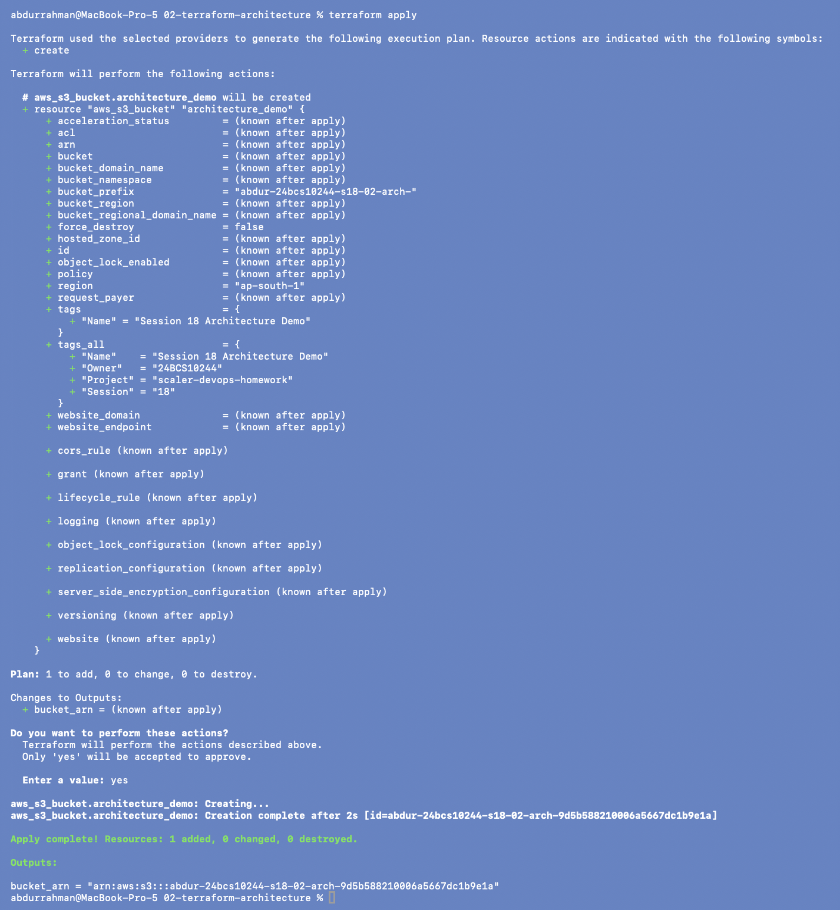
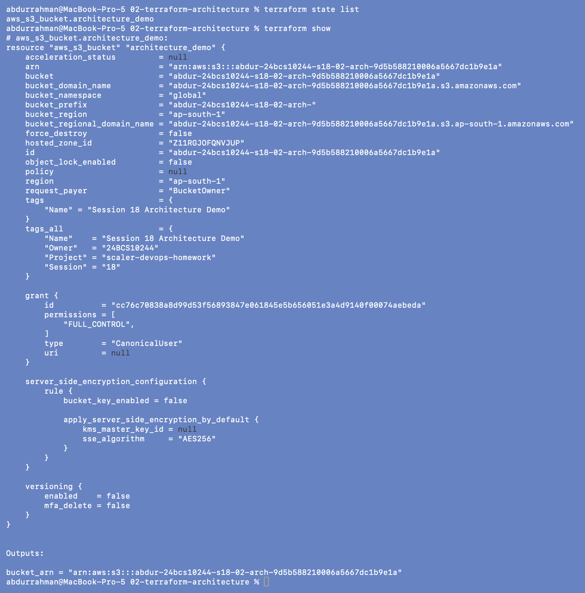
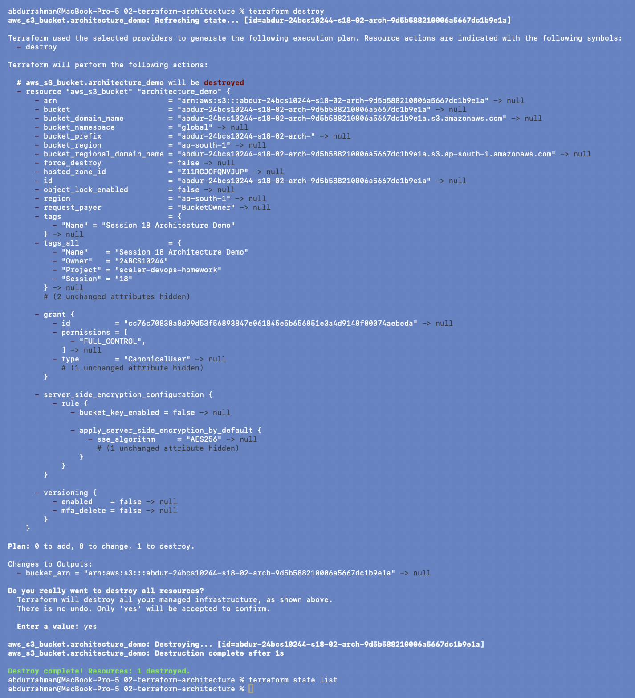

# 02 - Terraform Architecture

**Name:** Abdur Rahman Ibne Munir
**Enrollment number:** 24BCS10244

Terraform sits between my configuration and the cloud API. It never talks to AWS
itself; a provider plugin does.

```text
   main.tf (HCL)            terraform.tfstate
        |                          ^
        v                          |  records what exists
 +----------------+        +---------------+
 | Terraform CLI  |<------>|    State      |
 +----------------+        +---------------+
        |  gRPC
        v
 +----------------+
 |  AWS provider  |  (plugin downloaded by terraform init)
 +----------------+
        |  HTTPS API calls (signed with my AWS credentials)
        v
 +----------------+
 |      AWS       |  S3 / EC2 / VPC ...
 +----------------+
```

| Part | Role | Where I see it |
|---|---|---|
| Configuration (HCL) | describes the desired end state | `main.tf` |
| Terraform CLI | reads config + state, builds a plan, runs it | `terraform ...` commands |
| Provider | plugin that knows one API (AWS here) | `.terraform/providers/...`, installed by `init` |
| Resource | one managed object | `aws_s3_bucket.architecture_demo` |
| State | Terraform's record of what it created | `terraform.tfstate` |

A plan is built from three inputs: **configuration + state + the real world** (Terraform
refreshes state from AWS before planning). Terraform is **declarative**: I describe what
I want (one bucket with this prefix and these tags), not the API calls needed to get
there.

`main.tf` is the lecture file with my bucket prefix (`abdur-24bcs10244-s18-02-arch-`)
and the provider `default_tags`, both commented. A `.gitignore` was added because the
lecture folder had none.

## 1. Init, format, validate

```bash
terraform init
terraform fmt
terraform validate
```



Same provider as in 01 (v6.67.0). Because `TF_PLUGIN_CACHE_DIR` is set in my terminal,
`.terraform/providers/...` is only a link to the copy downloaded once, not another
~750 MB copy of the provider. `fmt` has nothing to change and `validate` passes. (`terraform fmt` and
`terraform validate` show up once mid-output because I typed them while init was still
running; they ran afterwards, as the prompts below show.)

## 2. Plan

```bash
terraform plan
```



`Plan: 1 to add, 0 to change, 0 to destroy.` The output `bucket_arn` is
`(known after apply)` because the name isn't decided until AWS creates the bucket.

## 3. Apply

```bash
terraform apply
yes
```



`Apply complete! Resources: 1 added` and
`bucket_arn = "arn:aws:s3:::abdur-24bcs10244-s18-02-arch-9d5b588210006a5667dc1b9e1a"`.

## 4. Inspect

```bash
terraform state list
terraform show
```



`state list` gives the resource address, and `terraform show` prints everything
Terraform recorded about it: the ARN, `bucket_region = "ap-south-1"`, the merged
`tags_all`, and settings AWS applied on its own, such as AES256 server-side encryption and
versioning disabled. Those values came back from the provider after creation; I never
wrote them.

## 5. Cleanup

```bash
terraform destroy
yes
terraform state list
```



`Destroy complete! Resources: 1 destroyed.` and the state is empty again.

## What I understood

- The CLI is generic; all AWS knowledge lives in the provider plugin, which is why the
  same workflow works for Azure, GCP, Kubernetes or GitHub.
- State is what lets Terraform know that `aws_s3_bucket.architecture_demo` *is* the
  bucket `abdur-24bcs10244-s18-02-arch-9d5b…`. Without it, Terraform would try to create
  a second bucket.
- Declarative means I only change the description; Terraform works out whether that
  means create, update, replace or delete.
