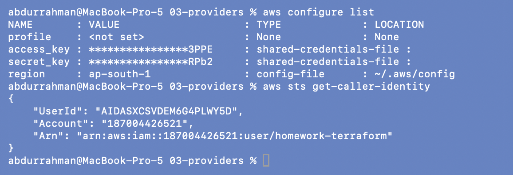
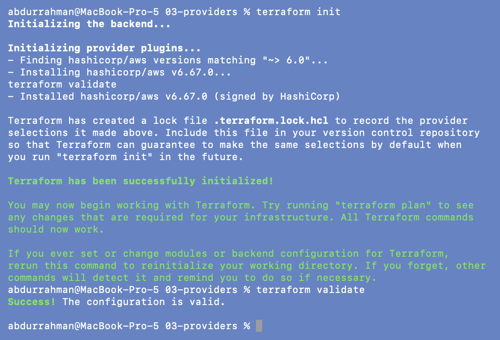
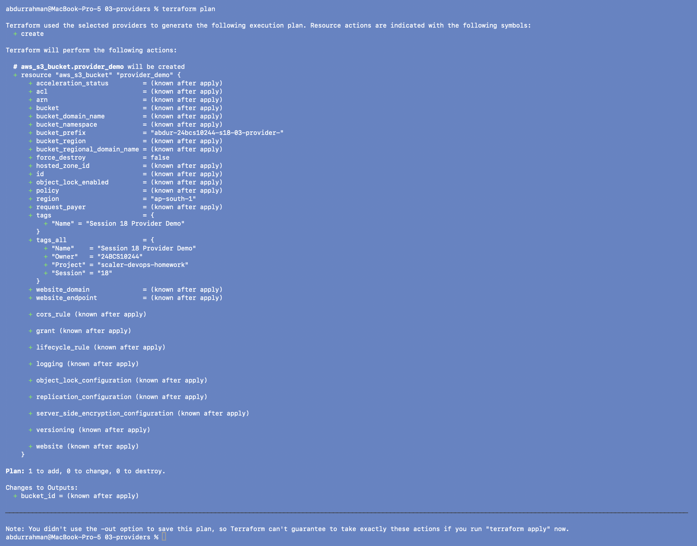
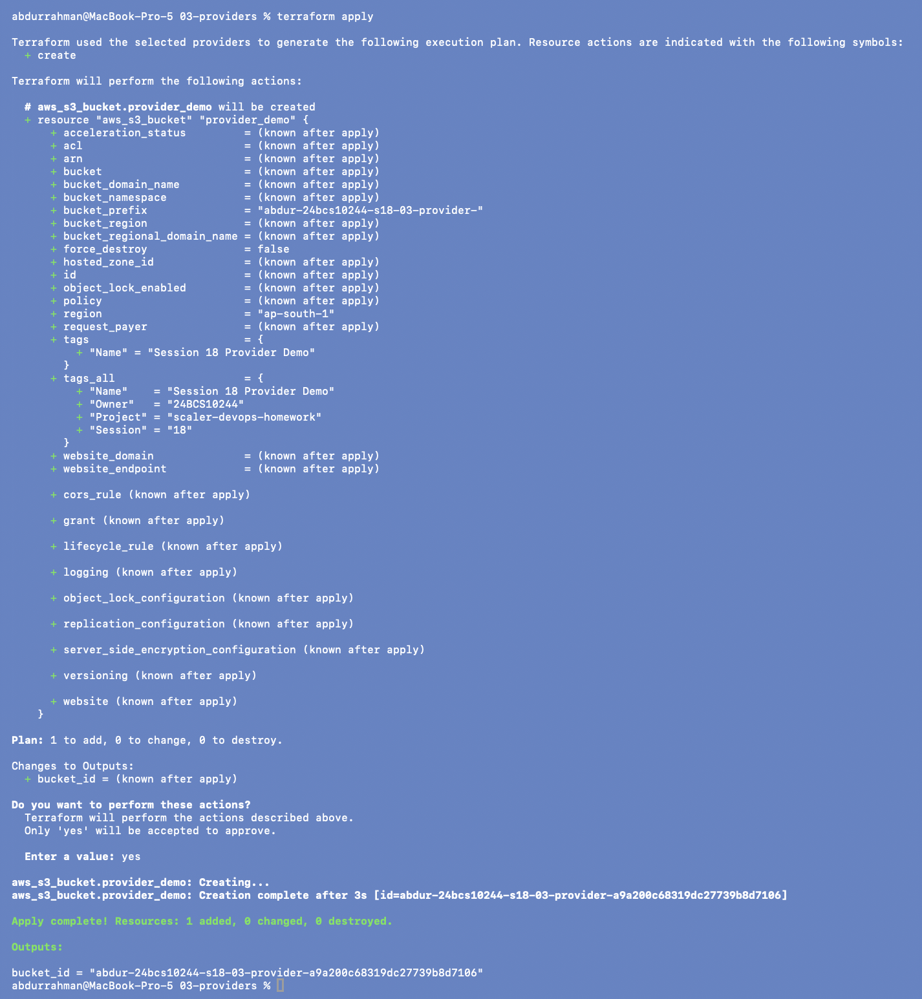
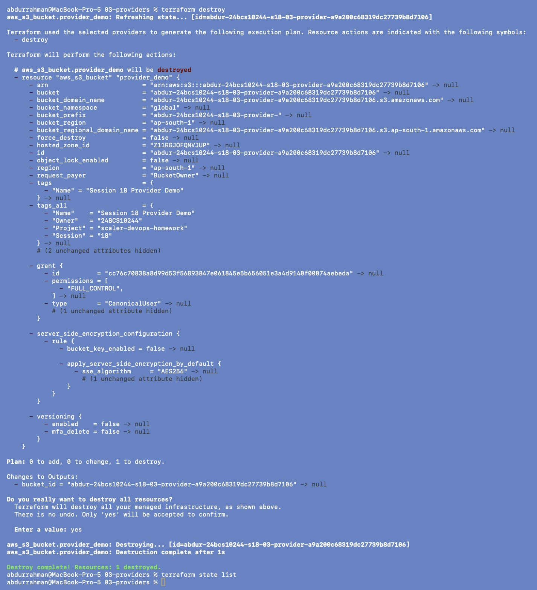

# 03 - Providers

**Name:** Abdur Rahman Ibne Munir
**Enrollment number:** 24BCS10244

A provider is the plugin that lets Terraform talk to one external API. The AWS provider
(maintained by HashiCorp) knows how to create, read, update and delete S3, EC2, VPC,
EKS, ECS and hundreds of other AWS resource types.

```hcl
terraform {
  required_providers {
    aws = {
      source  = "hashicorp/aws"   # registry.terraform.io/<namespace>/<type>
      version = "~> 6.0"          # any 6.x, never 7.0
    }
  }
}

provider "aws" {
  region = var.aws_region         # "ap-south-1" by default
  # + default_tags (added, see 01)
}
```

```text
aws
├── namespace: hashicorp
├── type: aws
└── version constraint: ~> 6.0   (>= 6.0, < 7.0)
```

The region comes from a variable with default `ap-south-1`, so the provider block itself
has no hardcoded environment details. My only changes to `main.tf` are the bucket prefix
(`abdur-24bcs10244-s18-03-provider-`) and `default_tags`.

## 1. Authentication

The notes say to run `aws configure`. That command prompts for the access key ID and
secret key and echoes the existing ones, so I did **not** run it on screen. The CLI was
already configured for the homework IAM user, so I proved it works with two read-only
commands instead:

```bash
aws configure list            # shows where credentials come from, keys masked
aws sts get-caller-identity   # "who am I" according to AWS
```



Credentials come from the shared credentials file (`~/.aws/credentials`), region
`ap-south-1` from `~/.aws/config`, and AWS confirms the caller is
`arn:aws:iam::187004426521:user/homework-terraform`. The Terraform AWS provider uses
the same credential chain as the CLI, so this is all Terraform needs.

**Never put keys in the provider block** (`access_key = "..."`, `secret_key = "..."`).
The `.tf` files go to Git, and anyone with the repo would then have the account.

## 2. Init and validate

```bash
terraform init
terraform validate
```



`Finding hashicorp/aws versions matching "~> 6.0"... Installed hashicorp/aws v6.67.0
(signed by HashiCorp)`, the same lines the notes show with `v6.x.x`. The configuration is
valid.

## 3. Plan

```bash
terraform plan
```



`Plan: 1 to add, 0 to change, 0 to destroy.` with `region = "ap-south-1"` coming from
the variable default.

## 4. Apply

```bash
terraform apply
yes
```



`bucket_id = "abdur-24bcs10244-s18-03-provider-a9a200c68319dc27739b8d7106"`.

## 5. Cleanup

```bash
terraform destroy
yes
terraform state list
```



One resource destroyed; the state list is empty.

## What I understood

- `source` says *which* plugin (namespace/type on the registry) and `version` says
  *which versions are acceptable*; the lock file then records the exact one that was
  picked (6.67.0) so every run uses the same build.
- The provider block configures *how* to connect (region, tags), not *what* to create.
- Credentials belong to the environment (CLI profile, environment variables, SSO or an
  IAM role), never to the Terraform code.
