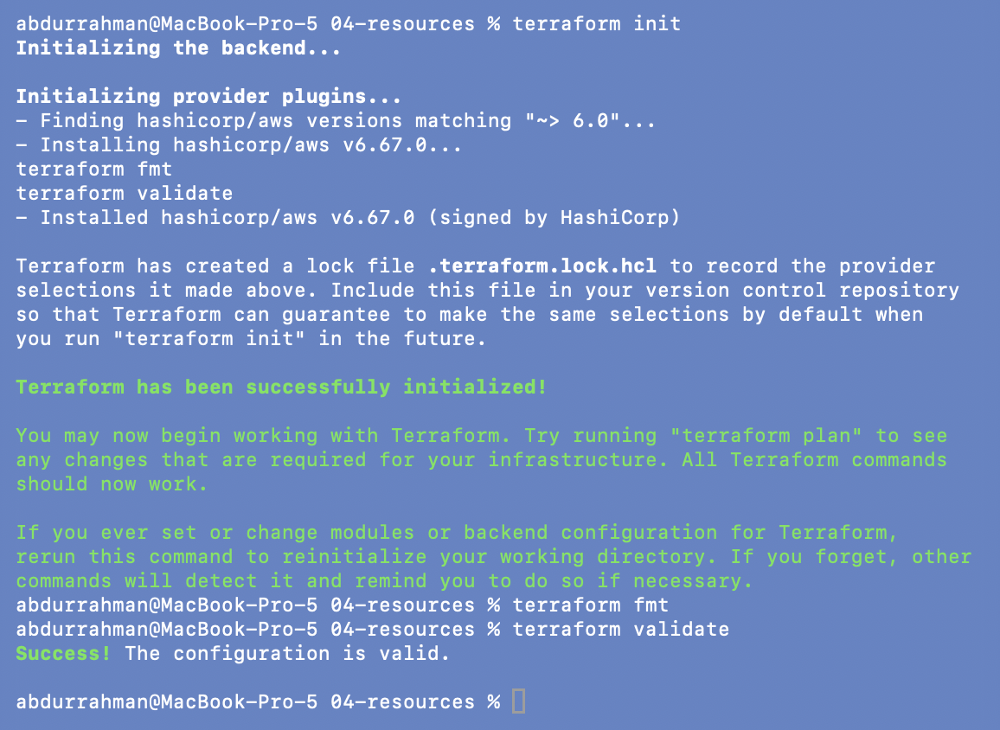
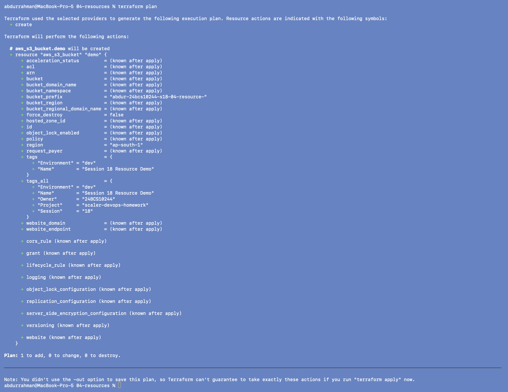
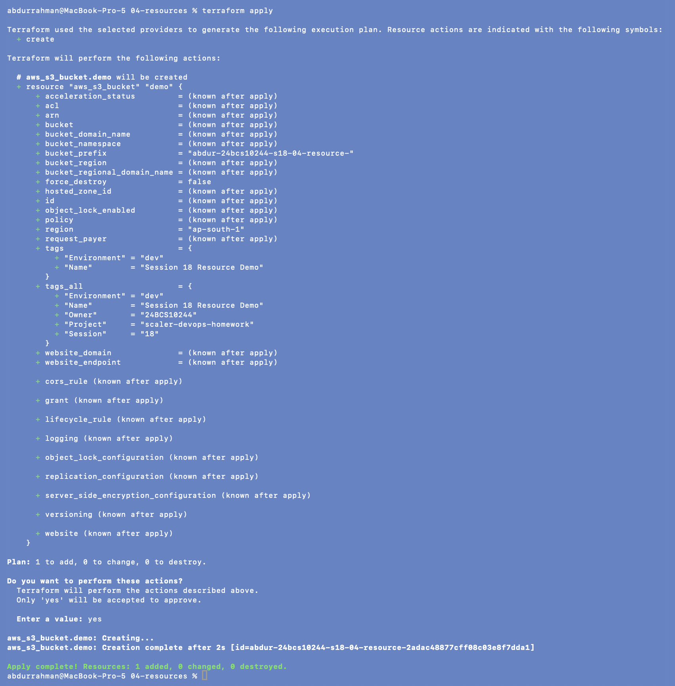
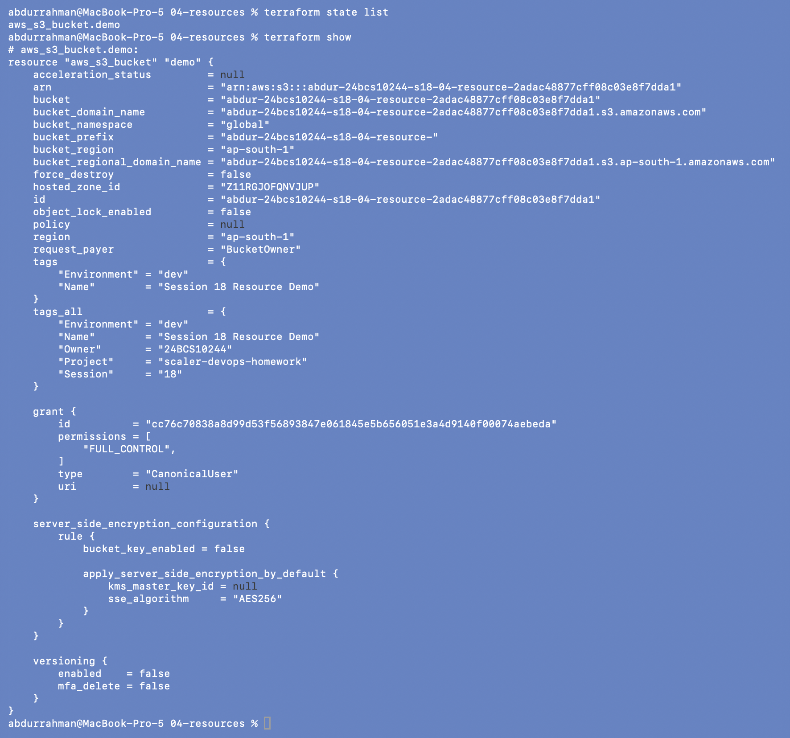
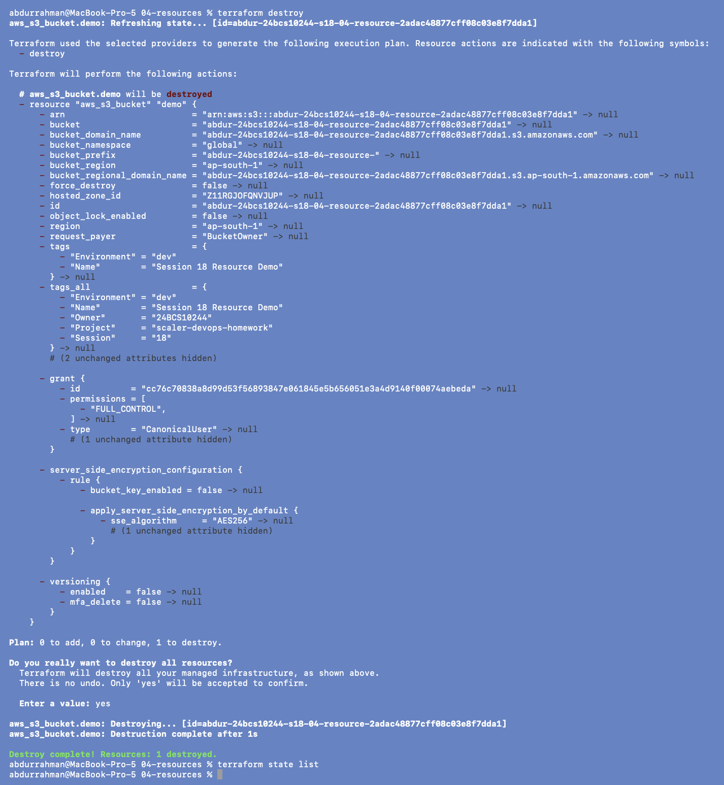
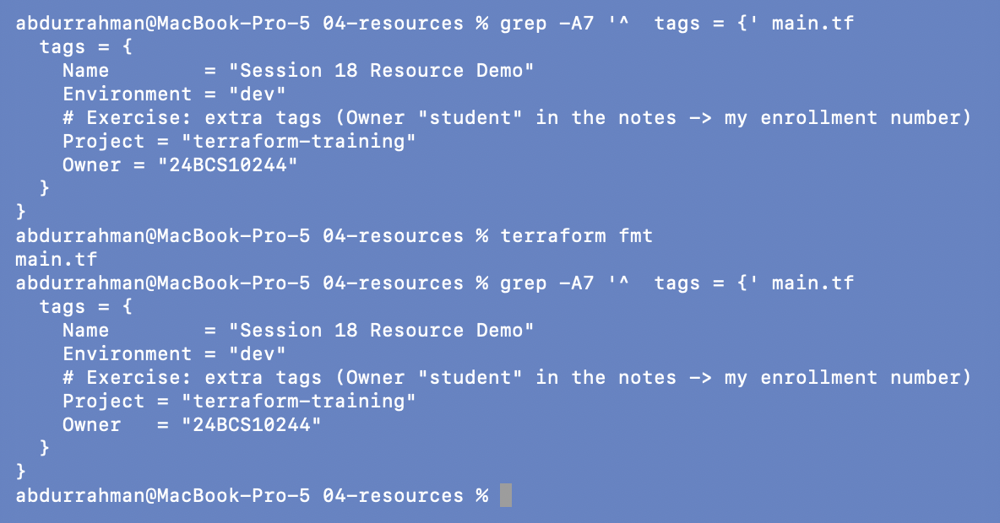
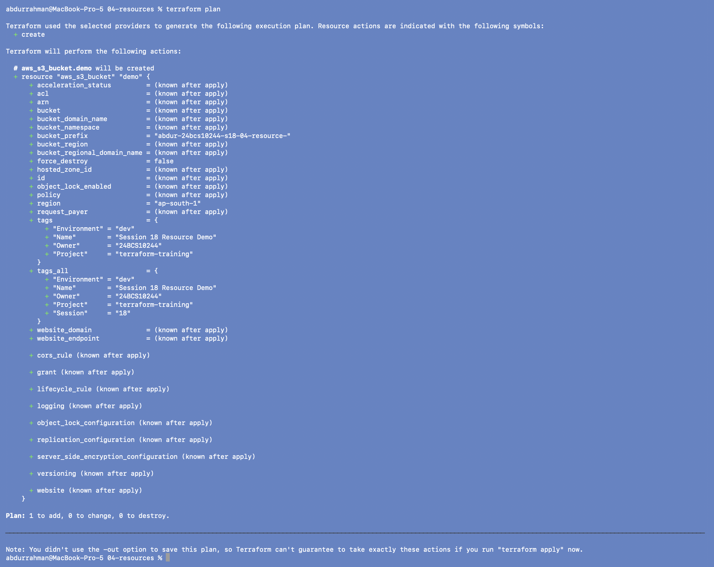

# 04 - Resources

**Name:** Abdur Rahman Ibne Munir
**Enrollment number:** 24BCS10244

A resource block is one piece of infrastructure that Terraform creates and manages.

```hcl
resource "RESOURCE_TYPE" "LOCAL_NAME" {
  argument = value
}
```

| Part | Meaning | In this folder |
|---|---|---|
| `resource` | block keyword | |
| `aws_s3_bucket` | resource type: provider prefix `aws_` + kind of object | general-purpose S3 bucket |
| `demo` | local name, only meaningful inside this configuration | address is `aws_s3_bucket.demo` |
| `bucket_prefix` | an argument of that type | `abdur-24bcs10244-s18-04-resource-` (lecture: `session18-resource-`) |

The type plus local name form the **address** (`aws_s3_bucket.demo`) used everywhere
else: in `state list`, in references like `aws_s3_bucket.demo.arn`, and in plan output.

## 1. Init, format, validate

```bash
terraform init
terraform fmt
terraform validate
```



Provider v6.67.0, configuration valid. (`fmt`/`validate` were typed during init and
appear echoed once in the middle.)

## 2. Plan

```bash
terraform plan
```



`# aws_s3_bucket.demo will be created`, `Plan: 1 to add, 0 to change, 0 to destroy.`

## 3. Apply

```bash
terraform apply
yes
```



`aws_s3_bucket.demo: Creation complete after 2s
[id=abdur-24bcs10244-s18-04-resource-2adac48877cff08c03e8f7dda1]`. This config has no
outputs, so the ID in that line is the only place the name appears.

## 4. State and inspect

```bash
terraform state list
terraform show
```



`aws_s3_bucket.demo`, exactly as the notes expect. `terraform show` lists every
attribute the provider knows about the bucket, including ones I didn't set: the
`grant` giving my canonical user `FULL_CONTROL`, default `AES256` encryption,
`versioning.enabled = false`.

## 5. Cleanup

```bash
terraform destroy
yes
terraform state list
```



`Plan: 0 to add, 0 to change, 1 to destroy.` → `Destroy complete! Resources: 1
destroyed.`, matching the notes.

## 6. Exercise: add tags, `fmt`, `plan`

The exercise adds `Project`, `Environment` and `Owner` tags. `Environment = "dev"` was
already there; for `Owner = "student"` I used my enrollment number. My new lines weren't
aligned like the existing ones, which made this a good test of `terraform fmt`.

```bash
grep -A7 '^  tags = {' main.tf
terraform fmt
grep -A7 '^  tags = {' main.tf
```



`fmt` printed `main.tf` (the file it rewrote) and lined up the `=` signs of `Project`
and `Owner`. It only changes layout, never meaning.

```bash
terraform plan
```



I ran the exercise after the cleanup, in the order of the notes, so the plan is a new
`+ create` (nothing exists to update). The interesting part is the tags: `tags` now has
four entries, and in `tags_all` the resource's `Project = "terraform-training"` has
**replaced** the provider default `Project = "scaler-devops-homework"`. When the same
key is set in both places, the resource-level value wins. I did not apply this plan.

## What I understood

- A resource's address (`type.local_name`) is its identity inside Terraform; the real
  bucket name is just an attribute of it.
- After apply, the state holds far more attributes than I wrote, because the provider
  stores everything AWS returns. That is how `terraform show` can display them without
  calling AWS.
- `terraform fmt` is purely cosmetic and safe to run any time; teams run it in CI to keep
  diffs clean.
- Resource `tags` override provider `default_tags` for the same key. This is useful, but
  it can hide a required tag by accident.
