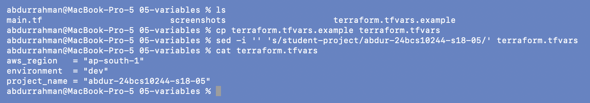
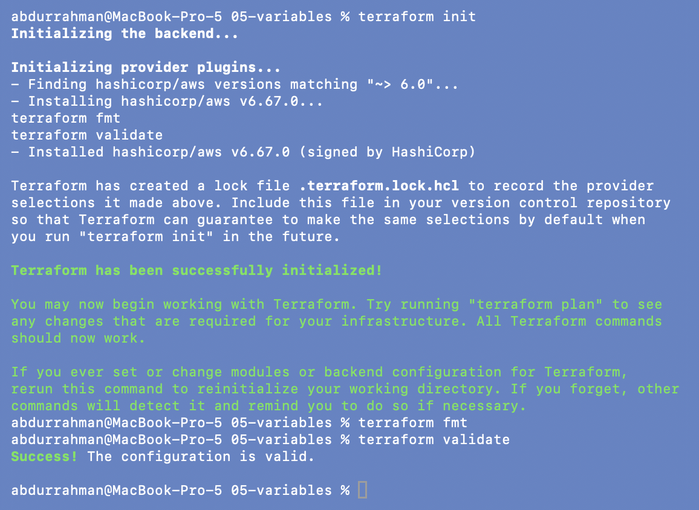
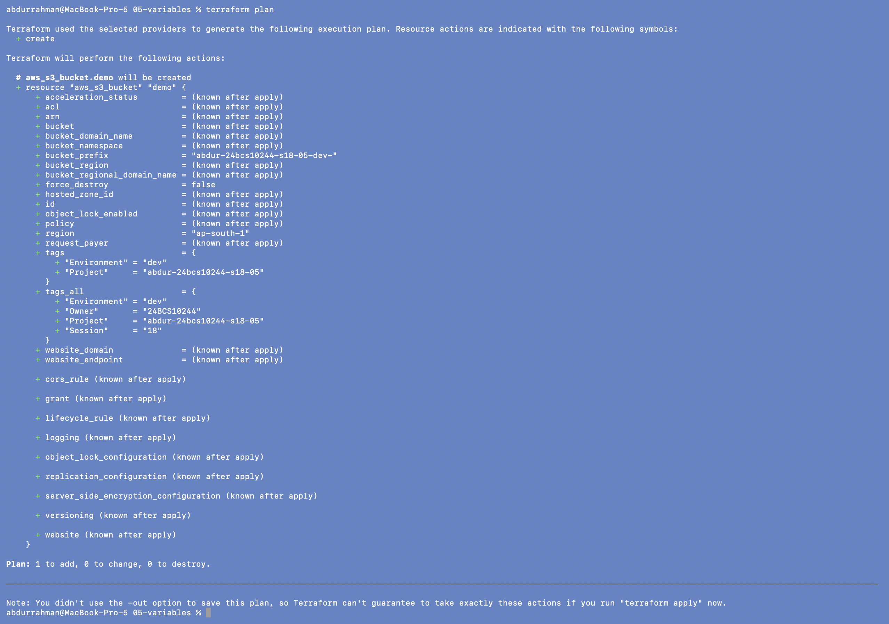
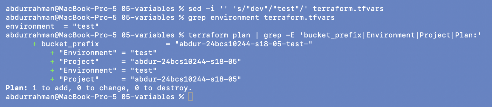
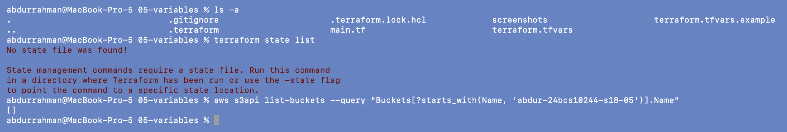

# 05 - Variables

**Name:** Abdur Rahman Ibne Munir
**Enrollment number:** 24BCS10244

Hardcoded values tie a configuration to one environment. Variables let the same code
produce `dev`, `test`, `staging` or `prod` just by changing inputs.

```hcl
# without variables
bucket_prefix = "student-project-dev-"

# with variables
bucket_prefix = "${var.project_name}-${var.environment}-"
```

A variable has a description, a type and optionally a default, and is read with
`var.<name>`:

```hcl
variable "environment" {
  description = "Environment name"
  type        = string
  default     = "dev"
}
```

`main.tf` declares `aws_region`, `environment` and `project_name`. The bucket prefix and
the `Project`/`Environment` tags are built from them. Values can come from (lowest to
highest priority) the default, `TF_VAR_<name>` environment variables, `terraform.tfvars`,
`*.auto.tfvars`, and finally `-var` / `-var-file` on the command line. This lab uses
`terraform.tfvars`.

## 1. Create `terraform.tfvars`

```bash
cp terraform.tfvars.example terraform.tfvars
sed -i '' 's/student-project/abdur-24bcs10244-s18-05/' terraform.tfvars
cat terraform.tfvars
```



The notes say "edit if required". I changed `project_name` from `student-project` to
`abdur-24bcs10244-s18-05` so that the generated prefix follows my bucket naming
convention. (`sed -i ''` is the macOS/BSD form of in-place editing.)

## 2. Init, format, validate

```bash
terraform init
terraform fmt
terraform validate
```



## 3. Plan

```bash
terraform plan
```



"You should see a resource using your variable values": the plan shows
`bucket_prefix = "abdur-24bcs10244-s18-05-dev-"` and the tags `Environment = "dev"`,
`Project = "abdur-24bcs10244-s18-05"`. Every value came from `terraform.tfvars`, none
from `main.tf`.

In `tags_all` the resource's `Project` tag (from the variable) overrides the provider
`default_tags` value `scaler-devops-homework`, just like in
[04](../04-resources/README.md#6-exercise-add-tags-fmt-plan). That doesn't matter here,
because this folder is plan-only (next section).

## 4. Exercise: `environment = "test"`

```bash
sed -i '' 's/"dev"/"test"/' terraform.tfvars
grep environment terraform.tfvars
terraform plan | grep -E 'bucket_prefix|Environment|Project|Plan:'
```



Only the input changed, and the desired bucket changed with it: prefix
`abdur-24bcs10244-s18-05-test-` and `Environment = "test"` (the tag lines appear twice:
once under `tags`, once under `tags_all`). I filtered the plan with `grep` because the
rest of it is identical to the screenshot above.

## 5. Nothing was created

The notes for this folder stop at `plan`; there is no `apply`, so there is nothing to
destroy. To be sure, I checked both Terraform and AWS:

```bash
ls -a
terraform state list
aws s3api list-buckets --query "Buckets[?starts_with(Name, 'abdur-24bcs10244-s18-05')].Name"
```



No state file exists ("No state file was found!") and AWS has no bucket with this
folder's prefix (`[]`).

**About keeping `terraform.tfvars`.** The notes recommend adding `terraform.tfvars` to
`.gitignore` in real projects because it often holds secrets. Mine contains only a
region, an environment name and a project name, so I kept it as part of the homework;
the folder's `.gitignore` still covers state, plans and `.terraform/`. It is left at
`environment = "test"` from the exercise.

## Practice question

**Why does changing a variable change the desired infrastructure configuration?**
Terraform evaluates every expression before planning. `bucket_prefix` and the tags are
expressions that depend on `var.environment`, so a new value produces a different
desired state. The plan is then the difference between that desired state and what
state says exists. Here nothing existed, so it is still "1 to add", just with different
values. If the dev bucket had been applied, changing `bucket_prefix` would force a
**replacement** (destroy and recreate), because a bucket's name can't be changed in
place.

## What I understood

- Variables separate *what is the same* (the code) from *what differs per environment*
  (the tfvars file).
- A `.tfvars` file is just input; secrets in it would be committed along with the code,
  so real secrets belong in a secret manager or `TF_VAR_` environment variables.
- `plan` is free and safe: it called AWS only to read, and created nothing.
