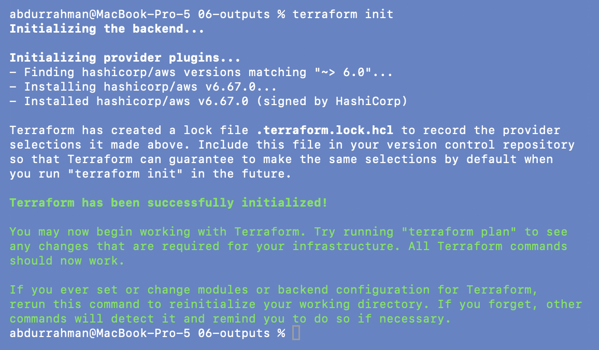
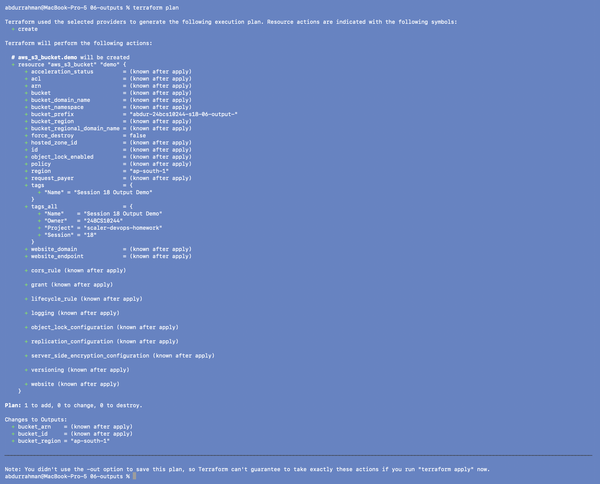
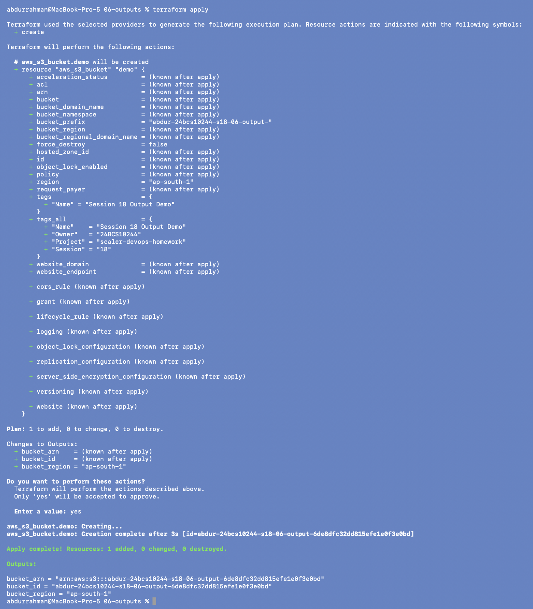
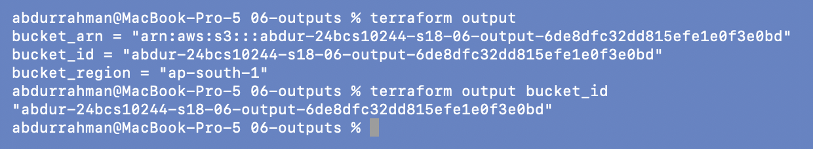
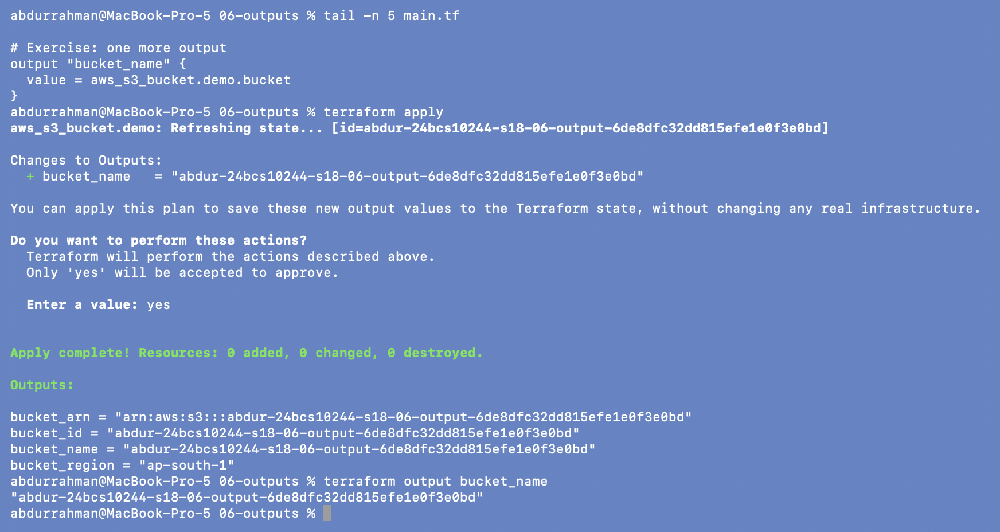
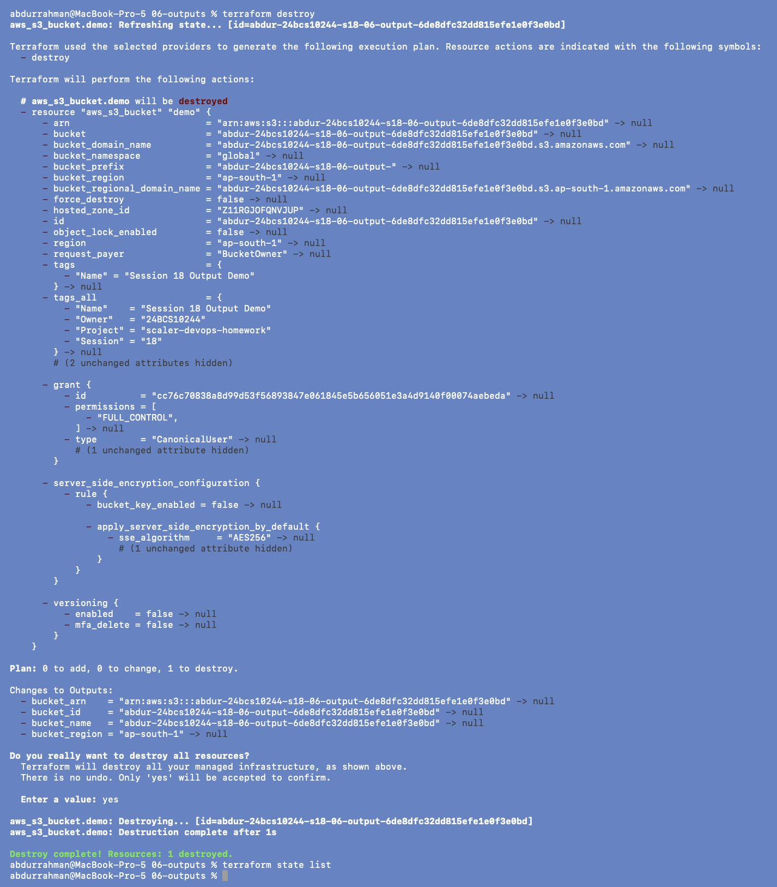

# 06 - Outputs

**Name:** Abdur Rahman Ibne Munir
**Enrollment number:** 24BCS10244

Outputs expose values from a configuration after apply: IDs, ARNs, endpoints. They are
printed at the end of `apply`, stored in state, and readable later with
`terraform output`.

```hcl
output "bucket_id" {
  description = "The S3 bucket ID"
  value       = aws_s3_bucket.demo.id
}

output "bucket_arn" {
  description = "The S3 bucket ARN"
  value       = aws_s3_bucket.demo.arn
}

output "bucket_region" {
  description = "The AWS region"
  value       = "ap-south-1"
}
```

Changes to the lecture `main.tf`: bucket prefix `abdur-24bcs10244-s18-06-output-`,
provider `default_tags`, and the `bucket_name` output from the exercise.

## 1. Init and plan

```bash
terraform init
terraform plan
```




Under `Changes to Outputs:` the plan already knows `bucket_region = "ap-south-1"` (a
constant) while `bucket_id` and `bucket_arn` are `(known after apply)`.

## 2. Apply

```bash
terraform apply
yes
```



All three outputs are printed after `Apply complete!`, matching the notes:
`bucket_arn = "arn:aws:s3:::abdur-24bcs10244-s18-06-output-6de8dfc32dd815efe1e0f3e0bd"`,
`bucket_id = "abdur-24bcs10244-s18-06-output-6de8…"`, `bucket_region = "ap-south-1"`.

## 3. Read outputs

```bash
terraform output
terraform output bucket_id
```



`terraform output` reads the values from state without calling AWS. A single output is
printed as a quoted string; `terraform output -raw bucket_id` would drop the quotes,
which is the form to use in shell scripts. I used `-raw` in
[01](../01-iac-basics/README.md#4-verify) to pass the bucket name to the AWS CLI.

## 4. Exercise: add a `bucket_name` output

```hcl
# Exercise: one more output
output "bucket_name" {
  value = aws_s3_bucket.demo.bucket
}
```

```bash
terraform apply
yes
terraform output bucket_name
```



Adding an output doesn't touch AWS: the plan has no resource changes, only
`Changes to Outputs: + bucket_name`, and Terraform explains it can save the new output
value "without changing any real infrastructure". Result:
`Resources: 0 added, 0 changed, 0 destroyed`, and `bucket_name` is now available.

## 5. Cleanup (added: the notes for this folder have no destroy step)

The notes end after the exercise and leave the bucket running. I added a destroy so
nothing stays in the account:

```bash
terraform destroy
yes
terraform state list
```



`Destroy complete! Resources: 1 destroyed.` All four outputs go to `null` with it.

## Why outputs matter

- **Modules:** a child module's outputs are the only values its parent can use
  (`module.network.vpc_id`).
- **Humans:** IDs, IPs and URLs show up right after apply instead of in the console.
- **Automation / CI/CD:** `terraform output -json` or `-raw` feeds values into scripts,
  Ansible inventories or the next pipeline step.
- **Sharing between stacks:** another configuration can read them through
  `terraform_remote_state`.

## What I understood

- Outputs are part of state. That's why `terraform output` works offline, and why
  `sensitive = true` outputs still sit in plain text in the state file.
- Output values are computed. Anything that depends on AWS (ID, ARN) is unknown until
  apply, while constants are known at plan time.
- An output-only change is a real apply (state is updated), but with zero infrastructure
  changes.
