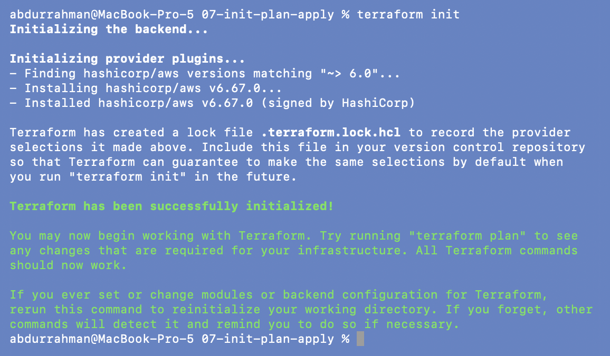
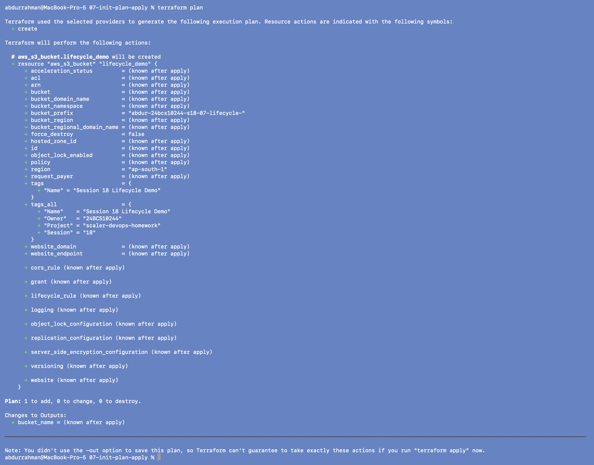
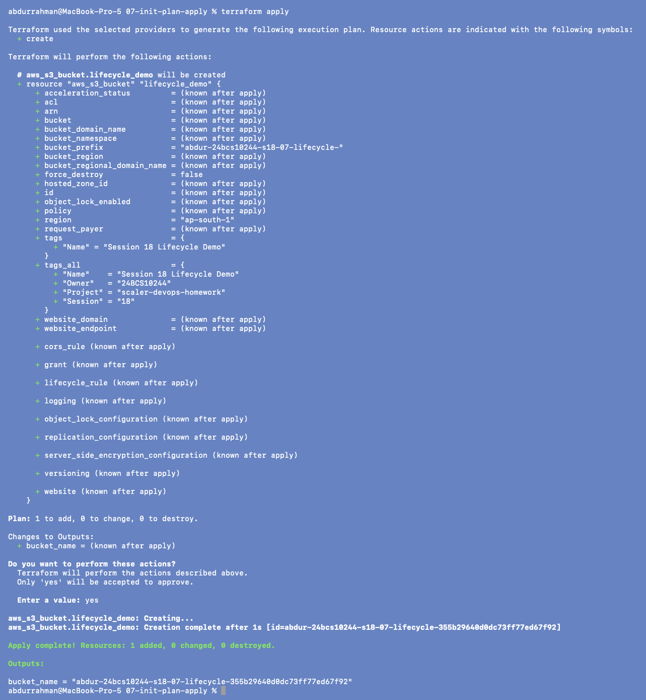
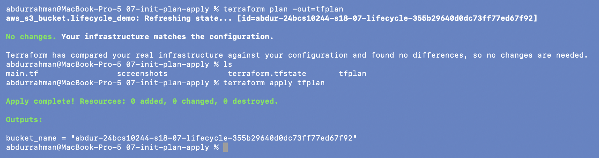
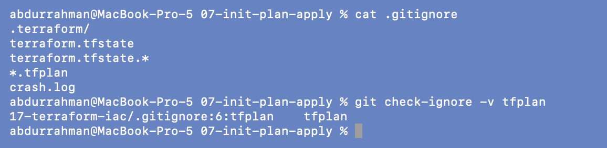
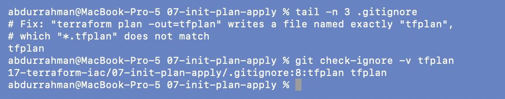
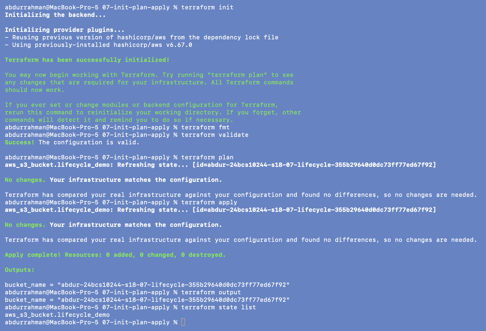
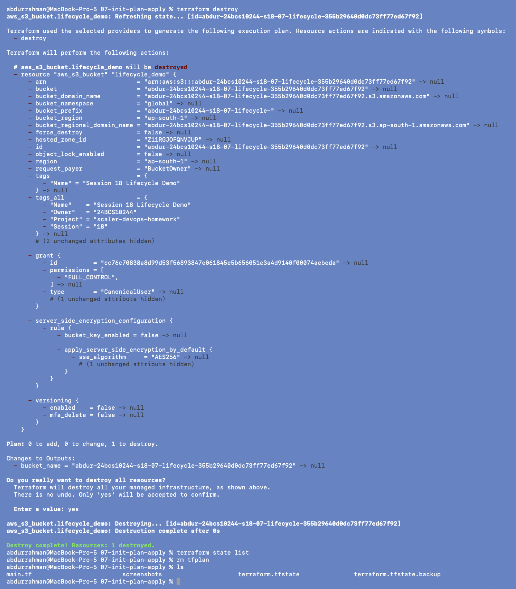

# 07 - Terraform Init, Plan and Apply

**Name:** Abdur Rahman Ibne Munir
**Enrollment number:** 24BCS10244

The core workflow, step by step, on one bucket (`aws_s3_bucket.lifecycle_demo`, prefix
`abdur-24bcs10244-s18-07-lifecycle-`; `default_tags` added as in the other folders).

```text
init  ->  fmt  ->  validate  ->  plan  ->  apply  ->  (output / state list)  ->  destroy
```

## Step 1 - Init

```bash
terraform init
```



Prepares the working directory: installs the provider (v6.67.0), sets up the backend
(local here) and writes the lock file. It's safe to run again; step 6 shows that.

## Steps 2 and 3 - Format and validate

```bash
terraform fmt
terraform validate
```


No output from `fmt` (already formatted) and `Success! The configuration is valid.`
`validate` only checks syntax and internal consistency; it doesn't contact AWS.

## Step 4 - Plan

```bash
terraform plan
```



Plan symbols: `+` create, `~` update in place, `-` destroy, `-/+` replace. A new bucket
is all `+`: `Plan: 1 to add, 0 to change, 0 to destroy.` The note at the bottom says
that without `-out` Terraform can't guarantee that a later `apply` will do exactly this.

## Step 5 - Apply

```bash
terraform apply
yes
```



Same lines as the notes: `aws_s3_bucket.lifecycle_demo: Creating...`,
`Creation complete after 1s`, `Apply complete! Resources: 1 added`, and
`bucket_name = "abdur-24bcs10244-s18-07-lifecycle-355b29640d0dc73ff77ed67f92"`.

## Saved plan

```bash
terraform plan -out=tfplan
ls
terraform apply tfplan
```



The bucket already matched the code, so the saved plan is "No changes", and applying it
does nothing (`0 added, 0 changed, 0 destroyed`). Note what's different:
`terraform apply tfplan` **did not ask for `yes`**. The reviewed plan file *is* the
approval, which is why CI pipelines run `plan -out` in one job and `apply <file>` in a
later, approved job. `ls` shows the binary plan file `tfplan` next to the state.

### Problem found: `tfplan` is not covered by this folder's `.gitignore`

```bash
cat .gitignore
git check-ignore -v tfplan
```



**Root cause.** The folder's `.gitignore` has `*.tfplan`, which matches files *ending in*
`.tfplan` (e.g. `prod.tfplan`). The notes' own command `terraform plan -out=tfplan`
writes a file named exactly `tfplan`, with no extension, so the pattern doesn't match.
`git check-ignore` shows it was only ignored because of my session-level
`17-terraform-iac/.gitignore`, which lists `tfplan`. On its own, this folder would let a
plan file into a commit, and plan files can contain sensitive values.

**Fix.** Add `tfplan` to the folder's `.gitignore`, with a comment:

```bash
tail -n 3 .gitignore
git check-ignore -v tfplan
```



Now the match comes from `07-init-plan-apply/.gitignore:8:tfplan`.

## Student exercise: the complete sequence

```bash
terraform init
terraform fmt
terraform validate
terraform plan
terraform apply
terraform output
terraform state list
```



Running the whole sequence a second time shows that Terraform is **idempotent**. `init`
reuses the locked provider version, `plan` and `apply` both say
`No changes. Your infrastructure matches the configuration.`, and `apply` doesn't even
ask for `yes` because there's nothing to approve. `output` and `state list` show the same
bucket as before.

## Cleanup (added: the notes for this folder have no destroy step)

```bash
terraform destroy
yes
terraform state list
rm tfplan
ls
```



The bucket is destroyed, state is empty, and I deleted the leftover `tfplan` file.

## What I understood

- `init` prepares, `validate` checks the code, `plan` compares code + state + reality,
  and `apply` makes reality match the code. Running them again with no changes does
  nothing.
- A saved plan turns "plan" and "apply" into two separate, reviewable steps; applying it
  needs no prompt, because the plan file is the approval.
- `.gitignore` patterns are literal about names: `*.tfplan` and `tfplan` are different
  files, and checking with `git check-ignore -v` is better than assuming.
