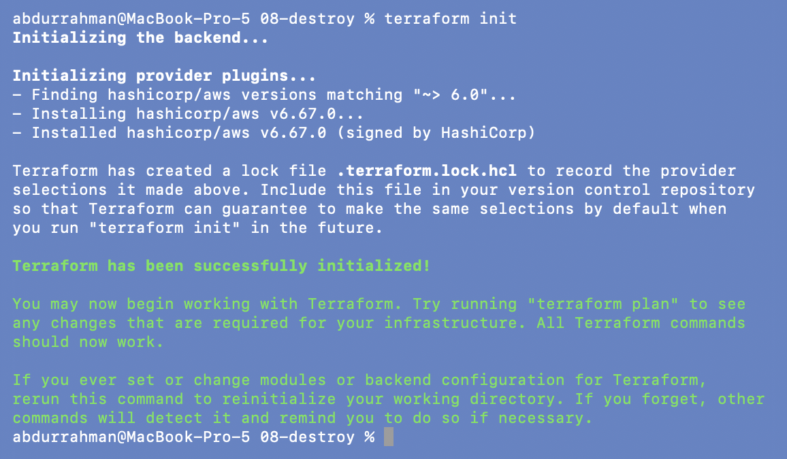
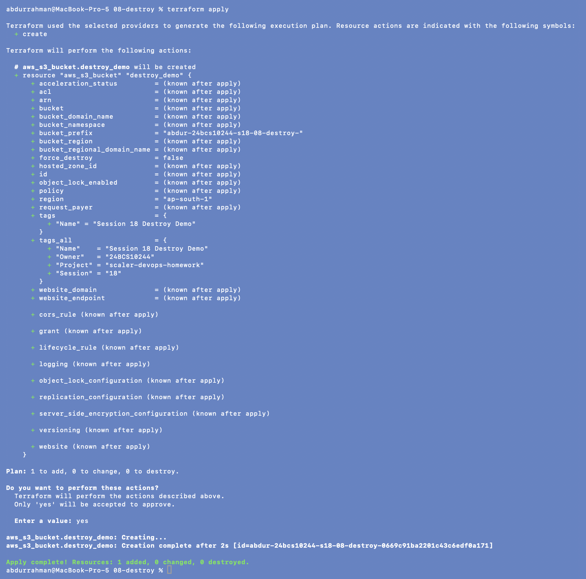
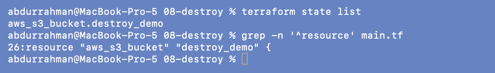
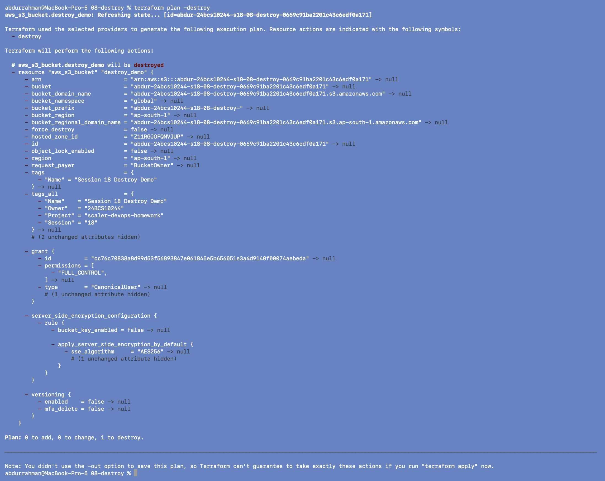
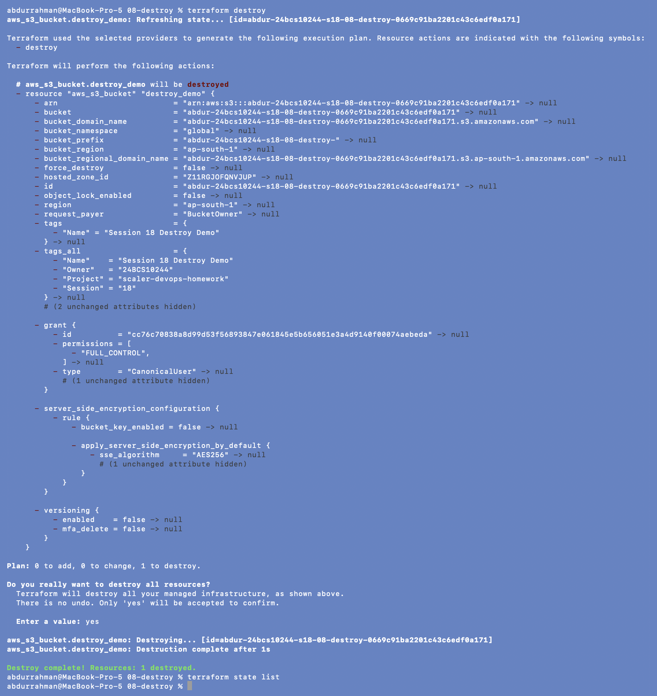

# 08 - Terraform Destroy

**Name:** Abdur Rahman Ibne Munir
**Enrollment number:** 24BCS10244

`terraform destroy` removes everything the current state manages. Internally it is a
plan in destroy mode, followed by an approval, followed by the deletions.

`main.tf` is the lecture file (resource `aws_s3_bucket.destroy_demo`) with my bucket
prefix `abdur-24bcs10244-s18-08-destroy-` and `default_tags`.

## Setup (added: the notes start at "Before Destroy")

The notes go straight to `terraform state list` and expect a resource to be there, but
nothing in this folder had been created yet. I added `init` and `apply` first so there was
something to destroy:

```bash
terraform init
terraform apply
yes
```




One bucket created: `abdur-24bcs10244-s18-08-destroy-0669c91ba2201c43c6edf0a171`.

## Before destroy

```bash
terraform state list
grep -n '^resource' main.tf
```



### Problem found: the README uses the wrong resource name

The notes expect `aws_s3_bucket.lifecycle_demo` (here and in every destroy example), but
the state shows **`aws_s3_bucket.destroy_demo`**.

**Root cause.** The README text was copied from folder 07, whose resource *is* called
`lifecycle_demo`; this folder's `main.tf` (line 26) names it `destroy_demo`. The code is
fine; the README is wrong. **Fix:** no code change needed. I used the real address
everywhere below. If I had copied `terraform state show aws_s3_bucket.lifecycle_demo`
from the notes, it would fail with "No instance found for the given address"
(the same error is shown in the
[S3 demo](../terraform-s3-demo/README.md#problem-found-the-readme-uses-a-resource-name-that-doesnt-exist)).

## Inspect the destroy plan first

The notes warn: always run `terraform plan -destroy` before `terraform destroy`.

```bash
terraform plan -destroy
```



`# aws_s3_bucket.destroy_demo will be destroyed`, every attribute going `-> null`, and
`Plan: 0 to add, 0 to change, 1 to destroy.` Nothing is deleted yet; this is the step to
review, and the step to stop at if the list contains something unexpected.

## Destroy

```bash
terraform destroy
yes
terraform state list
```



Terraform printed the same destroy plan, asked "Do you really want to destroy all
resources? There is no undo.", and after `yes`:
`aws_s3_bucket.destroy_demo: Destroying...`, `Destruction complete after 1s`,
`Destroy complete! Resources: 1 destroyed.` The empty `state list` confirms Terraform
manages nothing here anymore.

## Practice questions

1. **What is the difference between `plan` and `apply`?** `plan` only computes and shows
   the changes; it never modifies anything. `apply` computes the same plan (or uses a
   saved one) and then executes it against AWS.
2. **What does `destroy` do?** It plans the deletion of every resource in the current
   state (dependencies in reverse order), asks for confirmation and deletes them. It only
   touches what is in *this* state; other resources in the account are never touched.
3. **Why run `plan -destroy` before deleting production infrastructure?** `destroy` is
   irreversible: a deleted database or bucket is gone. `plan -destroy` shows exactly what
   would be deleted, so a wrong workspace, a wrong state file or an unexpectedly large
   resource list is caught before anything happens. The plan can also be saved
   (`plan -destroy -out=…`) and reviewed by someone else.

## What I understood

- Destroy is just a plan where the desired state is "nothing".
- The resource address in the README must match the code; `terraform state list` is the
  quick way to see the real addresses.
- An S3 bucket can only be deleted when it is empty. These buckets were empty, so the
  destroy took about a second. For buckets with objects, Terraform needs
  `force_destroy = true` (the S3 demo uses it).
