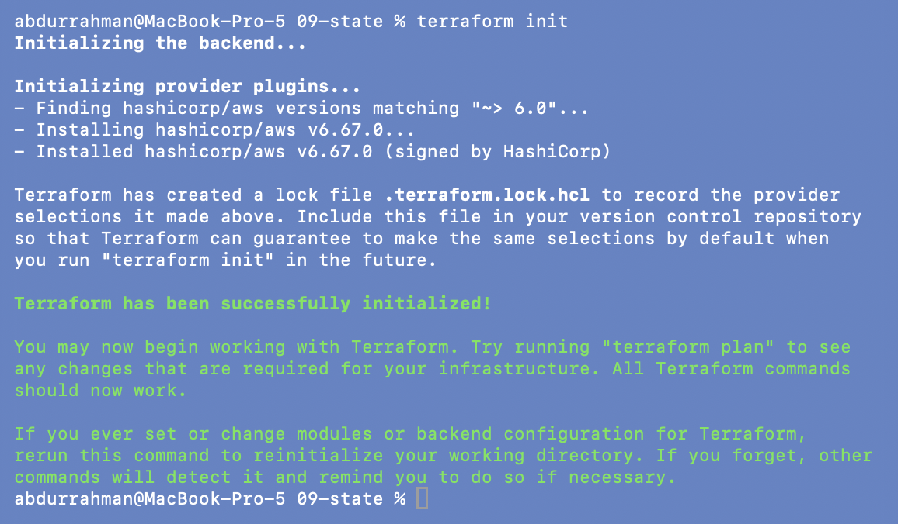
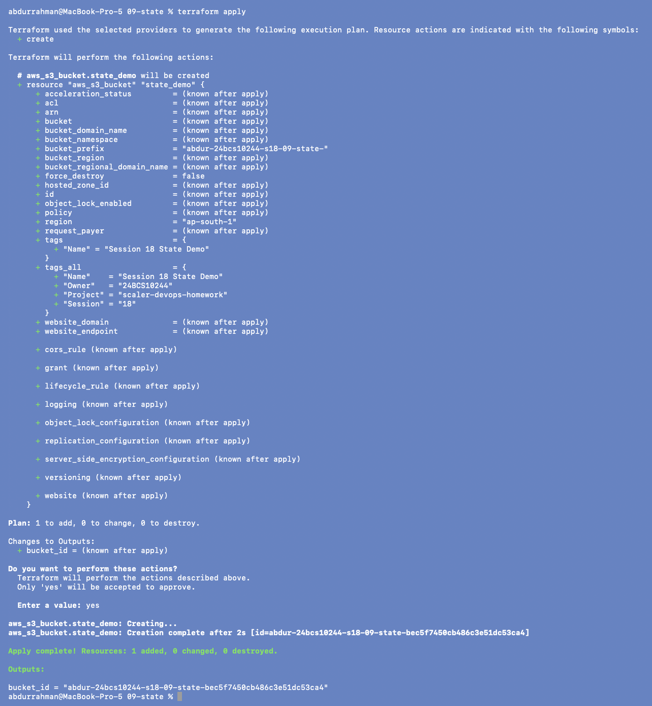
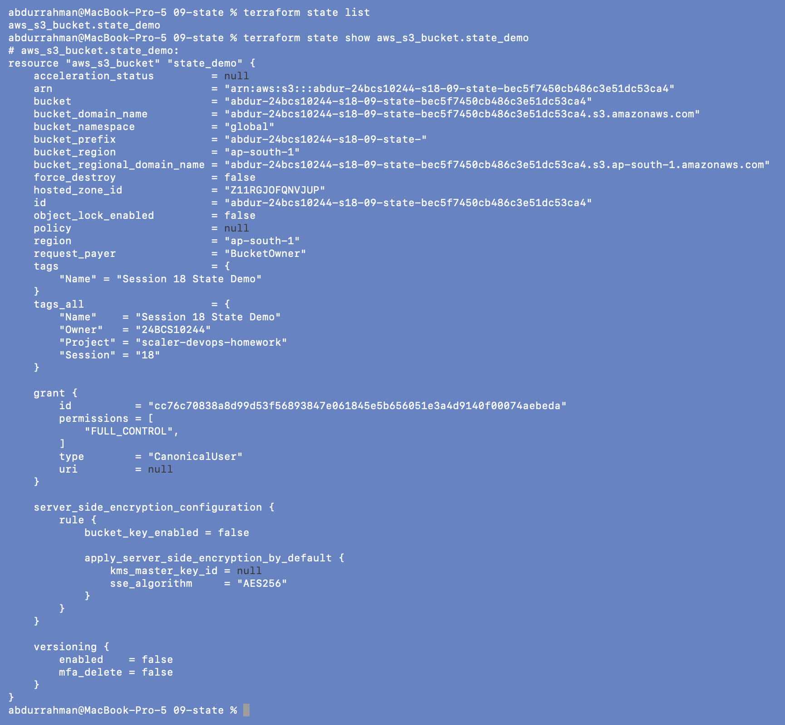
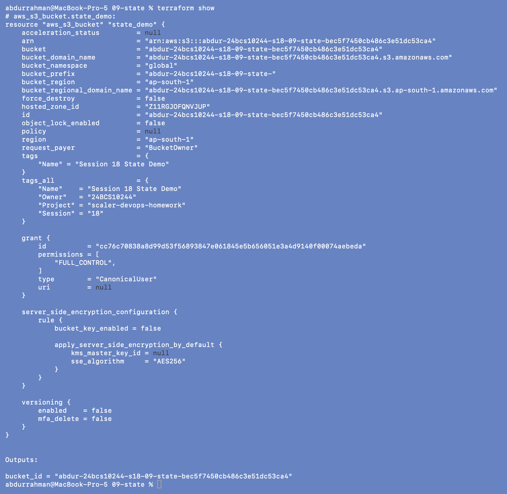
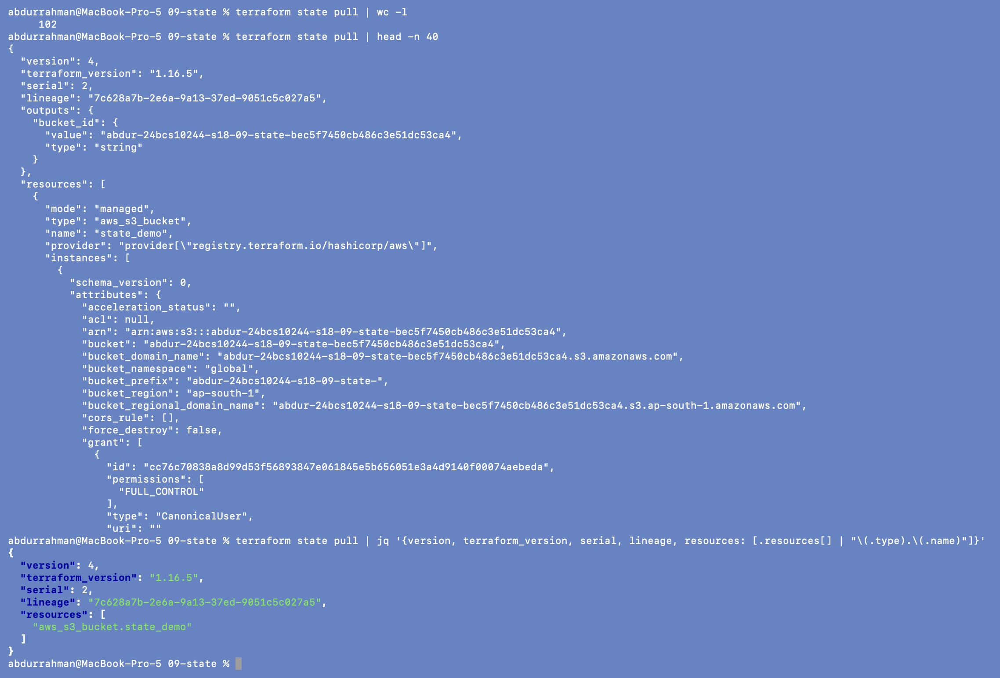
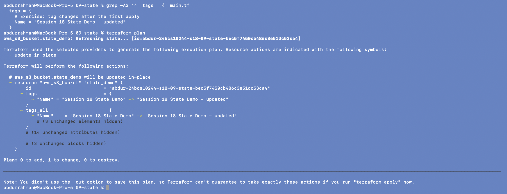
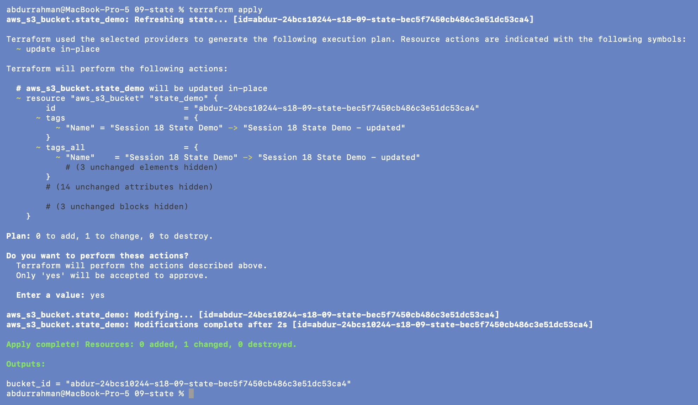
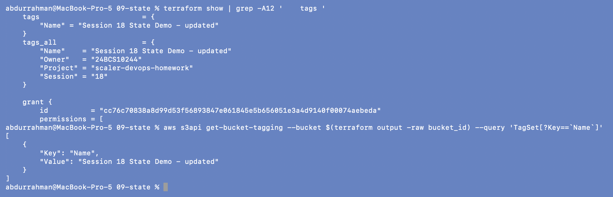
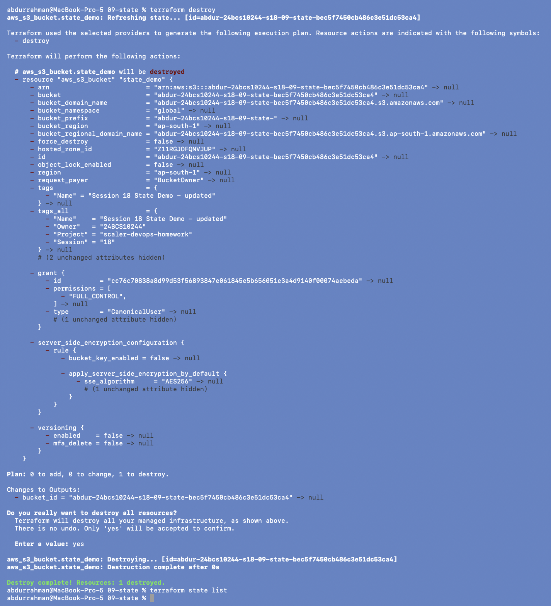

# 09 - Terraform State

**Name:** Abdur Rahman Ibne Munir
**Enrollment number:** 24BCS10244

State is Terraform's record of what it manages. It maps each resource **address** in the
code (`aws_s3_bucket.state_demo`) to a **real object** in AWS (bucket
`abdur-24bcs10244-s18-09-state-…`), and stores the attributes it last saw. Locally it
lives in `terraform.tfstate`.

```text
main.tf  --(desired)-->  Terraform  <--(recorded)-->  terraform.tfstate
                             |
                             v
                      AWS (real world)
```

`main.tf` is the lecture file with my bucket prefix and `default_tags`, plus the tag
change from the exercise.

## 1. Create infrastructure

```bash
terraform init
terraform apply
yes
```




`bucket_id = "abdur-24bcs10244-s18-09-state-bec5f7450cb486c3e51dc53ca4"`.

## 2. Inspect state

```bash
terraform state list
terraform state show aws_s3_bucket.state_demo
```



`state list` prints the address, as the notes expect. `state show` prints **one**
resource from state, with the values the notes mention (`arn`, `bucket`, `id`) plus
everything else the provider recorded.

```bash
terraform show
```



`terraform show` prints the **whole** state in readable form: here the single resource
and the `Outputs:` section, which `state show` doesn't include.

## 3. State pull

```bash
terraform state pull | wc -l
terraform state pull | head -n 40
terraform state pull | jq '{version, terraform_version, serial, lineage, resources: [.resources[] | "\(.type).\(.name)"]}'
```



`terraform state pull` prints the raw JSON state. It is 102 lines, too long for one
screenshot, so I show the first 40 lines and then a `jq` summary of the important
top-level fields:

- `version: 4`: the state file format;
- `terraform_version: "1.16.5"`: the Terraform version that wrote it;
- `serial: 2`: increases on every write, so Terraform can tell an old copy from a new one;
- `lineage`: a random ID created with the state, to stop two unrelated states being
  mixed up;
- `resources`: the list of managed objects (only `aws_s3_bucket.state_demo`).

## 4. Exercise: change a tag, plan, apply, show

The exercise starts with apply → state list → state show, which is exactly sections 1-2,
so I continued from there. I did the exercise **before** the cleanup so the bucket only
had to be created once (the notes list the cleanup first).

I changed the `Name` tag in `main.tf` to `"Session 18 State Demo - updated"`:

```bash
grep -A3 '^  tags = {' main.tf
terraform plan
```



This time the symbol is `~`: `aws_s3_bucket.state_demo will be updated in-place`, with
only `"Name" = "Session 18 State Demo" -> "Session 18 State Demo - updated"` changing
(in `tags` and in `tags_all`), and `Plan: 0 to add, 1 to change, 0 to destroy`.
Terraform compared the new code with the state and found exactly one difference.

```bash
terraform apply
yes
```



`Modifying... Modifications complete after 2s`, `0 added, 1 changed, 0 destroyed`. The
bucket wasn't recreated (same ID), because tags can be changed in place.

```bash
terraform show | grep -A12 '    tags '
aws s3api get-bucket-tagging --bucket $(terraform output -raw bucket_id) --query 'TagSet[?Key==`Name`]'   # added
```



The state now holds the new tag, and AWS agrees.

## 5. Cleanup

```bash
terraform destroy
yes
terraform state list
```



`Destroy complete! Resources: 1 destroyed.` and `state list` prints nothing: "No managed
resources should remain."

## Security and handling rules (from the notes)

- **Never commit `terraform.tfstate` / `terraform.tfstate.*`.** State holds every
  attribute of every resource, including passwords and keys when a resource has them,
  in plain text. The folder's `.gitignore` covers it.
- **Never edit state by hand.** Use `terraform state list / show / mv / rm` and
  `terraform import` when state operations are really needed.
- **Refresh is automatic.** Modern Terraform refreshes state during `plan`, `apply` and
  `destroy` (the `Refreshing state... [id=...]` lines in the screenshots above).
- For teams, state goes in a **remote backend** (for example S3 with locking) so
  everyone works against the same copy and two applies can't run at once.

## What I understood

- Code says what I want; state says what Terraform believes exists; refresh checks that
  belief against AWS. A plan is the difference.
- `state show` is one resource, `show` is the whole state with outputs, and
  `state pull` is the raw JSON underneath.
- `serial` and `lineage` are how Terraform avoids overwriting a newer state with an older
  one, which matters as soon as state is shared.
- Some changes can be made in place (tags) and some force replacement (bucket name). The
  plan symbol (`~` or `-/+`) tells which before anything happens.
