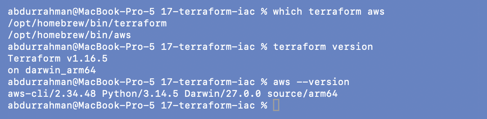
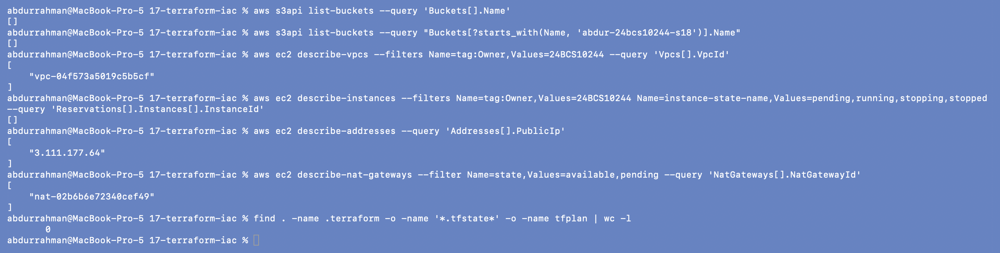

# Terraform and Infrastructure as Code

**Name:** Abdur Rahman Ibne Munir
**Enrollment number:** 24BCS10244

Class session 18. Lecture material: [`session18-terraform-iac`](https://github.com/Nency-Ravaliya/devops-heros/tree/main/session18-terraform-iac)
in the course repo. I worked through all nine lecture folders in order (IaC basics,
architecture, providers, resources, variables, outputs, init/plan/apply, destroy, state).
For Task 1 I ran the full Terraform workflow on the lecture's S3 demo, fixing what didn't
fit, and for Task 2 I wrote a research page for each AWS service, with a few read-only
AWS CLI calls against my own account to make each page concrete. Every command was typed
in a real terminal on my Mac against a real AWS account, and every screenshot is that
terminal. Everything Terraform created was an empty S3 bucket (free), and every one was
destroyed right after its screenshots; the last screenshot on this page shows the account
afterwards.

## Homework tasks → where they are

| Task | What was asked | Where |
|---|---|---|
| 1 | Terraform S3 demo: `main.tf`, `variables.tf`, `outputs.tf`, `provider.tf`, `terraform.tfvars`, `README.md`; run and document `init`, `fmt`, `validate`, `plan`, `apply`, `show`, `output`, `destroy` | [`terraform-s3-demo/`](terraform-s3-demo/README.md) |
| 2 | IAM: users, groups, roles, policies, permissions, least privilege, best practices, use cases | [`aws-services/01-iam/`](aws-services/01-iam/README.md) |
| 2 | EC2: AMI, instance types, key pairs, security groups, EBS, public vs private IP, lifecycle, use cases | [`aws-services/02-ec2/`](aws-services/02-ec2/README.md) |
| 2 | S3: buckets, objects, storage classes, versioning, lifecycle, encryption, bucket policies, use cases | [`aws-services/03-s3/`](aws-services/03-s3/README.md) |
| 2 | VPC: CIDR, subnets, route tables, IGW, NAT GW, security groups, NACLs, public vs private subnets | [`aws-services/04-vpc/`](aws-services/04-vpc/README.md) |
| 2 | DynamoDB (NoSQL, tables, items, attributes, partition/sort key) and RDS (engines, instances, security, backups, Multi-AZ, read replicas) | [`aws-services/05-dynamodb-rds/`](aws-services/05-dynamodb-rds/README.md) |
| lecture | the nine lecture folders, every README command run in order | `01-…` to `09-…` below |

### Task 1: every required command and where it is shown

| Command | Task 1 | Also in the lecture folders |
|---|---|---|
| `terraform init` | [step 1](terraform-s3-demo/README.md#1-terraform-init-lecture-files-as-written) | all nine folders |
| `terraform fmt` | [step 2](terraform-s3-demo/README.md#2-terraform-fmt-and-terraform-validate-as-written) | [01](01-iac-basics/README.md), [04](04-resources/README.md#6-exercise-add-tags-fmt-plan) (fmt actually rewriting a file) |
| `terraform validate` | [step 2](terraform-s3-demo/README.md#2-terraform-fmt-and-terraform-validate-as-written) | [01](01-iac-basics/README.md), [07](07-init-plan-apply/README.md) |
| `terraform plan` | [step 3](terraform-s3-demo/README.md#3-terraform-plan) | [05](05-variables/README.md) (variables), [07](07-init-plan-apply/README.md#saved-plan) (saved plan), [09](09-state/README.md#4-exercise-change-a-tag-plan-apply-show) (in-place update) |
| `terraform apply` | [step 4](terraform-s3-demo/README.md#4-terraform-apply) | every folder except 05 |
| `terraform show` | [step 6](terraform-s3-demo/README.md#6-terraform-show) | [02](02-terraform-architecture/README.md), [04](04-resources/README.md), [09](09-state/README.md) |
| `terraform output` | [step 7](terraform-s3-demo/README.md#7-terraform-output) | [06](06-outputs/README.md) |
| `terraform destroy` | [step 9](terraform-s3-demo/README.md#9-destroy) | every folder that applied; [08](08-destroy/README.md) is about it |

## Folder structure

```text
17-terraform-iac/
├── 01-iac-basics/              main.tf                                   lecture 01
├── 02-terraform-architecture/  main.tf                                   lecture 02
├── 03-providers/               main.tf  (+ aws configure list / sts)     lecture 03
├── 04-resources/               main.tf  (+ tags exercise)                lecture 04
├── 05-variables/               main.tf, terraform.tfvars(.example)       lecture 05 (plan only)
├── 06-outputs/                 main.tf  (+ bucket_name output)           lecture 06
├── 07-init-plan-apply/         main.tf  (+ saved plan)                   lecture 07
├── 08-destroy/                 main.tf                                   lecture 08
├── 09-state/                   main.tf  (+ tag-change exercise)          lecture 09
├── terraform-s3-demo/          provider.tf, variables.tf, terraform.tfvars,
│                               main.tf, outputs.tf                       Task 1
├── aws-services/
│   ├── 01-iam/  02-ec2/  03-s3/  04-vpc/  05-dynamodb-rds/               Task 2
├── screenshots/                tool versions, final cleanup check
├── .gitignore                  .terraform/, *.tfstate*, *.tfplan, tfplan, crash logs
└── README.md
```

Each Terraform folder keeps its `.terraform.lock.hcl` (the pinned provider version) and
a `.gitignore`; each folder has a `screenshots/` directory, and its README walks through
them in order (84 screenshots in total). `.terraform/` directories and state files were
deleted at the end; every state was empty by then.

## Setup

The lecture's top-level notes only link to the install guides for Terraform and the AWS
CLI. Both were already installed with Homebrew:

```bash
which terraform aws
terraform version
aws --version
```



Terraform **v1.16.5** and AWS CLI **v2.34.48** on macOS (Apple Silicon). The AWS CLI
was already configured; see [03-providers](03-providers/README.md#1-authentication) for
why I used `aws configure list` and `aws sts get-caller-identity` instead of
`aws configure`.

## Environment and deviations from the notes

- **AWS account and region.** Everything ran as IAM user `homework-terraform` in account
  `187004426521`, region **ap-south-1** only (all lecture code already uses it).
- **Bucket names.** S3 names are global. Every bucket I created starts with
  `abdur-24bcs10244-s18-` (for example `abdur-24bcs10244-s18-01-basics-<generated>`
  instead of `session18-iac-<generated>`, and `abdur-24bcs10244-s18-s3-demo` instead of
  the taken `yatri1107`), so they can be recognised and verified gone.
- **Tags.** Every provider block got `default_tags` with `Project =
  "scaler-devops-homework"`, `Session = "18"`, `Owner = "24BCS10244"`, marked with a
  comment.
- **Destroy right away.** Each folder's resources were destroyed as soon as its
  screenshots were taken, including **06 and 07, whose notes have no destroy step** (I
  added one) and 08, whose notes have no create step (I added init + apply). In 09 I did
  the exercise before the cleanup so the bucket was only created once.
- **`aws configure` → `aws configure list` + `aws sts get-caller-identity`**, so no keys
  appear on screen.
- **Provider cache.** `TF_PLUGIN_CACHE_DIR` was set in my terminal, so the ~750 MB AWS
  provider was downloaded once and linked into each folder's `.terraform/`. That's why
  init is quick after the first folder.
- **AWS CLI pager.** `AWS_PAGER` was empty in my terminal so the CLI prints straight to
  the terminal instead of opening `less`.
- **Long output.** `terraform state pull` (102 lines) and `describe-instance-types`
  (113 lines) don't fit one screenshot, so I showed them with `head` plus a summary
  (`jq` / `--query`); the full commands are in the screenshots.
- **Echoed type-ahead.** In a few screenshots (01, 02, 03, 04, 05) the next command, or
  `yes`, appears echoed in the middle of the previous command's output. I typed it while
  Terraform was still busy; the terminal echoed it at once and ran it afterwards, in
  order.
- **Other agents' resources.** This AWS account was also used by other parts of the
  homework at the same time. The only non-default network resources I saw belong to
  session 21 (tagged `Session = 21`), and I didn't touch them.

## Problems found in the lecture material

| Where | What happened | Fix |
|---|---|---|
| s3-demo `variables.tf` | default bucket `yatri1107` is already taken (`head-bucket` → 403) | my own name in a new `terraform.tfvars` ([details](terraform-s3-demo/README.md#problem-1-the-default-bucket-name-belongs-to-someone-else)) |
| s3-demo | homework needs `provider.tf` + `terraform.tfvars`; lecture has `terraform.tf` + `providers.tf`, no tfvars | merged into `provider.tf`, created tfvars ([details](terraform-s3-demo/README.md#problems-2-and-3-missing-terraformtfvars-and-providertf-vs-providerstf--terraformtf)) |
| s3-demo `.gitignore` | `*.tfvars` hides the `terraform.tfvars` deliverable | `!terraform.tfvars` ([details](terraform-s3-demo/README.md#problem-4-the-folders-gitignore-would-hide-terraformtfvars)) |
| s3-demo README | uses `aws_s3_bucket.demo` / bucket `demo`; code has `aws_s3_bucket.devops553` → "No instance found"; `head-bucket --bucket demo` hits someone else's bucket (403) | used the real address and `terraform output -raw bucket_name` ([details](terraform-s3-demo/README.md#problem-found-the-readme-uses-a-resource-name-that-doesnt-exist)) |
| s3-demo `main.tf` | resource tag `Project = "Session18"` overrides the default `Project` tag | removed, with a comment |
| s3-demo `outputs.tf` | `type = string` inside `output` blocks looked invalid | **not a bug** on Terraform 1.16.5: validate passes and the type is enforced ([details](terraform-s3-demo/README.md#2-terraform-fmt-and-terraform-validate-as-written)); file unchanged |
| 07 `.gitignore` | `*.tfplan` doesn't match the file `tfplan` that `plan -out=tfplan` creates | added `tfplan` ([details](07-init-plan-apply/README.md#problem-found-tfplan-is-not-covered-by-this-folders-gitignore)) |
| 08 README | refers to `aws_s3_bucket.lifecycle_demo`; `main.tf` has `destroy_demo` | used `destroy_demo` ([details](08-destroy/README.md#problem-found-the-readme-uses-the-wrong-resource-name)) |
| 06, 07 | no destroy step, so the bucket would stay up | added `terraform destroy` |
| 08 | starts at "Before Destroy" with nothing created | added `init` + `apply` first |
| 01, 02 | no `.gitignore` (03-09 have one) | added the same one |

## Cleanup verification

After the last destroy, and after deleting the local `.terraform/` folders and empty
state files, I checked the account from this folder:

```bash
aws s3api list-buckets --query 'Buckets[].Name'
aws s3api list-buckets --query "Buckets[?starts_with(Name, 'abdur-24bcs10244-s18')].Name"
aws ec2 describe-vpcs --filters Name=tag:Owner,Values=24BCS10244 --query 'Vpcs[].VpcId'
aws ec2 describe-instances --filters Name=tag:Owner,Values=24BCS10244 Name=instance-state-name,Values=pending,running,stopping,stopped --query 'Reservations[].Instances[].InstanceId'
aws ec2 describe-addresses --query 'Addresses[].PublicIp'
aws ec2 describe-nat-gateways --filter Name=state,Values=available,pending --query 'NatGateways[].NatGatewayId'
find . -name .terraform -o -name '*.tfstate*' -o -name tfplan | wc -l
```



- **S3: `[]`**. There are no buckets at all in the account, so all nine buckets from this
  session (01-04, 06-09, plus the Task 1 bucket; 05 never created one) are gone.
- **EC2 instances: `[]`**. This session never created any.
- The VPC `vpc-04f573a5019c5b5cf`, the Elastic IP `3.111.177.64` and the NAT gateway
  `nat-02b6b6e72340cef49` are **not from this session**. Their tags say `Session = 21`
  and `Name = taskboard-vpc…`: they belong to the final-project stack (folder
  `20-final-devops-project`), which was running in the same account at the same time. I
  only read them, and they are reported to be cleaned up with that project.
- Locally: no `.terraform/`, state or plan files are left (`0`).

## Pending: needs the student

Nothing in this session needs another remote step: no registry, GitHub or extra AWS
work. The folder only needs to be committed and pushed with the rest of the repo.

## What I understood

- IaC turns infrastructure into reviewable, repeatable code. `plan` is the safety net
  that shows exactly what will change before anything does.
- Terraform is a CLI plus provider plugins plus **state**. State maps each resource
  address to a real object, and every plan is "code vs state vs reality".
- Variables and tfvars separate *what stays the same* from *what changes per
  environment*; outputs expose results to people and automation; `default_tags` and
  naming conventions make resources findable and easy to clean up.
- Destroy is a normal part of the workflow, not an afterthought. Running
  `plan -destroy`, checking `state list` and verifying from the cloud side (`head-bucket`
  → 404) is how you know something is really gone, and in a pay-per-use account that
  matters as much as creating it.
