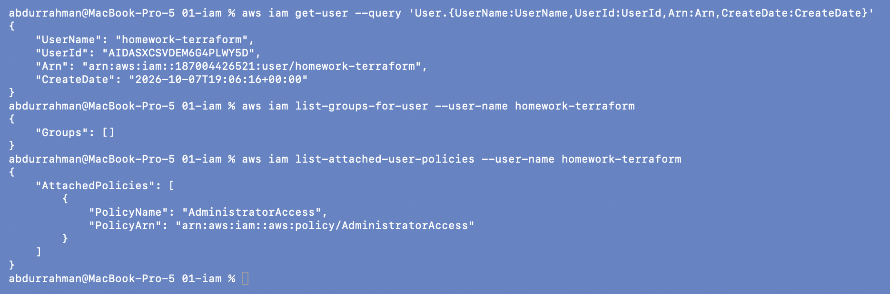

# AWS IAM (Identity and Access Management)

**Name:** Abdur Rahman Ibne Munir
**Enrollment number:** 24BCS10244

Session 18, Task 2 (AWS services research). Written in my own words. The CLI examples
at the end are read-only calls against my homework AWS account; nothing was created.

## What IAM is

IAM is the AWS service that answers two questions for every single API call:

1. **Authentication:** *who* is making this request? (a user with an access key, a role
   with temporary credentials, the root user, ...)
2. **Authorization:** is that identity *allowed* to do this action on this resource?

Every click in the console and every `aws ...` or Terraform call is an API request, and
IAM checks it before anything happens. IAM is global (not tied to a region) and has no
extra cost.

```text
request: "s3:CreateBucket on arn:aws:s3:::my-bucket"
     |
     v
 who is it?  ──>  user / role (credentials checked)
     |
     v
 which policies apply?  ──>  identity policies + resource policies + boundaries + SCPs
     |
     v
 explicit Deny anywhere?  ──yes──>  DENIED
     |no
 an Allow that matches?  ──no───>  DENIED (default)
     |yes
   ALLOWED
```

The default answer is **deny**. Nothing is allowed until a policy allows it, and an
explicit `Deny` always wins over any `Allow`.

## The building blocks

### Root user

The email address that created the account. It can do everything, including closing the
account and changing billing, and it cannot be restricted by IAM policies. It should be
protected with MFA and not used for daily work.

### Users

An IAM user is a long-lived identity for one person or one application. It can have:

- a console password (for people), and/or
- up to two access keys (`AKIA...` key ID + secret) for the CLI/SDKs.

The CLI and Terraform in this homework run as the IAM user `homework-terraform`, not as
root (see the CLI example below).

### Groups

A group is a collection of users. Policies attached to a group apply to every member, so
permissions are managed per job function instead of per person:

```text
Group "developers"  ──>  policy: read S3, deploy to dev
   ├── alice
   └── bob
Group "admins"      ──>  policy: AdministratorAccess
   └── carol
```

Groups can't be nested, and a group is not an identity: you can't log in as a group or
name it as a principal in a policy.

### Roles

A role is an identity with permissions but **no long-term credentials**. Something
*assumes* the role and receives temporary credentials (from AWS STS) that expire after a
set time, usually 1 hour.

Who can assume it is defined by the role's **trust policy**. Typical cases:

- an EC2 instance (through an instance profile) that needs to read from S3
- a Lambda function or an EKS pod (IRSA / Pod Identity)
- a user from another AWS account (cross-account access)
- a CI/CD pipeline such as GitHub Actions (OIDC federation, no stored keys)
- people logging in through SSO (IAM Identity Center)

Roles are preferred over users with access keys because nothing long-lived can leak.

### Policies

A policy is a JSON document that lists permissions. Each statement has:

| Field | Meaning | Example |
|---|---|---|
| `Effect` | `Allow` or `Deny` | `"Allow"` |
| `Action` | API actions | `"s3:GetObject"`, `"ec2:Describe*"` |
| `Resource` | which ARNs | `"arn:aws:s3:::reports-bucket/*"` |
| `Condition` (optional) | extra checks | source IP, MFA present, tag values, region |

```json
{
  "Version": "2012-10-17",
  "Statement": [
    {
      "Effect": "Allow",
      "Action": ["s3:GetObject", "s3:PutObject"],
      "Resource": "arn:aws:s3:::reports-bucket/*"
    }
  ]
}
```

Kinds of policies:

| Kind | Attached to | Notes |
|---|---|---|
| AWS managed | users, groups, roles | written by AWS, e.g. `AdministratorAccess`, `AmazonS3ReadOnlyAccess` |
| Customer managed | users, groups, roles | written by me, reusable, versioned |
| Inline | one user/group/role | embedded in that identity, deleted with it |
| Resource-based | a resource (S3 bucket, SQS queue, KMS key) | has a `Principal` field; can grant cross-account access |
| Trust policy | a role | resource-based policy that says who may assume the role |
| Permissions boundary | a user or role | the *maximum* permissions it can ever get |
| SCP (Organizations) | an account or OU | guardrails for whole accounts |

### Permissions

The *effective* permission is the result of evaluating all of the above together:

- start from deny
- an explicit `Deny` in any policy ends it
- otherwise there must be an `Allow` in an identity or resource policy
- and the action must also be inside any boundary or SCP that applies

So attaching an `Allow` is necessary but not always sufficient.

## Least privilege

Give each identity only the actions and resources it needs for its job, and nothing
more. In practice:

- start narrow (specific actions, specific ARNs) and widen only when something fails,
  rather than starting with `*` and trying to trim later
- use conditions (e.g. only in `ap-south-1`, only resources tagged `Project=x`)
- use IAM Access Analyzer to generate a policy from what a role actually used
- review and remove permissions that are never used (last-accessed info)

My own setup is a good counter-example: `homework-terraform` has `AdministratorAccess`
because Terraform in this course creates many different kinds of resources. For a real
team I would give a Terraform CI role only the services it manages, and limit it to one
region and to resources carrying our tags.

## Best practices

1. Lock away the root user: MFA on, no access keys, use it only for the few tasks that
   need it.
2. Use roles and temporary credentials wherever possible (EC2 instance profiles, OIDC for
   CI, SSO for people) instead of long-lived access keys.
3. If access keys are unavoidable, rotate them, never commit them to Git, never put them
   in Terraform code or tfvars (the lecture makes the same point for the provider block).
4. Enable MFA for every human user.
5. Manage permissions through groups (or SSO permission sets), not per user.
6. Follow least privilege and review it regularly.
7. Use a strong password policy.
8. Turn on CloudTrail so every API call is logged and can be audited.
9. Separate environments into separate accounts (AWS Organizations) and use SCPs as
   guardrails.

## Use cases

- Developers get read-only access to production and full access to the dev account.
- An EC2 web server reads its config from S3 through an instance role, with no keys on
  the machine.
- A GitHub Actions workflow deploys with Terraform by assuming a role via OIDC.
- A partner company's account is allowed to put objects into one bucket only.
- An auditor gets `SecurityAudit` / `ReadOnlyAccess` for a limited time.

## CLI: looking at my own identity (read-only)

```bash
aws iam get-user --query 'User.{UserName:UserName,UserId:UserId,Arn:Arn,CreateDate:CreateDate}'
aws iam list-groups-for-user --user-name homework-terraform
aws iam list-attached-user-policies --user-name homework-terraform
```



- `get-user` with no `--user-name` describes the caller: user `homework-terraform`, its
  unique ID (`AIDA…` is the prefix for IAM users) and its ARN
  `arn:aws:iam::187004426521:user/homework-terraform`. I used `--query` to show only
  these four fields and leave out the user's tags.
- `list-groups-for-user` is empty: the user is in no group, so its permissions come
  only from directly attached policies. That's fine for a one-person homework account,
  but in a team I would put the policy on a group instead.
- `list-attached-user-policies` shows the AWS managed policy `AdministratorAccess`
  (`"Action": "*"`, `"Resource": "*"`). It is the opposite of least privilege, which
  is why the account has a zero-spend budget alert and every resource I create is
  tagged and destroyed straight away.

All three calls only read. I did not create, change or delete any user, group, role,
policy or access key.


## What I understood

- IAM decides two things for every API call: who is calling, and whether that identity
  is allowed to do this action on this resource. The default is deny, and an explicit
  Deny always wins.
- Users and groups are long-lived identities; roles are identities that hand out
  temporary credentials, which is why roles are the safer choice for machines and CI.
- Policies are JSON documents of Effect / Action / Resource / Condition, and the final
  permission is the combination of every policy that applies, not one policy alone.
- Least privilege is a habit, not a single setting. My homework user is an admin for
  convenience, and I can explain why a real pipeline should not be.
