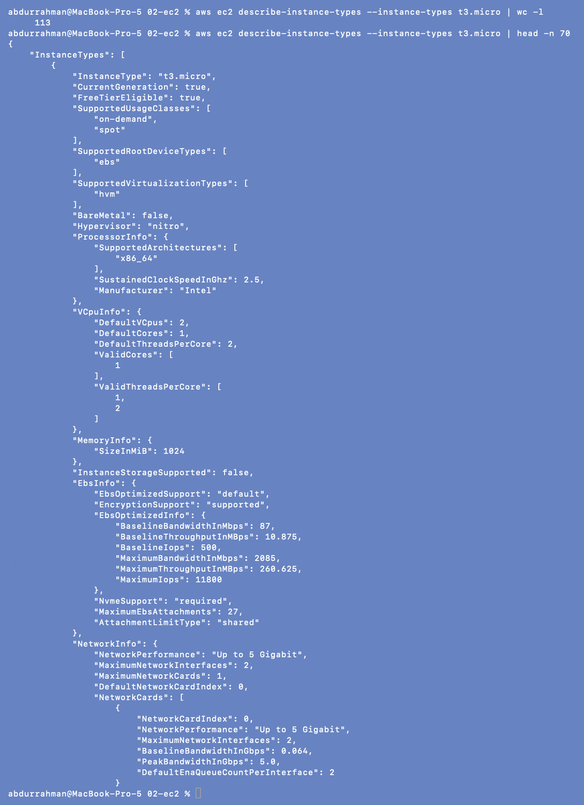
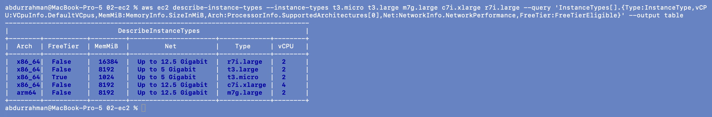
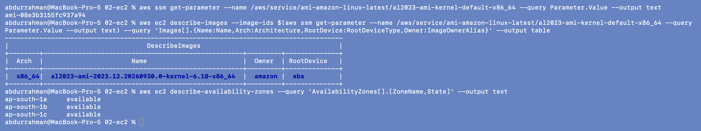

# Amazon EC2 (Elastic Compute Cloud)

**Name:** Abdur Rahman Ibne Munir
**Enrollment number:** 24BCS10244

Session 18, Task 2 (AWS services research). Written in my own words. The CLI examples
only *describe* things; no instance, key pair, security group or volume was created.

## What EC2 is

EC2 gives you virtual servers ("instances") in AWS data centres, billed by the second
while they run. You pick the operating system image, the size (CPU/RAM), the network and
the disk, and you get a machine you can SSH into a minute later. Instead of buying a
server for peak load, you start more instances when you need them and stop them when
you don't.

```text
AMI (OS image) + instance type (size) + key pair (login) + security group (firewall)
               + subnet in a VPC (network) + EBS volume (disk)
                                   |
                                   v
                             EC2 instance
```

## AMI (Amazon Machine Image)

An AMI is the template an instance boots from: the root volume snapshot (OS plus any
pre-installed software), the CPU architecture (`x86_64` or `arm64`), and launch
permissions.

- **AWS / Marketplace AMIs:** Amazon Linux 2023, Ubuntu, Windows, RHEL, vendor images.
- **Custom AMIs:** I can build my own from a configured instance (or with Packer) so new
  servers start with my app already installed ("golden image").
- AMIs are **regional** and IDs differ per region and change with every update, so
  hardcoding an AMI ID is fragile. AWS publishes the current ID in SSM Parameter Store,
  which is what the CLI example below uses.

## Instance types

The name encodes the family, generation, options and size: `m7g.large` = family **m**
(general purpose), generation **7**, **g** = Graviton (ARM) processor, size **large**.

| Family | Optimised for | Examples | Typical use |
|---|---|---|---|
| T | burstable general purpose (CPU credits) | t3.micro, t4g.small | small web apps, dev/test |
| M | balanced general purpose | m7i.large, m7g.large | app servers, mid-size databases |
| C | compute | c7i.xlarge | batch jobs, video encoding, high-traffic APIs |
| R / X | memory | r7i.large | in-memory caches, large databases |
| I / D | storage (local NVMe / HDD) | i4i.large | NoSQL databases, data warehouses |
| P / G / Inf / Trn | accelerators (GPU / ML chips) | g5.xlarge | ML training/inference, graphics |

Sizes double each step (`large` → `xlarge` → `2xlarge` …), and so does the price.

## Key pairs

EC2 uses public-key authentication for SSH. AWS stores the **public** key and puts it
into `~/.ssh/authorized_keys` at first boot; I keep the **private** key (`.pem`). AWS
only shows the private key once, when the key pair is created. If it's lost, I can't
log in with that key again (the fix is to attach the volume to another instance, or to
use SSM Session Manager). Windows uses the key pair to decrypt the Administrator
password. Today, Session Manager or EC2 Instance Connect can avoid long-lived SSH keys
entirely.

## Security groups

A security group is a **stateful** virtual firewall attached to an instance's network
interface:

- rules are **allow-only** (there are no deny rules); anything not allowed is blocked;
- default: **all inbound blocked, all outbound allowed**;
- stateful: if an inbound request is allowed, the reply goes out automatically (and the
  other way round);
- a rule's source can be a CIDR (`203.0.113.10/32`) or **another security group**
  (e.g. "the DB group accepts 5432 only from the app group"), which keeps working when
  IPs change.

Typical web server: inbound 80/443 from `0.0.0.0/0`, inbound 22 only from my IP (or no
22 at all, with Session Manager instead).

## EBS (Elastic Block Store)

EBS volumes are network-attached block disks for instances.

- One volume lives in **one Availability Zone** and attaches to instances in that AZ
  (multi-attach only for io1/io2).
- It **persists independently** of the instance: stopping an instance keeps the data;
  the root volume is deleted on termination by default (`DeleteOnTermination`), extra
  volumes are not.
- Types: **gp3** (general SSD, the default, baseline 3000 IOPS), **io2** (provisioned
  IOPS for databases), **st1/sc1** (throughput/cold HDD).
- **Snapshots** are incremental backups stored in S3; they can be copied to other
  regions and used to create new volumes or AMIs.
- Can be encrypted with KMS, and can be resized while in use.

**Instance store** is different: physically attached, very fast, but **lost** when the
instance stops or terminates. It's only for caches and scratch data.

## Public vs private IP

| | Private IP | Public IP | Elastic IP |
|---|---|---|---|
| Comes from | the subnet's CIDR (e.g. 172.31.x.x) | AWS's pool, if the subnet/launch asks for one | allocated to my account |
| Reachable from | inside the VPC (and peered/VPN networks) | the internet (if an Internet Gateway route exists) | the internet |
| Lifetime | stays for the life of the instance, through stop/start | **changes on every stop/start** | stays until I release it |
| Cost | free | public IPv4 is billed per hour (since 2024) | billed per hour, also while unused |

The instance itself only knows its private IP; the Internet Gateway does a 1:1 NAT
between the public and private address. Servers that don't need to be reached from the
internet (databases, internal services) should have **only** a private IP.

## Instance lifecycle

```text
          launch
            |
            v
        pending ──────> running ──── reboot ───> running (same host, same IPs)
                         |    ^
                    stop |    | start
                         v    |
                     stopping -> stopped      (no compute billing; EBS still billed;
                         |                     public IP released, private IP kept;
                         |                     may move to new hardware on start)
                         |
          terminate (from running or stopped)
                         v
                  shutting-down -> terminated  (gone; root EBS deleted by default)
```

- **Billing:** compute is charged only in `running` (per second for Linux, minimum 60 s);
  EBS volumes and Elastic IPs keep costing money while the instance is stopped.
- **Hibernate:** like stop, but RAM is saved to the EBS root volume so apps resume where
  they were.
- **Termination protection** prevents accidental termination from the console/API.

## Pricing models (short)

On-Demand (pay per second, no commitment), Savings Plans / Reserved Instances (1-3 year
commitment, up to ~70% cheaper), Spot (spare capacity, up to ~90% cheaper, can be
interrupted with 2 minutes' notice), Dedicated Hosts (licensing/compliance).

## Use cases

- Web and application servers behind a load balancer in an Auto Scaling group.
- Self-managed databases or software that needs full OS control.
- Batch processing and CI build agents (often on Spot).
- GPU instances for ML training and inference.
- Kubernetes worker nodes (EKS managed node groups are EC2 instances).
- Bastion hosts, VPN servers, dev/test machines that can be stopped at night.

## CLI: instance types, AMIs and AZs (read-only)

### `describe-instance-types` for t3.micro

```bash
aws ec2 describe-instance-types --instance-types t3.micro | wc -l
aws ec2 describe-instance-types --instance-types t3.micro | head -n 70
```



The full answer is 113 lines of JSON, so I printed the first 70. For t3.micro:
`FreeTierEligible: true`, `on-demand` and `spot` usage, **EBS-only** root device,
`Hypervisor: nitro`, Intel `x86_64` at 2.5 GHz, **2 vCPUs (1 core × 2 threads)**,
**1024 MiB** RAM, `InstanceStorageSupported: false` (no instance store), EBS bandwidth
87 Mbps baseline / 2085 Mbps burst, network "Up to 5 Gigabit", max 2 network interfaces.
"Burstable" shows up in the numbers too: baseline network bandwidth is 0.064 Gbps, while
the peak is 5 Gbps.

### Comparing families

```bash
aws ec2 describe-instance-types --instance-types t3.micro t3.large m7g.large c7i.xlarge r7i.large \
  --query 'InstanceTypes[].{Type:InstanceType,vCPU:VCpuInfo.DefaultVCpus,MemMiB:MemoryInfo.SizeInMiB,Arch:ProcessorInfo.SupportedArchitectures[0],Net:NetworkInfo.NetworkPerformance,FreeTier:FreeTierEligible}' \
  --output table
```



The memory-per-vCPU ratio is what separates the families: **c7i.xlarge** has
2 GiB per vCPU (8 GiB on 4 vCPUs), **m7g.large / t3.large** 4 GiB per vCPU (8 GiB on 2)
and **r7i.large** 8 GiB per vCPU (16 GiB on 2). `m7g.large` is the only `arm64`
one (the **g** = Graviton). Only t3.micro is free-tier eligible.

### Current Amazon Linux 2023 AMI and the region's AZs

```bash
aws ssm get-parameter --name /aws/service/ami-amazon-linux-latest/al2023-ami-kernel-default-x86_64 \
  --query Parameter.Value --output text
aws ec2 describe-images --image-ids $(aws ssm get-parameter --name /aws/service/ami-amazon-linux-latest/al2023-ami-kernel-default-x86_64 --query Parameter.Value --output text) \
  --query 'Images[].{Name:Name,Arch:Architecture,RootDevice:RootDeviceType,Owner:ImageOwnerAlias}' --output table
aws ec2 describe-availability-zones --query 'AvailabilityZones[].[ZoneName,State]' --output text
```



The public SSM parameter resolves to `ami-08e3b3155fc937a94` in ap-south-1, which
`describe-images` identifies as `al2023-ami-2023.12.20260930.0-kernel-6.18-x86_64`,
owned by `amazon`, `x86_64`, root device `ebs`. Terraform can look up the same parameter
(`data "aws_ssm_parameter"`) instead of hardcoding an AMI ID. Mumbai has three AZs,
`ap-south-1a/b/c`, all `available`.

## What I understood

- An instance is the combination of an AMI (what it boots), an instance type (how big),
  a subnet (where), a security group (who can reach it), a key pair (how I log in) and
  EBS volumes (where data lives).
- Instance type names tell me the family and size; the vCPU-to-memory ratio is the real
  difference between C, M and R.
- Stop and terminate are very different: stop keeps the EBS disk (and its cost) and the
  private IP but loses the public IP; terminate deletes the instance and, by default,
  its root disk.
- Security groups are stateful allow-lists. Opening only what's needed, and referencing
  other security groups instead of IPs, keeps an instance's attack surface small.
