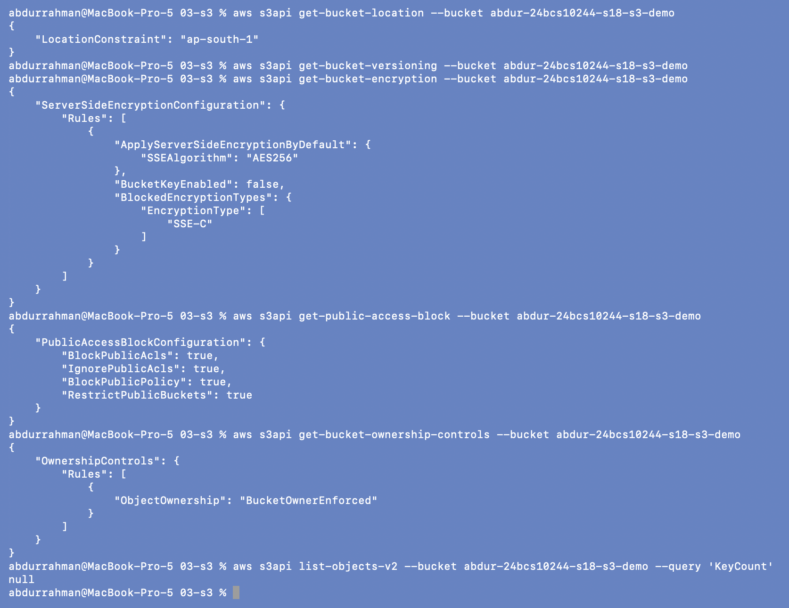

# Amazon S3 (Simple Storage Service)

**Name:** Abdur Rahman Ibne Munir
**Enrollment number:** 24BCS10244

Session 18, Task 2 (AWS services research). Written in my own words. Every Terraform
lab in this session created an S3 bucket, so the CLI example below reads the real
settings of the Task 1 bucket while it existed (it was destroyed right after).

## What S3 is

S3 is object storage: you put files ("objects") into containers ("buckets") over HTTPS
and get them back by key. There are no disks to size, no file system to mount, and no
capacity limit. You pay per GB stored per month, per request and for data transferred
out. AWS designs S3 Standard for 99.999999999% (eleven 9s) durability by storing every
object redundantly across at least three Availability Zones.

```text
bucket:  abdur-24bcs10244-s18-s3-demo   (region ap-south-1, globally unique name)
  ├── index.html                        <- object, key "index.html"
  ├── images/logo.png                   <- key "images/logo.png" ("/" is only part of the name)
  └── backups/2026-10-08/db.sql.gz
```

## Buckets

- A bucket name is **globally unique** across all AWS accounts (3-63 characters,
  lowercase letters, digits, hyphens and dots), which is why the lecture's hardcoded
  names failed and I used `abdur-24bcs10244-s18-…` names.
- A bucket lives in **one region** (data never leaves it unless I replicate it), but the
  namespace is global.
- Settings are per bucket: versioning, encryption, Block Public Access, bucket policy,
  lifecycle rules, logging, replication, CORS, static website hosting, object lock.
- A bucket must be empty before it can be deleted (Terraform's `force_destroy = true`
  empties it first).

## Objects

An object is the data (up to **5 TB**; anything over 100 MB should use multipart upload)
plus:

- a **key**, its full name inside the bucket. The "folders" in the console are only key
  prefixes;
- **metadata**: system (Content-Type, size, ETag, last modified) and user-defined
  `x-amz-meta-*`;
- a **version ID** if versioning is on;
- **tags** (up to 10 key-value pairs), used by lifecycle rules, IAM conditions and cost
  reports.

S3 has strong read-after-write consistency: after a successful PUT, every GET or LIST
sees the new object.

## Storage classes

| Class | For | Notes |
|---|---|---|
| S3 Standard | frequently accessed data | default; ≥3 AZs; no retrieval fee |
| S3 Intelligent-Tiering | unknown or changing access patterns | moves objects between tiers automatically; small monitoring fee |
| S3 Standard-IA | infrequent access, needs fast retrieval | cheaper storage, per-GB retrieval fee, 30-day minimum |
| S3 One Zone-IA | re-creatable infrequent data | one AZ only, so it is lost if that AZ is lost |
| S3 Glacier Instant Retrieval | archive read about once a quarter | millisecond access, 90-day minimum |
| S3 Glacier Flexible Retrieval | archives | minutes to hours to restore |
| S3 Glacier Deep Archive | long-term compliance archives | cheapest; restore takes up to 12-48 h; 180-day minimum |
| S3 Express One Zone | very low latency hot data | single AZ, "directory buckets" |

The storage class is set per object, not per bucket.

## Versioning

With versioning **enabled**, every overwrite creates a new version and a DELETE only
adds a **delete marker**; the old versions stay and can be restored. That protects
against accidental deletes and overwrites, and it's required for replication. A bucket is
**unversioned** by default (the Task 1 bucket returned no `Status` at all, see below).
Once enabled, versioning can only be **suspended**, never fully turned off. Old versions
still cost money, so versioning is usually paired with a lifecycle rule that expires
noncurrent versions. **MFA Delete** can additionally require MFA to delete versions.

## Lifecycle policies

Lifecycle rules act automatically on objects, filtered by prefix or tag:

- **Transition** actions move objects to a cheaper class after N days
  (e.g. Standard → Standard-IA after 30 days → Glacier Deep Archive after 180);
- **Expiration** actions delete objects (or noncurrent versions, or delete markers) after
  N days;
- **abort incomplete multipart uploads**, which otherwise cost money without showing up
  as objects.

```json
{
  "Rules": [{
    "ID": "logs-retention",
    "Filter": { "Prefix": "logs/" },
    "Status": "Enabled",
    "Transitions": [{ "Days": 30, "StorageClass": "STANDARD_IA" },
                    { "Days": 90, "StorageClass": "GLACIER" }],
    "Expiration": { "Days": 365 }
  }]
}
```

## Encryption

- **In transit:** HTTPS (TLS). A bucket policy can deny any request with
  `aws:SecureTransport = false`.
- **At rest, server-side**, which is always on for new objects since January 2023:
  - **SSE-S3**: S3-managed keys (AES-256). The default; free and nothing to manage.
  - **SSE-KMS**: keys in AWS KMS. Adds CloudTrail audit of key use and key policies;
    **S3 Bucket Keys** reduce the KMS request cost. DSSE-KMS is a double-layer variant.
  - **SSE-C**: the client sends its own key with every request; AWS doesn't store it.
- **Client-side encryption:** encrypt before uploading; AWS only sees ciphertext.

## Bucket policies (and other access controls)

A bucket policy is a **resource-based** IAM policy attached to the bucket. Because it
has a `Principal`, it can grant access to other accounts or services, or deny things for
everyone:

```json
{
  "Version": "2012-10-17",
  "Statement": [{
    "Sid": "DenyInsecureTransport",
    "Effect": "Deny",
    "Principal": "*",
    "Action": "s3:*",
    "Resource": ["arn:aws:s3:::my-bucket", "arn:aws:s3:::my-bucket/*"],
    "Condition": { "Bool": { "aws:SecureTransport": "false" } }
  }]
}
```

Access to an object is decided by IAM policies + bucket policy (+ ACLs if still
enabled), evaluated together as in [IAM](../01-iam/README.md). Two account-level/bucket
safety switches sit above that:

- **Block Public Access**: four settings that override any policy or ACL that would make
  data public. All four are on by default for new buckets.
- **Object Ownership = Bucket owner enforced**: ACLs are disabled and the bucket owner
  owns every object; access is controlled only with policies. The default for new
  buckets.

Pre-signed URLs give temporary access to one object without making anything public.

## CLI: the bucket from Task 1, before it was destroyed

While `abdur-24bcs10244-s18-s3-demo` existed ([Task 1, step 8](../../terraform-s3-demo/README.md#8-verify-using-the-aws-cli)),
I read its settings with read-only `get-*` calls. Terraform only set the name and tags,
so everything below is an AWS default:

```bash
aws s3api get-bucket-location --bucket abdur-24bcs10244-s18-s3-demo
aws s3api get-bucket-versioning --bucket abdur-24bcs10244-s18-s3-demo
aws s3api get-bucket-encryption --bucket abdur-24bcs10244-s18-s3-demo
aws s3api get-public-access-block --bucket abdur-24bcs10244-s18-s3-demo
aws s3api get-bucket-ownership-controls --bucket abdur-24bcs10244-s18-s3-demo
aws s3api list-objects-v2 --bucket abdur-24bcs10244-s18-s3-demo --query 'KeyCount'
```



| Call | Result | Meaning |
|---|---|---|
| `get-bucket-location` | `ap-south-1` | the bucket's region |
| `get-bucket-versioning` | *(empty, no `Status`)* | never versioned: the default |
| `get-bucket-encryption` | `SSEAlgorithm: AES256`, `BucketKeyEnabled: false`, `BlockedEncryptionTypes: SSE-C` | default SSE-S3 encryption; this bucket also refuses SSE-C uploads |
| `get-public-access-block` | all four `true` | nothing in this bucket can be made public |
| `get-bucket-ownership-controls` | `BucketOwnerEnforced` | ACLs disabled; only policies control access |
| `list-objects-v2 … KeyCount` | `null` | the bucket was empty, so it cost nothing and could be deleted |

So a brand-new bucket is already private and encrypted. Making it public or unencrypted
would take deliberate changes.

## Use cases

- Static website hosting (with CloudFront in front) and storage for user uploads.
- Backups and disaster-recovery copies (with versioning, lifecycle to Glacier,
  cross-region replication).
- Data lake storage for Athena, EMR, Glue and Redshift Spectrum.
- Log storage (CloudTrail, ALB, VPC flow logs) with lifecycle expiry.
- Artifact storage for CI/CD (build outputs, Lambda zip files).
- **Terraform remote state** (an S3 backend, with locking), which is where this session
  leads next.

## What I understood

- S3 is a key-value store of objects in buckets. Folders are an illusion made of key
  prefixes, and bucket names are global.
- The storage class is a cost and retrieval-time trade-off chosen per object, and
  lifecycle rules automate moving data down the classes and deleting it.
- Versioning protects against mistakes but keeps paying for old versions, so it goes
  together with lifecycle expiry of noncurrent versions.
- New buckets are secure by default (encrypted, Block Public Access on, ACLs disabled),
  which I confirmed on my own bucket. Bucket policies are where cross-account access or
  extra deny rules go.
