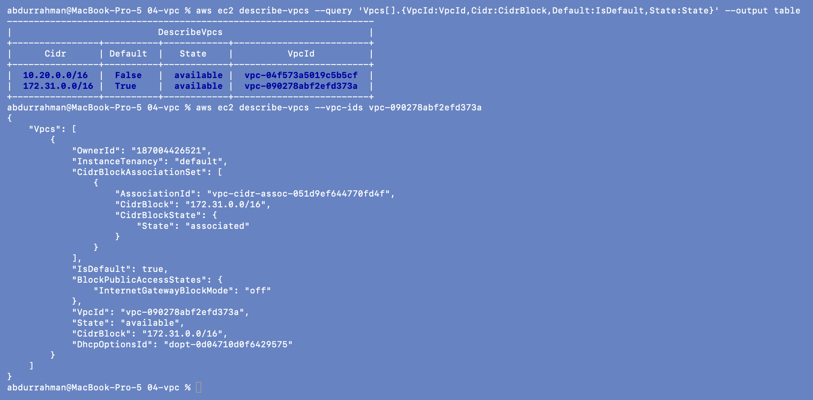
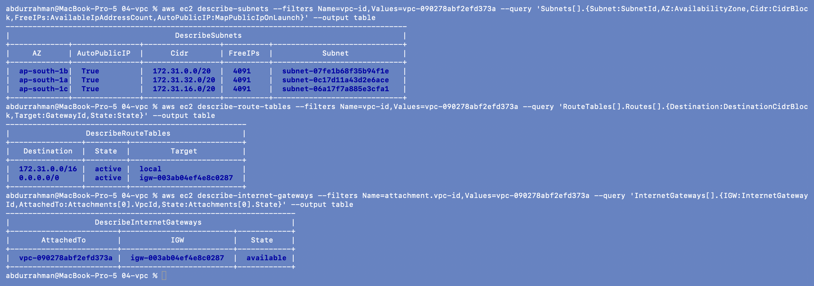
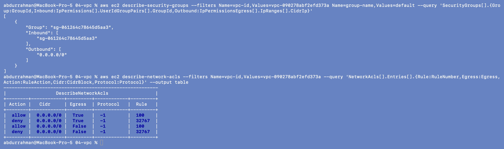

# Amazon VPC (Virtual Private Cloud)

**Name:** Abdur Rahman Ibne Munir
**Enrollment number:** 24BCS10244

Session 18, Task 2 (AWS services research). Written in my own words. For the CLI part
I only *read* the account's **default VPC** (`vpc-090278abf2efd373a`), which AWS creates
in every region. I didn't create or change any network resource.

## What a VPC is

A VPC is my own isolated private network inside an AWS region. I choose its IP range,
split it into subnets across Availability Zones, and decide with route tables and
gateways what can talk to what, including whether anything can reach the internet.
EC2 instances, RDS databases, EKS nodes, load balancers and Lambda functions (when
VPC-attached) all live in subnets of a VPC.

```text
Region ap-south-1
└── VPC 10.0.0.0/16
    ├── AZ ap-south-1a
    │   ├── public subnet  10.0.1.0/24   route 0.0.0.0/0 -> Internet Gateway   (ALB, NAT GW, bastion)
    │   └── private subnet 10.0.11.0/24  route 0.0.0.0/0 -> NAT Gateway        (app servers)
    ├── AZ ap-south-1b
    │   ├── public subnet  10.0.2.0/24
    │   └── private subnet 10.0.12.0/24
    ├── Internet Gateway (one per VPC)
    └── NAT Gateway (in a public subnet, one per AZ for HA)
```

## CIDR

CIDR notation writes an IP range as `address/prefix`. The prefix is how many leading
bits are fixed; the rest are host addresses.

| CIDR | Addresses | Typical use |
|---|---|---|
| `10.0.0.0/16` | 65,536 | a whole VPC (the largest allowed is /16, the smallest /28) |
| `10.0.1.0/24` | 256 (251 usable in AWS) | one subnet |
| `172.31.0.0/20` | 4,096 (4,091 usable) | a default-VPC subnet |
| `203.0.113.10/32` | 1 | one host, e.g. "SSH only from my IP" |
| `0.0.0.0/0` | all of IPv4 | "anywhere", e.g. the default route |

VPCs should use private (RFC 1918) ranges, `10.0.0.0/8`, `172.16.0.0/12` or
`192.168.0.0/16`, and should **not overlap** with other VPCs or the office network if
they will ever be peered or connected by VPN. AWS reserves **5 addresses in every
subnet** (network address, VPC router, DNS, one for future use, broadcast), which is why
a /20 shows 4,091 free IPs below, not 4,096.

## Subnets

A subnet is a slice of the VPC's CIDR that lives in **exactly one AZ**. Resources are
launched into subnets, and high availability means spreading them over subnets in at
least two AZs. Each subnet is associated with one route table and one network ACL.

## Route tables

A route table is a list of "destination → target" rules used by the subnets associated
with it. The most specific matching route wins.

- Every route table has a **`local`** route for the VPC CIDR, so all subnets in a VPC
  can always reach each other.
- `0.0.0.0/0 → igw-…` makes a subnet **public**;
- `0.0.0.0/0 → nat-…` gives a private subnet outbound-only internet;
- other targets: VPC peering, Transit Gateway, VPN gateway, VPC endpoints (e.g. S3
  gateway endpoint, so S3 traffic doesn't go through NAT).

## Internet Gateway (IGW)

A horizontally scaled, highly available gateway attached to one VPC. It lets resources
that have a public IP reach the internet and be reached from it, translating their
public IP to the private one. It costs nothing by itself, and one VPC can have only one.

## NAT Gateway

A managed NAT device placed in a **public** subnet that lets instances in **private**
subnets start connections to the internet (OS updates, calling external APIs, pulling
images) while nothing on the internet can start a connection to them.

- It is **zonal**: for high availability, put one per AZ and point each AZ's private
  route table at its own NAT.
- It **costs money**: an hourly charge per NAT Gateway plus a per-GB processing charge,
  even when idle. It is one of the most common surprise bills in practice, which is why
  my homework account checks for NAT gateways in its final cleanup.
- Alternatives: VPC endpoints for AWS services (S3, DynamoDB, ECR), or no internet at all.

## Security groups

Stateful, allow-only firewalls attached to **network interfaces** (instances, RDS,
load balancers…). Return traffic is allowed automatically, and rules can reference other
security groups. Details are in the [EC2 page](../02-ec2/README.md#security-groups).

## Network ACLs (NACLs)

Stateless firewalls attached to **subnets**:

| | Security group | Network ACL |
|---|---|---|
| Applies to | an ENI / instance | a whole subnet |
| State | **stateful** (return traffic automatic) | **stateless** (return traffic needs its own rule, usually ephemeral ports 1024-65535) |
| Rules | allow only | allow **and deny** |
| Evaluation | all rules together | in order of rule number, first match wins |
| Default | inbound nothing, outbound all | default NACL allows everything both ways |

NACLs are a coarse second layer, for example to block a known bad IP range for a whole
subnet; day-to-day access control is done with security groups.

## Public vs private subnets

AWS has no "public" checkbox. A subnet **is public because its route table sends
`0.0.0.0/0` to an Internet Gateway**. Instances there also need a public IP to be
reachable (`MapPublicIpOnLaunch` assigns one automatically).

| | Public subnet | Private subnet |
|---|---|---|
| Default route | Internet Gateway | NAT Gateway (or none) |
| Reachable from internet | yes, if the instance has a public IP and the SG allows it | no |
| Can reach internet | yes | outbound only, through NAT |
| Put here | load balancers, NAT gateways, bastion hosts | app servers, databases, EKS nodes, caches |

## CLI: inside the default VPC (read-only)

### `describe-vpcs`

```bash
aws ec2 describe-vpcs --query 'Vpcs[].{VpcId:VpcId,Cidr:CidrBlock,Default:IsDefault,State:State}' --output table
aws ec2 describe-vpcs --vpc-ids vpc-090278abf2efd373a
```



The default VPC uses `172.31.0.0/16` and `IsDefault: true`. The second VPC in the table,
`vpc-04f573a5019c5b5cf` (`10.20.0.0/16`), is not mine. Its tags show it belongs to
another part of this homework (session 21's final project), running in the same account
at the same time. I only listed it.

### Subnets, route table and Internet Gateway of the default VPC

```bash
aws ec2 describe-subnets --filters Name=vpc-id,Values=vpc-090278abf2efd373a \
  --query 'Subnets[].{Subnet:SubnetId,AZ:AvailabilityZone,Cidr:CidrBlock,FreeIPs:AvailableIpAddressCount,AutoPublicIP:MapPublicIpOnLaunch}' --output table
aws ec2 describe-route-tables --filters Name=vpc-id,Values=vpc-090278abf2efd373a \
  --query 'RouteTables[].Routes[].{Destination:DestinationCidrBlock,Target:GatewayId,State:State}' --output table
aws ec2 describe-internet-gateways --filters Name=attachment.vpc-id,Values=vpc-090278abf2efd373a \
  --query 'InternetGateways[].{IGW:InternetGatewayId,AttachedTo:Attachments[0].VpcId,State:Attachments[0].State}' --output table
```



- **Subnets:** one `/20` per AZ (`172.31.0.0/20` in 1b, `172.31.16.0/20` in 1c,
  `172.31.32.0/20` in 1a), each with **4091** free IPs (4096 − 5 reserved) and
  `AutoPublicIP: True`.
- **Route table:** `172.31.0.0/16 → local` and `0.0.0.0/0 → igw-003ab04ef4e8c0287`.
- **IGW:** `igw-003ab04ef4e8c0287`, attached to the default VPC.

Together this proves the definition above: every default subnet is a **public** subnet,
because its route table points `0.0.0.0/0` at an Internet Gateway and instances get a
public IP automatically. That is handy for quick tests and the reason real workloads use
their own VPC with private subnets.

### Default security group and network ACL

```bash
aws ec2 describe-security-groups --filters Name=vpc-id,Values=vpc-090278abf2efd373a Name=group-name,Values=default \
  --query 'SecurityGroups[].{Group:GroupId,Inbound:IpPermissions[].UserIdGroupPairs[].GroupId,Outbound:IpPermissionsEgress[].IpRanges[].CidrIp}'
aws ec2 describe-network-acls --filters Name=vpc-id,Values=vpc-090278abf2efd373a \
  --query 'NetworkAcls[].Entries[].{Rule:RuleNumber,Egress:Egress,Action:RuleAction,Cidr:CidrBlock,Protocol:Protocol}' --output table
```



- The **default security group** allows inbound traffic only from **itself**
  (`sg-061264c78645d5aa3` references its own ID) and all outbound to `0.0.0.0/0`.
  That's an example of a security group used as a source.
- The **default NACL** shows the NACL model: numbered rules evaluated in order, rule
  `100 allow` all protocols (`-1`) from/to `0.0.0.0/0` in each direction, and the fixed
  catch-all rule `32767 deny` (shown as `*` in the console) at the end. Because rule 100
  allows everything, the default NACL doesn't filter anything; filtering is left to
  security groups.

## What I understood

- A VPC is a private IP range in one region. Subnets put pieces of it into specific AZs,
  and route tables decide where each subnet's traffic can go.
- "Public" and "private" are a property of the route table (IGW vs NAT/none), not of the
  subnet itself. The default VPC is entirely public, which I saw in its routes.
- NAT Gateways give private subnets outbound internet but bill by the hour, so they must
  be deleted after labs.
- Security groups (stateful, per instance, allow-only) and NACLs (stateless, per subnet,
  ordered allow/deny) are two layers; most real rules belong in security groups.
