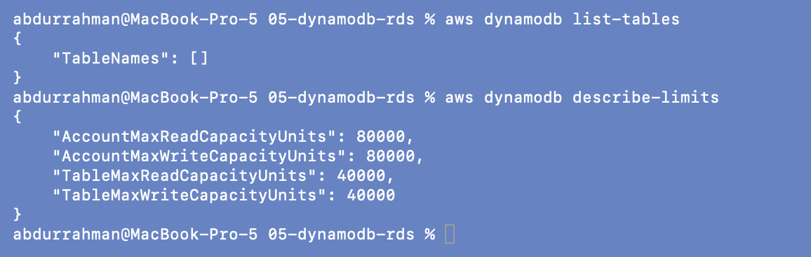
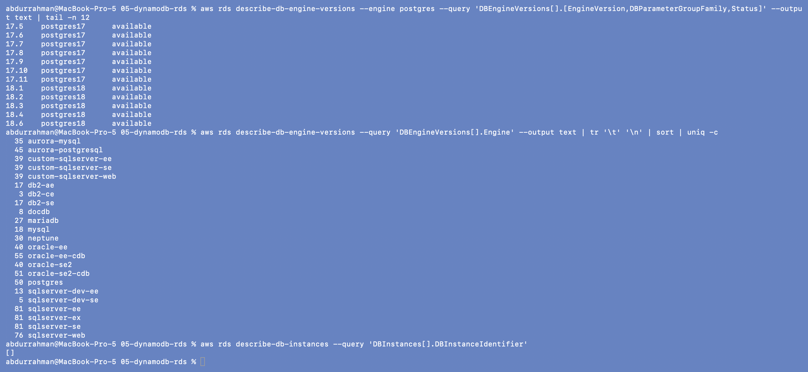

# Amazon DynamoDB and Amazon RDS

**Name:** Abdur Rahman Ibne Munir
**Enrollment number:** 24BCS10244

Session 18, Task 2 (AWS services research). Written in my own words. The CLI examples
only list and describe; no table or database instance was created.

The two services are AWS's main managed databases, and they solve different problems:

| | DynamoDB | RDS |
|---|---|---|
| Model | NoSQL key-value / document | relational (SQL, tables with schemas and joins) |
| Server | serverless: no instances to choose | you pick a DB instance class |
| Scaling | automatic, almost unlimited, horizontal | vertical (bigger instance) + read replicas |
| Queries | by key (and indexes); no joins | any SQL, joins, transactions, aggregates |
| Latency | single-digit milliseconds at any scale | depends on instance and query |
| Pricing | per request (on-demand) or provisioned capacity, plus storage | per instance-hour + storage + I/O + backups |

---

## DynamoDB

### What DynamoDB is (NoSQL)

DynamoDB is a fully managed, serverless **NoSQL** database. "NoSQL" here means there is
no fixed schema apart from the key, no joins and no SQL engine optimising arbitrary
queries. In return, every read and write by key is fast and predictable however big
the table gets, because the data is spread across many partitions automatically.
Data is replicated across three AZs; Global Tables replicate it across regions.

### Tables, items, attributes

```text
Table: Orders
┌──────────────┬─────────────────────┬────────┬──────────┬──────────────────────┐
│ CustomerId   │ OrderDate           │ Total  │ Status   │ Items                │
│ (partition)  │ (sort key)          │        │          │                      │
├──────────────┼─────────────────────┼────────┼──────────┼──────────────────────┤
│ C#1001       │ 2026-10-01T10:00Z   │ 499    │ SHIPPED  │ ["book","pen"]       │  <- item
│ C#1001       │ 2026-10-05T18:30Z   │ 1299   │ PENDING  │                      │  <- item (no Items attribute)
│ C#2002       │ 2026-10-03T09:15Z   │ 89     │ DELIVERED│ ["cable"]            │
└──────────────┴─────────────────────┴────────┴──────────┴──────────────────────┘
```

- **Table:** a collection of items. The only thing you must define up front is the
  primary key (plus billing mode).
- **Item:** one record, like a row; maximum 400 KB.
- **Attribute:** a name-value pair in an item. Types: string, number, binary, boolean,
  null, list, map and sets. Items in the same table can have **different
  attributes** (the second order above has no `Items`).

### Partition key and sort key

The primary key is either:

1. **Partition key only** (simple key): e.g. `UserId`. Must be unique per item.
   DynamoDB hashes the value to decide which physical partition stores the item.
2. **Partition key + sort key** (composite key): e.g. `CustomerId` + `OrderDate`.
   Many items can share a partition key; within it they are stored **sorted** by the
   sort key, and the pair must be unique. That allows queries such as "all orders for
   C#1001 between 1 and 5 October, newest first" in one fast `Query` call.

A good partition key has **many distinct values** that are accessed evenly. A key like
`Status` with three values would push most traffic onto one "hot" partition.
**Secondary indexes** (GSI / LSI) add alternative keys for other access patterns, and
`Scan` (read the whole table) exists but is slow and expensive on large tables.

Other features: on-demand or provisioned capacity with auto scaling, TTL (auto-delete
expired items), Streams (change feed for Lambda), transactions, point-in-time recovery,
encryption at rest by default.

### DynamoDB use cases

- User sessions, shopping carts, user profiles and preferences.
- Gaming leaderboards and player state; IoT and time-series events keyed by device.
- High-traffic serverless backends (API Gateway + Lambda + DynamoDB).
- Metadata stores and lookup tables; also Terraform state locking, which older
  S3-backend setups used.

---

## RDS (Relational Database Service)

### Relational databases

Relational databases store data in **tables with fixed columns**, link tables with
**foreign keys**, and answer arbitrary **SQL** questions with joins, aggregates and
**ACID transactions**. That suits data with relationships and rules (orders →
customers → payments) and reporting queries that weren't planned in advance.

RDS is the managed version: AWS provisions the server, installs and patches the
database engine, takes backups, handles failover and monitoring. I only manage the
schema, queries, users and settings. I can't SSH into the host.

### Supported engines

**PostgreSQL, MySQL, MariaDB, Oracle, Microsoft SQL Server and IBM Db2**, plus
**Amazon Aurora** (MySQL- and PostgreSQL-compatible, with AWS's own distributed
storage). The CLI output below lists them, with how many versions are available for
each in ap-south-1.

### DB instances

A DB instance is one database server: an **instance class** (`db.t4g.micro`,
`db.m7g.large`, `db.r7g.xlarge`… the same family letters as EC2), **storage** (gp3 or
io2 EBS, with optional storage autoscaling), an engine and version, a **parameter group**
(engine settings) and an **option group**, all placed in a **DB subnet group** inside a
VPC. Clients connect to its DNS **endpoint**, not an IP, so failover can move the
endpoint to another host.

### Security

- **Network:** keep it in **private subnets**, with "publicly accessible" off. Its
  **security group** allows the DB port (5432 / 3306) only from the application's
  security group.
- **Authentication:** a master user (password ideally stored and rotated in Secrets
  Manager), normal database users, or **IAM database authentication** (short-lived
  tokens instead of passwords).
- **Encryption:** at rest with KMS (enabled at creation; it covers storage, backups,
  snapshots and replicas) and in transit with SSL/TLS (can be enforced).
- **IAM** controls who can manage the instance (create, delete, snapshot), separately
  from who can log in to the database.
- Auditing through CloudTrail (API) and engine logs exported to CloudWatch.

### Backups

- **Automated backups:** a daily snapshot plus transaction logs, kept for 1-35 days.
  They allow **point-in-time restore** to any second in that window (the restore
  creates a *new* instance).
- **Manual snapshots:** taken on demand, kept until I delete them, can be copied to
  other regions or shared with other accounts.
- Backups go to S3 behind the scenes; AWS Backup can manage them centrally.

### Multi-AZ

A **standby** copy in another AZ, kept up to date with **synchronous** replication.
If the primary fails (host, storage or AZ outage, or during patching), RDS fails over
automatically, usually within one to two minutes, by pointing the same endpoint at the
standby. The standby is **for availability, not for reads** in the classic setup.
The newer Multi-AZ *DB cluster* option has two readable standbys.

### Read replicas

**Asynchronous** copies of the primary (in the same AZ, another AZ or another region)
that serve **read-only** traffic, each with its own endpoint. They scale reads (reports,
dashboards, read-heavy APIs), can be **promoted** to standalone primaries (e.g. for
cross-region disaster recovery), and may lag slightly behind the primary.

| | Multi-AZ standby | Read replica |
|---|---|---|
| Purpose | high availability / failover | read scaling (and DR) |
| Replication | synchronous | asynchronous |
| Serves reads | no (classic Multi-AZ) | yes |
| Endpoint | same as primary | its own |
| Cross-region | no | yes |

### RDS use cases

- Backends for web and mobile apps that need relational data and transactions
  (e-commerce orders, banking, bookings).
- Moving an existing MySQL/PostgreSQL/Oracle/SQL Server database to AWS without running
  the servers.
- ERP, CRM and CMS systems (WordPress, Odoo) built on SQL databases.
- Reporting and BI on read replicas without slowing down production.

---

## CLI (read-only)

### DynamoDB

```bash
aws dynamodb list-tables
aws dynamodb describe-limits
```



`list-tables` returns `"TableNames": []`, so there are no tables in ap-south-1 in this
account. `describe-limits` shows the account's provisioned-capacity quotas in the region:
up to 40,000 read and 40,000 write capacity units **per table** and 80,000 each for the
whole account.

### RDS

```bash
aws rds describe-db-engine-versions --engine postgres --query 'DBEngineVersions[].[EngineVersion,DBParameterGroupFamily,Status]' --output text | tail -n 12
aws rds describe-db-engine-versions --query 'DBEngineVersions[].Engine' --output text | tr '\t' '\n' | sort | uniq -c
aws rds describe-db-instances --query 'DBInstances[].DBInstanceIdentifier'
```



- The newest PostgreSQL versions offered in ap-south-1 are **17.5-17.11** (parameter
  group family `postgres17`) and **18.1-18.6** (`postgres18`), all `available`. I used
  `tail` instead of `head` because the list is sorted oldest first, so the newest
  versions are at the end.
- Counting all engine versions by engine gives the supported-engines list from above
  with real numbers: `postgres` (50 versions), `mysql` (18), `mariadb` (27), several
  `oracle-*` and `sqlserver-*` editions, `db2-*`, and `aurora-mysql` /
  `aurora-postgresql`. The same API also lists `docdb` and `neptune`, which share the RDS
  management layer but are separate services.
- `describe-db-instances` returns `[]`: no database instances exist, and none were
  created.

## What I understood

- DynamoDB trades flexible queries for predictable speed at any scale. The table design
  starts from the access patterns, and the partition key (plus optional sort key)
  decides how data is spread and how it can be queried.
- RDS is a normal SQL database without the server work. I still choose the engine,
  instance size and network placement, but AWS handles patching, backups and failover.
- Multi-AZ (synchronous standby, same endpoint) is for surviving failures; read replicas
  (asynchronous, own endpoints) are for scaling reads. They solve different problems and
  are often used together.
- Both are secured the same way as everything else in AWS: IAM for management access,
  private subnets and security groups for network access, KMS for encryption at rest.
