# Task 1: Terraform S3 Bucket Demo

**Name:** Abdur Rahman Ibne Munir
**Enrollment number:** 24BCS10244

Session 18 homework, Task 1: create an S3 bucket with Terraform using separate
`main.tf`, `variables.tf`, `outputs.tf`, `provider.tf` and `terraform.tfvars` files, and
run and document `init`, `fmt`, `validate`, `plan`, `apply`, `show`, `output` and
`destroy`. I started from the lecture's `terraform-s3-demo` folder, ran it as written,
and fixed what didn't work or didn't fit the homework. Each fix is shown below.

The bucket `abdur-24bcs10244-s18-s3-demo` was created in `ap-south-1`, inspected, and
destroyed again a few minutes later.

## Project structure

```text
terraform-s3-demo/
├── provider.tf          terraform block (version pins) + provider "aws" (region, default_tags)
├── variables.tf         aws_region, bucket_name (with defaults)
├── terraform.tfvars     the values I actually used (no secrets)
├── main.tf              aws_s3_bucket.devops553
├── outputs.tf           bucket_name, bucket_arn, bucket_region
├── .terraform.lock.hcl  provider version lock from the lecture (aws 6.66.0)
├── .gitignore
├── README.md
└── screenshots/
```

```text
provider.tf ──> AWS provider (region = var.aws_region, default_tags)
variables.tf ──> declares inputs ──┐
terraform.tfvars ──> sets inputs ──┤
                                   v
main.tf ──> aws_s3_bucket.devops553 ──> S3 bucket in ap-south-1
                                   │
outputs.tf <── reads its attributes┘ ──> printed after apply / terraform output
```

### The files

`provider.tf` (merged from the lecture's `terraform.tf` + `providers.tf`, see Problem 3):

```hcl
terraform {
  required_version = ">= 1.6.0"
  required_providers {
    aws = {
      source  = "hashicorp/aws"
      version = "~> 6.0"
    }
  }
}

provider "aws" {
  region = var.aws_region

  # Added: tag everything this homework creates in AWS so it can be found and
  # cleaned up later. Resource-level tags are merged on top of these.
  default_tags {
    tags = {
      Project = "scaler-devops-homework"
      Session = "18"
      Owner   = "24BCS10244"
    }
  }
}
```

`variables.tf` (unchanged from the lecture):

```hcl
variable "aws_region" {
  type        = string
  description = "AWS region where the S3 bucket will be created."
  default     = "ap-south-1"
}
variable "bucket_name" {
  type        = string
  description = "Name of the S3 bucket."
  default     = "yatri1107"
}
```

`terraform.tfvars` (added, see Problem 2):

```hcl
aws_region  = "ap-south-1"
bucket_name = "abdur-24bcs10244-s18-s3-demo"
```

`main.tf`:

```hcl
resource "aws_s3_bucket" "devops553" {
  bucket        = var.bucket_name
  force_destroy = true          # lets destroy delete the bucket even if it has objects
  tags = {
    Name        = var.bucket_name
    Environment = "dev"
    ManagedBy   = "Terraform"
    # Lecture had Project = "Session18" here. A resource tag overrides the
    # provider default_tags, so it is removed; Project now comes from provider.tf.
  }
}
```

`outputs.tf` (unchanged from the lecture):

```hcl
output "bucket_name" {
  type        = string
  description = "Name of the S3 bucket."
  value       = aws_s3_bucket.devops553.bucket
}
output "bucket_arn" {
  type        = string
  description = "ARN of the S3 bucket."
  value       = aws_s3_bucket.devops553.arn
}
output "bucket_region" {
  type        = string
  description = "AWS region of the S3 bucket."
  value       = aws_s3_bucket.devops553.region
}
```

---

## Prerequisites

The notes say `aws configure`. That prompts for (and can echo) the access keys, so I
showed the existing setup with `aws configure list` (keys masked) and
`aws sts get-caller-identity` instead. The first screenshot also shows the folder exactly
as copied from the lecture.

```bash
ls -a
aws configure list
aws sts get-caller-identity
```

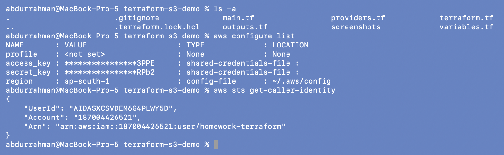

The CLI, and therefore Terraform, runs as IAM user `homework-terraform` in account
`187004426521`, region `ap-south-1`.

## 1. `terraform init` (lecture files as written)

```bash
terraform init
```

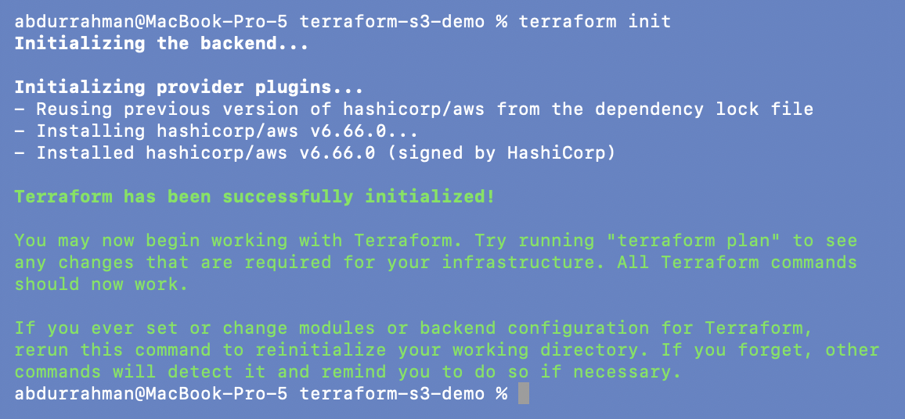

`Reusing previous version of hashicorp/aws from the dependency lock file` → installs
**v6.66.0**. The lecture folder includes `.terraform.lock.hcl`, so I got exactly the
version the instructor used, not the newest 6.x (6.67.0 in the other folders). That is
what a committed lock file is for.

## 2. `terraform fmt` and `terraform validate` (as written)

```bash
terraform fmt
terraform validate
```


Both pass. Before running it I expected `validate` to fail: `outputs.tf` puts
`type = string` inside each `output` block, and I had only ever seen `type` on variables.
It didn't fail, so I checked whether Terraform 1.16 really understands that argument, or
silently ignores it:

```bash
grep -n 'type' outputs.tf
printf 'output "type_test" {\n  type  = number\n  value = "not-a-number"\n}\n' > type_test.tf
cat type_test.tf
terraform validate
rm type_test.tf
terraform validate
```

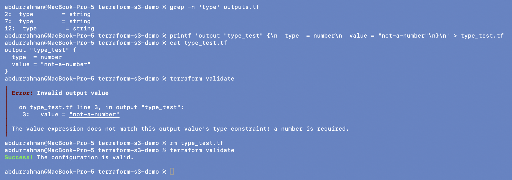

An unknown argument would be reported as "Unsupported argument". Instead Terraform
**enforces** the type: a `number` output with a string value fails with "does not match
this output value's type constraint". So on my Terraform v1.16.5, `type` in an output
block is a real, supported feature, and `outputs.tf` needs no fix. (I ran this check at
the end, after the destroy, which is why its screenshot number is 16. It only runs
`validate`, which doesn't call AWS.) One caveat: the files say
`required_version = ">= 1.6.0"`, and I only tested 1.16.5. An older Terraform that
doesn't have output type constraints would reject these lines, so either the
`required_version` should be raised or the `type` lines dropped if the demo must run on
older versions.

## Problem 1: the default bucket name belongs to someone else

S3 bucket names are global across **all** AWS accounts. `variables.tf` defaults to
`yatri1107`, so I checked whether that name is free before trying to use it:

```bash
grep -A4 'variable "bucket_name"' variables.tf
aws s3api head-bucket --bucket yatri1107
aws s3api head-bucket --bucket abdur-24bcs10244-s18-s3-demo
```

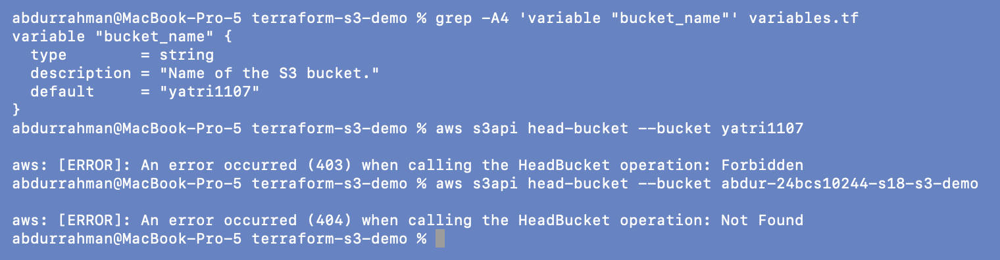

`head-bucket` returns **403 Forbidden** for `yatri1107`: the bucket exists, but in an
account I can't access. An apply with that name would fail with `BucketAlreadyExists`.
For my own name it returns **404 Not Found**, so the name is free. This check is
read-only and costs nothing, unlike a failed `apply`.

**Fix:** I didn't edit the default in `variables.tf`; I set the value in a new
`terraform.tfvars` instead, which is exactly what the tfvars file is for (Problems 2-3).

## Problems 2 and 3: missing `terraform.tfvars`, and `provider.tf` vs `providers.tf` + `terraform.tf`

- The homework lists `terraform.tfvars` as a deliverable, and the lecture README's
  structure lists it too, but the folder didn't have one. **Fix:** created it with the
  region and my bucket name, and a comment that it holds no secrets.
- The homework asks for `provider.tf`; the lecture split the same content into
  `terraform.tf` (the `terraform {}` block) and `providers.tf` (one line,
  `provider "aws" { region = var.aws_region }`). **Fix:** merged both into `provider.tf`
  with a comment saying so, and added `default_tags`. Terraform loads every `.tf` file in
  the folder, so the file names don't matter to it; this is only about matching the
  homework.
- `main.tf` set `Project = "Session18"` on the bucket. Resource tags override
  `default_tags`, so that would have hidden my `Project` tag; I removed it (with a
  comment).

```bash
ls
cat provider.tf terraform.tfvars
terraform fmt
terraform validate
```

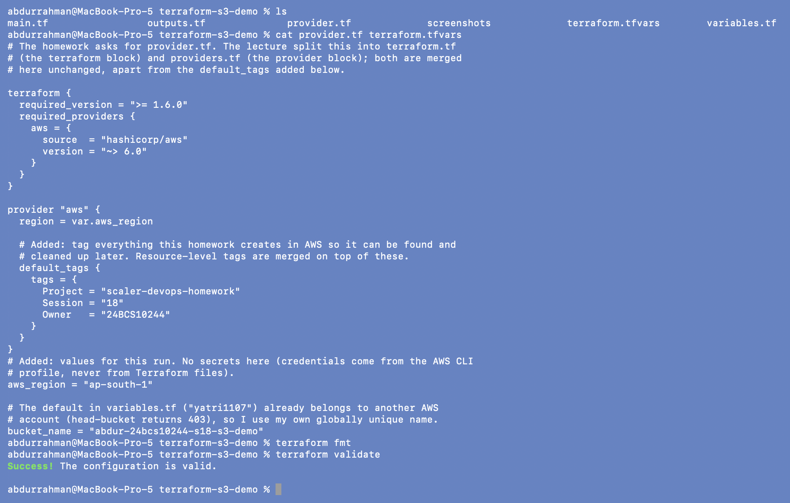

## Problem 4: the folder's `.gitignore` would hide `terraform.tfvars`

```bash
git check-ignore -v terraform.tfvars
```

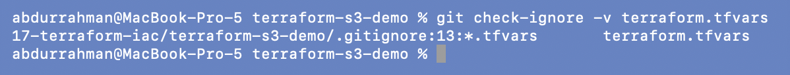

The lecture `.gitignore` has `*.tfvars` (with an exception only for
`terraform.tfvars.example`), so my new deliverable would never be committed. That rule
makes sense when tfvars files contain secrets; this one doesn't. **Fix:** an explicit
`!terraform.tfvars` exception, with a comment:

```bash
sed -n '11,16p' .gitignore
git check-ignore -v terraform.tfvars
git check-ignore -q terraform.tfvars || echo "terraform.tfvars is NOT ignored"
```

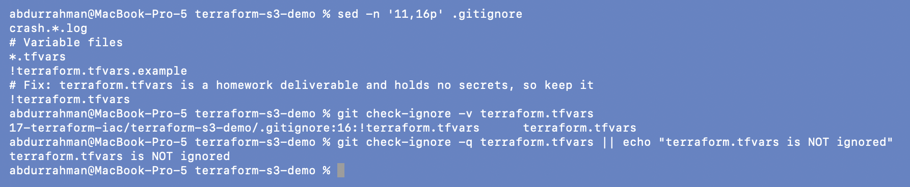

The last matching rule is now `!terraform.tfvars`, so git will include the file.
State, plans and `.terraform/` are still ignored.

## 3. `terraform plan`

```bash
terraform plan
```

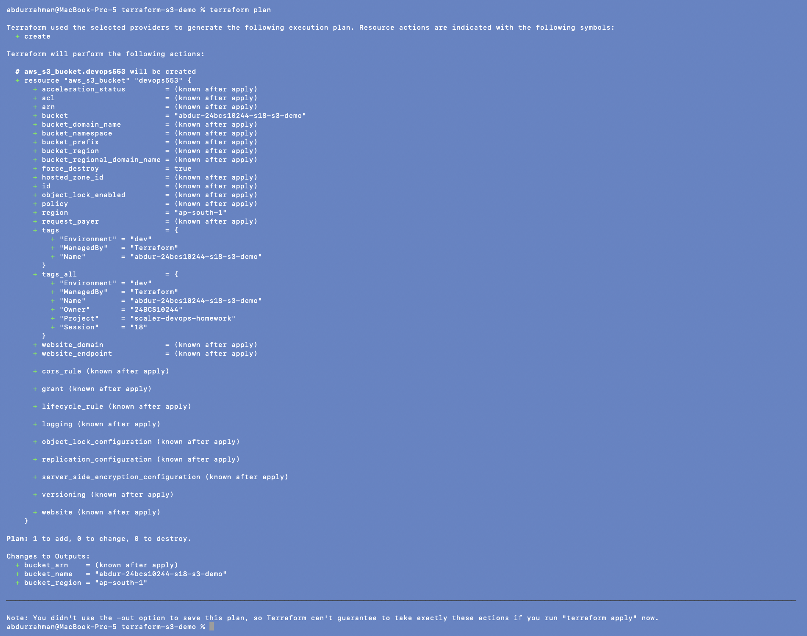

`+ resource "aws_s3_bucket" "devops553"` with `bucket = "abdur-24bcs10244-s18-s3-demo"`
(from tfvars), `force_destroy = true`, `region = "ap-south-1"`, and `tags_all` holding
the three resource tags plus the three default tags. `Plan: 1 to add, 0 to change, 0 to
destroy.` Because the name is fixed, `bucket_name` and `bucket_region` are already known
in the outputs; only `bucket_arn` waits for apply.

## 4. `terraform apply`

```bash
terraform apply
yes
```

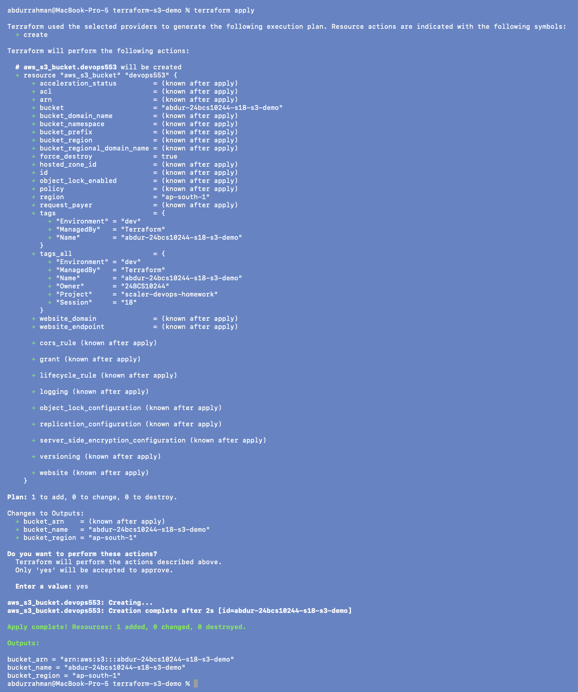

```text
aws_s3_bucket.devops553: Creation complete after 2s [id=abdur-24bcs10244-s18-s3-demo]
Apply complete! Resources: 1 added, 0 changed, 0 destroyed.
bucket_arn    = "arn:aws:s3:::abdur-24bcs10244-s18-s3-demo"
bucket_name   = "abdur-24bcs10244-s18-s3-demo"
bucket_region = "ap-south-1"
```

## 5. Check state (and Problem 5: the README's resource name)

```bash
terraform state list
terraform state show aws_s3_bucket.demo          # as written in the lecture README
terraform state show aws_s3_bucket.devops553     # the real address
```

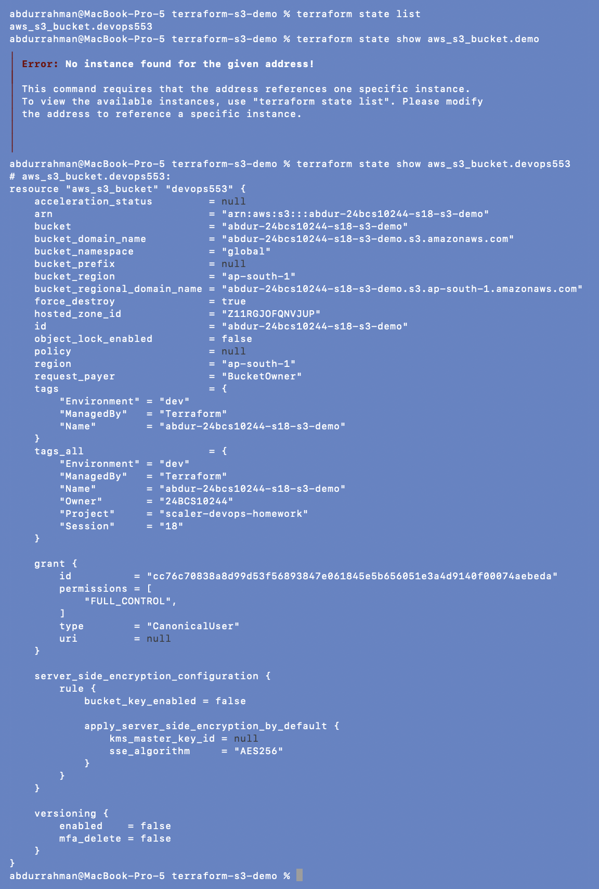

### Problem found: the README uses a resource name that doesn't exist

`terraform state show aws_s3_bucket.demo` fails with **"No instance found for the given
address!"**. **Root cause:** the lecture README (architecture diagram, step 6 and the
"Complete Demo" list) calls the resource `aws_s3_bucket.demo` and the bucket `demo`, but
`main.tf` declares `resource "aws_s3_bucket" "devops553"`. `state list` shows the real
address. **Fix:** this README uses `aws_s3_bucket.devops553`. I kept the resource name in
the code, because renaming it after apply would make Terraform plan a destroy and
recreate (unless a `moved {}` block is added).

`state show` then prints the single resource with all its attributes.

## 6. `terraform show`

The homework asks for `terraform show`; the lecture README uses `terraform state show`.
I ran both (above and here):

```bash
terraform show
```

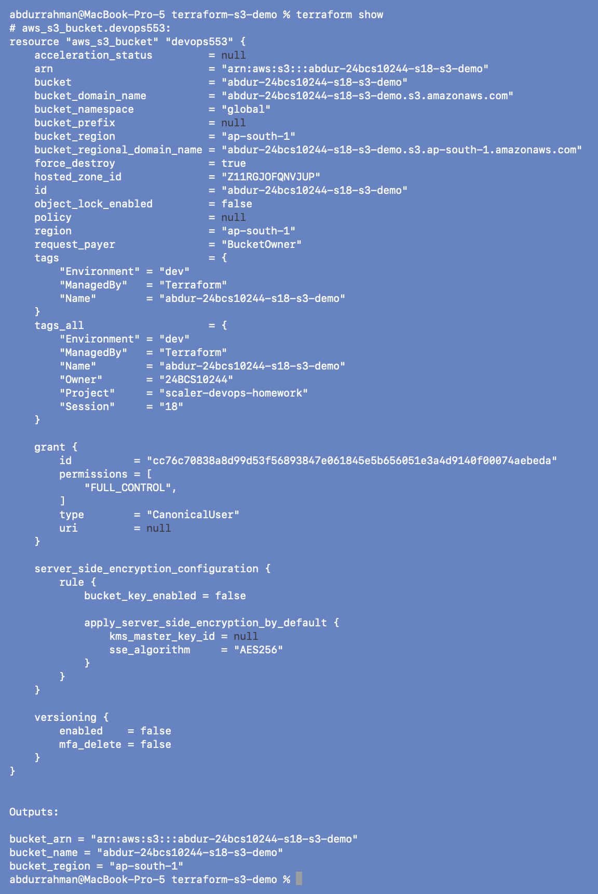

The full state in readable form: the bucket with everything AWS set by default (AES256
encryption, versioning off, owner `FULL_CONTROL` grant) **plus the `Outputs:`
section**, which `state show` doesn't print.

## 7. `terraform output`

```bash
terraform output
terraform output bucket_name
```

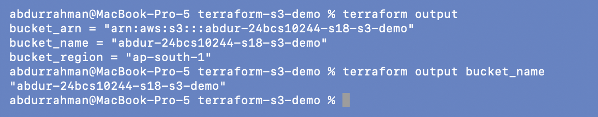

All three outputs, then just one. The README expected `"demo"`; with my tfvars it is
`"abdur-24bcs10244-s18-s3-demo"`. None of these outputs is sensitive.

## 8. Verify using the AWS CLI

```bash
aws s3 ls
aws s3api head-bucket --bucket demo                                  # as written in the README
aws s3api head-bucket --bucket $(terraform output -raw bucket_name)  # my bucket
```

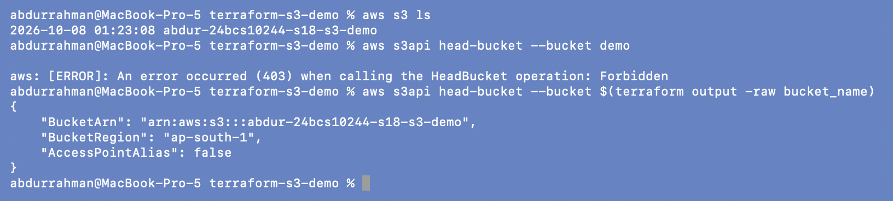

`aws s3 ls` lists my bucket. The README's `head-bucket --bucket demo` returns **403**:
a bucket called `demo` exists, but it belongs to some other AWS account, so the
README's verification command would "check" a stranger's bucket instead of the one we
just made. With `terraform output -raw` the command always uses the right name, and
AWS confirms `BucketRegion: ap-south-1`.

While the bucket existed I also read its default security settings for the S3 research
page: encryption, Block Public Access, object ownership and versioning. See
[aws-services/03-s3](../aws-services/03-s3/README.md#cli-the-bucket-from-task-1-before-it-was-destroyed).

## 9. Destroy

```bash
terraform plan -destroy
```

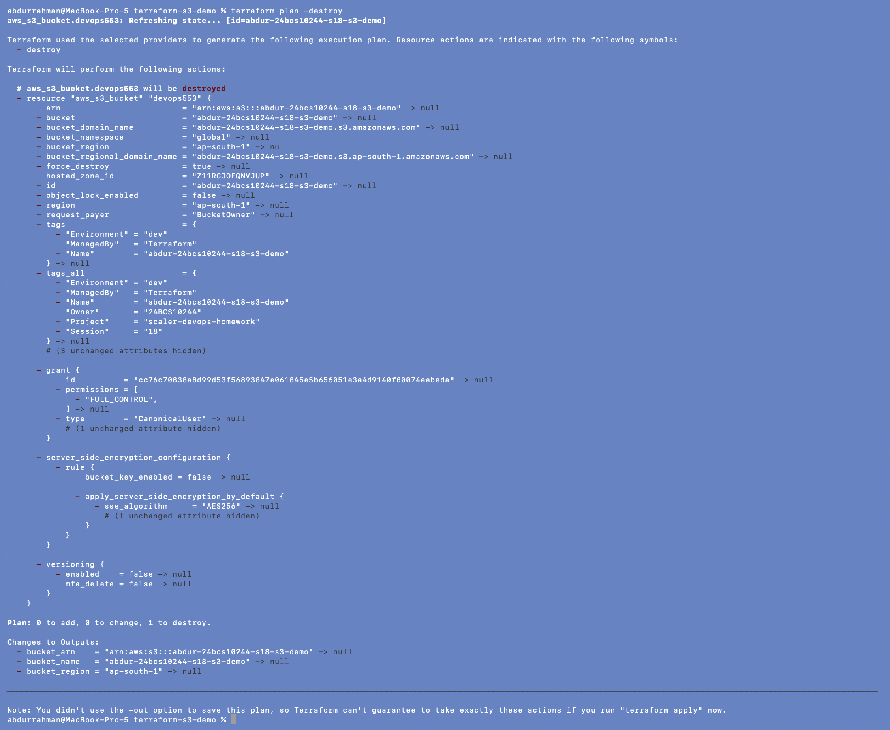

`Plan: 0 to add, 0 to change, 1 to destroy.`, with every output going to `null`.
Reviewed, so:

```bash
terraform destroy
yes
terraform state list
aws s3api head-bucket --bucket abdur-24bcs10244-s18-s3-demo
```

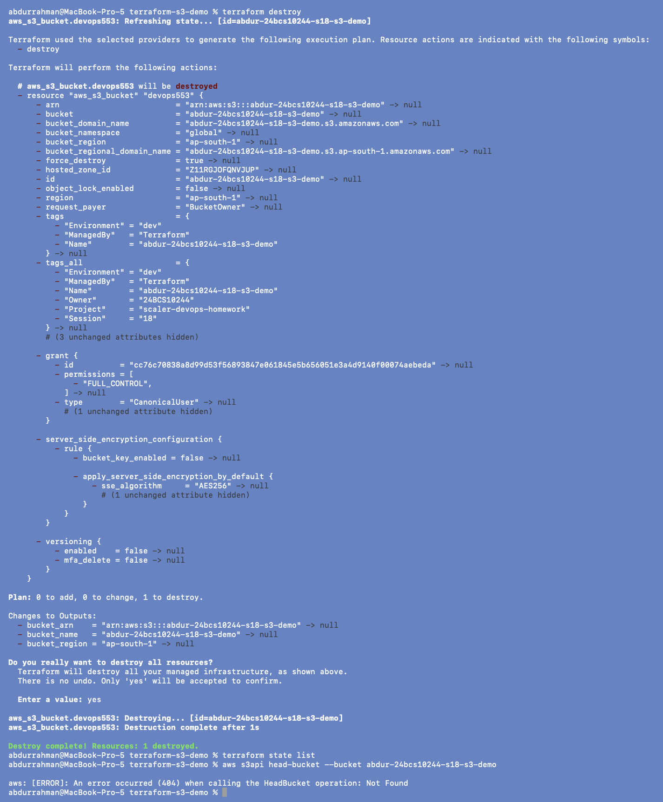

`Destroy complete! Resources: 1 destroyed.` The state is empty, and AWS now answers
**404 Not Found** for the bucket name: it is really gone, not just removed from state.

## Summary of changes to the lecture files

| File | Change | Why |
|---|---|---|
| `terraform.tf` + `providers.tf` → `provider.tf` | merged, comment added | homework asks for `provider.tf` |
| `provider.tf` | `default_tags` (Project / Session / Owner) | tag everything I create |
| `terraform.tfvars` | created: region + `abdur-24bcs10244-s18-s3-demo` | deliverable; `yatri1107` is taken (403) |
| `main.tf` | removed `Project = "Session18"` tag | it overrode the default `Project` tag |
| `.gitignore` | `!terraform.tfvars` | the deliverable was being ignored |
| `outputs.tf`, `variables.tf`, `.terraform.lock.hcl` | unchanged | `type` in outputs is valid on Terraform 1.16.5 |
| README commands | `aws_s3_bucket.demo` / `demo` → `aws_s3_bucket.devops553` / my bucket | the README didn't match the code |

## Terraform lifecycle (as I ran it)

```text
.tf files + terraform.tfvars
        |
  terraform init       provider aws 6.66.0 from the lock file
        |
  terraform fmt / validate
        |
  terraform plan       1 to add
        |
  terraform apply      bucket created (2 s)
        |
  terraform state list / state show / show / output   + AWS CLI checks
        |
  terraform plan -destroy -> terraform destroy        bucket deleted, head-bucket = 404
```

## What I understood

- Splitting a configuration into `provider.tf`, `variables.tf`, `main.tf` and
  `outputs.tf` is only for people; Terraform reads all `.tf` files in the folder as
  one configuration.
- `variables.tf` declares inputs, `terraform.tfvars` gives them values. Changing the
  bucket name meant editing data, not code.
- S3 names are a global namespace. A hardcoded name in shared course material will
  almost always be taken, and `head-bucket` (403 vs 404) is a free way to check.
- `terraform state show <address>` needs the exact address from the code; `state list`
  is the source of truth for addresses.
- A committed `.terraform.lock.hcl` pins the provider version for everyone (6.66.0
  here), and a `.gitignore` has to be checked against the files the homework actually
  needs.
