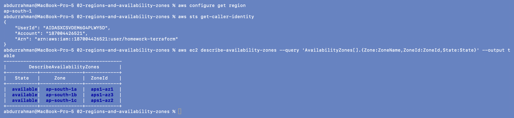

# 02 - Regions and Availability Zones

**Name:** Abdur Rahman Ibne Munir
**Enrollment number:** 24BCS10244

## The idea

- A **Region** is a geographic area where AWS runs data centers, e.g. `ap-south-1`
  (Mumbai), `us-east-1`, `eu-west-1`.
- An **Availability Zone (AZ)** is an isolated location *inside* a region (separate
  buildings, power and networking). A region has several AZs.

```text
Region = city            ap-south-1
AZ     = separate campus  ap-south-1a, ap-south-1b, ap-south-1c
```

Spreading servers over two or more AZs means one AZ failing doesn't take the whole
application down. That is the basic idea of high availability.

| Concept | Scope | Example in this homework |
|---|---|---|
| Region | geographic area, chosen in the provider block | `provider "aws" { region = var.aws_region }` |
| VPC | regional (spans all AZs of the region) | `aws_vpc.main` |
| Subnet | lives in exactly one AZ | `availability_zone = "${var.aws_region}a"` |

## Check my region and identity

```bash
aws configure get region
aws sts get-caller-identity
# addition (not in the notes): list the AZs of my region
aws ec2 describe-availability-zones \
  --query 'AvailabilityZones[].{Zone:ZoneName,ZoneId:ZoneId,State:State}' --output table
```



- The CLI's default region is `ap-south-1`, so every command and every Terraform run in
  this session goes to Mumbai.
- `get-caller-identity` shows who I am authenticated as: IAM user `homework-terraform` in
  account `187004426521`. It doesn't print any keys.
- I added the AZ listing to see the "one region, several AZs" picture with real data:
  `ap-south-1` has three AZs, `1a`, `1b` and `1c`. The zone **ID** (`aps1-az1`…) is the
  physical location; AWS maps zone *names* to IDs differently per account, which is why
  `1b` here is `aps1-az3`.

## Practice answers

```text
Is an AZ bigger than a Region?            No. Region > AZ.
Can one Region contain multiple AZs?      Yes (ap-south-1 has 3).
Why use multiple AZs?                     Fault isolation: one AZ down, the app still runs.
Is a subnet tied to a Region or an AZ?    One specific AZ.
```

## What I understood

- I pick the region once in the Terraform provider; every resource is then created there
  unless I say otherwise.
- VPCs are regional but subnets are zonal, so a highly available design needs at least
  one subnet per AZ. The labs here use a single subnet in `ap-south-1a`, which is fine for
  learning but would not survive an AZ outage.
- The lecture code builds the AZ name as `"${var.aws_region}a"`. That works for
  `ap-south-1` but assumes an `a` zone exists in whatever region is passed in.
