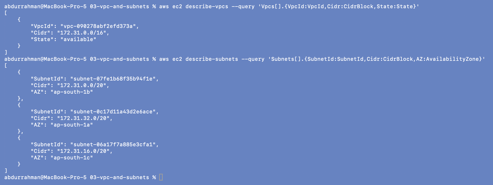

# 03 - VPC and Subnets

**Name:** Abdur Rahman Ibne Munir
**Enrollment number:** 24BCS10244

## The idea

- A **VPC** (Virtual Private Cloud) is my own private network inside AWS, with an IP
  range written in CIDR notation, e.g. `10.0.0.0/16`.
- A **subnet** is a smaller range carved out of the VPC, e.g. `10.0.1.0/24`, and it lives
  in one Availability Zone.
- A subnet is called **public** when its route table sends `0.0.0.0/0` to an Internet
  Gateway, and **private** when it has no such route (next section).

```text
VPC 10.0.0.0/16              (65,536 addresses)
 |
 +-- public subnet  10.0.1.0/24   (256 addresses, AWS reserves 5 of them)
 +-- private subnet 10.0.2.0/24
```

The smaller the number after the `/`, the bigger the range. A `/24` always fits inside a
`/16` with the same first two octets, so a subnet can never be bigger than its VPC.

Terraform version of this (the same shape is used in 06, 08 and 09):

```hcl
resource "aws_vpc" "main" {
  cidr_block = "10.0.0.0/16"
}

resource "aws_subnet" "public" {
  vpc_id                  = aws_vpc.main.id
  cidr_block              = "10.0.1.0/24"
  availability_zone       = "ap-south-1a"
  map_public_ip_on_launch = true
}
```

## Look at the VPCs and subnets in my account

```bash
aws ec2 describe-vpcs \
  --query 'Vpcs[].{VpcId:VpcId,Cidr:CidrBlock,State:State}'
aws ec2 describe-subnets \
  --query 'Subnets[].{SubnetId:SubnetId,Cidr:CidrBlock,AZ:AvailabilityZone}'
```



Before any Terraform run, the account only has the **default VPC** that AWS creates in
every region: `172.31.0.0/16`, with one `/20` subnet in each of the three AZs
(`1a`, `1b`, `1c`). I left the default VPC alone; all my labs create their own VPC.

## Practice answers

1. **VPC:** a private, isolated network in one region with its own IP range.
2. **Subnet:** a slice of the VPC's range, placed in one AZ, where resources get their IPs.
3. **Can a subnet be larger than its VPC?** No, it has to be inside the VPC's CIDR.
4. **`10.0.0.0/16`:** the first 16 bits are fixed (`10.0`), the remaining 16 bits are free,
   so `10.0.0.0` to `10.0.255.255`.
5. **Public vs private:** a public subnet has a route to an Internet Gateway, a private one
   doesn't. The subnet resource itself is the same; the route table makes the difference.

## What I understood

- The default VPC exists so people can launch an instance without designing a network.
  For anything real (and for this homework) I create my own VPC with a range I chose.
- `map_public_ip_on_launch = true` only hands out public IPs. It does **not** make the
  subnet reachable from the internet by itself; that also needs the IGW route (04) and a
  security group rule (05).
- Subnet CIDRs inside one VPC must not overlap, and I should leave room in the VPC range
  for more subnets later.
