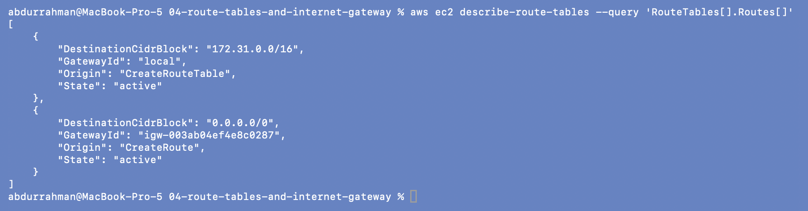

# 04 - Route Tables and Internet Gateway

**Name:** Abdur Rahman Ibne Munir
**Enrollment number:** 24BCS10244

## The idea

- A **route table** is the road map of a subnet: for each destination range, where should
  packets go next?
- An **Internet Gateway (IGW)** connects a VPC to the internet.
- Creating an IGW alone changes nothing. A subnet becomes public only when it is
  **associated** with a route table that has `0.0.0.0/0 -> igw-…`.

```text
VPC
 |
 +-- Internet Gateway
 +-- Route Table
 |     +-- 10.0.0.0/16 -> local   (added automatically: traffic inside the VPC)
 |     +-- 0.0.0.0/0   -> IGW     (everything else goes to the internet)
 +-- Public Subnet  (associated with that route table)
```

`0.0.0.0/0` means "any IPv4 destination". Routes are matched by the most specific prefix,
so VPC-internal traffic still uses the `local` route.

Terraform, as used in 06, 08 and 09:

```hcl
resource "aws_internet_gateway" "main" {
  vpc_id = aws_vpc.main.id
}

resource "aws_route_table" "public" {
  vpc_id = aws_vpc.main.id
  route {
    cidr_block = "0.0.0.0/0"
    gateway_id = aws_internet_gateway.main.id
  }
}

resource "aws_route_table_association" "public" {
  subnet_id      = aws_subnet.public.id
  route_table_id = aws_route_table.public.id
}
```

(The lecture's snippet for this, like `08-mini-project/main.tf`, has `gateway_id  =`
with two spaces. It's valid HCL; `terraform fmt` just realigns it, see 08.)

## Look at the routes in my account

```bash
aws ec2 describe-route-tables \
  --query 'RouteTables[].Routes[]'
```



This is the default VPC's main route table, and it matches what the notes describe:
`172.31.0.0/16 -> local` (created with the route table, `Origin: CreateRouteTable`) and
`0.0.0.0/0 -> igw-003ab04ef4e8c0287` (`Origin: CreateRoute`). That second route is why
the default VPC's subnets are public.

## Practice: explain the path

```text
Laptop -> Internet -> Internet Gateway -> Route Table -> Public Subnet -> EC2
```

A request from my laptop reaches the VPC through the IGW. The route table of the public
subnet has a `0.0.0.0/0 -> IGW` route, so the reply from the EC2 instance has a way back
out. The instance also needs a public IP (the subnet's `map_public_ip_on_launch`).

**Why a route table doesn't replace a security group:** the route table only says *where*
traffic goes. It has no idea about ports or who is allowed. Without a security group rule,
packets that are routed correctly are still dropped at the instance. I saw both pieces
working together in [09-final-project](../09-final-project/).

## What I understood

- "Public subnet" is not a setting on the subnet. It is the combination of an IGW plus a
  `0.0.0.0/0` route plus the association of that route table to the subnet.
- Every VPC gets a `local` route automatically, which is why resources inside one VPC can
  always talk to each other (if security groups allow it).
- In Terraform, the association is its own resource. Forgetting it is an easy mistake:
  the subnet would silently use the VPC's main route table, which has no IGW route.
