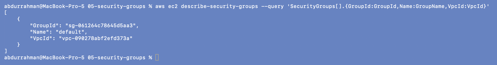

# 05 - Security Groups

**Name:** Abdur Rahman Ibne Munir
**Enrollment number:** 24BCS10244

## The idea

A **security group** is a virtual firewall attached to resources like EC2 instances. It
answers: *who is allowed to talk to this resource, on which port?*

- **Inbound (ingress) rules:** which traffic may come in. Anything not listed is dropped.
- **Outbound (egress) rules:** which traffic may go out.
- **Stateful:** if a request is allowed in, its reply is allowed back out automatically,
  without a matching egress rule (and the other way round).

| Component | Question it answers |
|---|---|
| Route table | Where should this traffic go? |
| Security group | Is this traffic allowed? |

The lecture's example, which 06 and 08 use (HTTP and HTTPS from anywhere, all outbound):

```hcl
resource "aws_security_group" "web" {
  name        = "session19-web"
  description = "Allow web traffic"
  vpc_id      = aws_vpc.main.id

  ingress {
    description = "HTTP"
    from_port   = 80
    to_port     = 80
    protocol    = "tcp"
    cidr_blocks = ["0.0.0.0/0"]
  }

  egress {
    description = "Allow outbound IPv4"
    from_port   = 0
    to_port     = 0
    protocol    = "-1"
    cidr_blocks = ["0.0.0.0/0"]
  }
}
```

## Look at the security groups in my account

```bash
aws ec2 describe-security-groups \
  --query 'SecurityGroups[].{GroupId:GroupId,Name:GroupName,VpcId:VpcId}'
```



Only one group exists before the labs: the `default` security group of the default VPC
(`vpc-090278abf2efd373a`). Every VPC gets its own `default` group, so when my Terraform
VPCs were up there was one more `default` group for each of them, next to my own
`session19-*` group.

## SSH warning, and what I did in the final project

`cidr_blocks = ["0.0.0.0/0"]` on port 22 exposes SSH to every scanner on the internet. In
[09-final-project](../09-final-project/) I went further than the notes:

- no SSH rule at all and no key pair (the server configures itself through `user_data`),
- HTTP 80 allowed only from **my own public IP as a `/32`**,
- no HTTPS rule, because nothing listens on 443.

## Practice answers

1. **What does a security group do?** Allows or drops traffic to a resource by protocol,
   port and source/destination.
2. **Inbound rule:** what may reach the resource (e.g. TCP 80 from my IP).
3. **Outbound rule:** what the resource may send (e.g. everything, so it can download
   packages).
4. **Why is `0.0.0.0/0` risky for SSH?** Anyone on the internet can try to log in, so
   bots will start brute-forcing within minutes.
5. **Security group vs route table:** a route table decides the path, a security group
   decides permission. Traffic needs both.

## What I understood

- Security groups only have *allow* rules. Everything not allowed is denied by default.
- Because they are stateful, I don't need an inbound rule for the replies to my
  instance's outgoing `dnf` downloads.
- The smallest useful rule is the right one: a single port from a single `/32` is far
  safer than "open to the world", and for a short demo it costs nothing extra.
