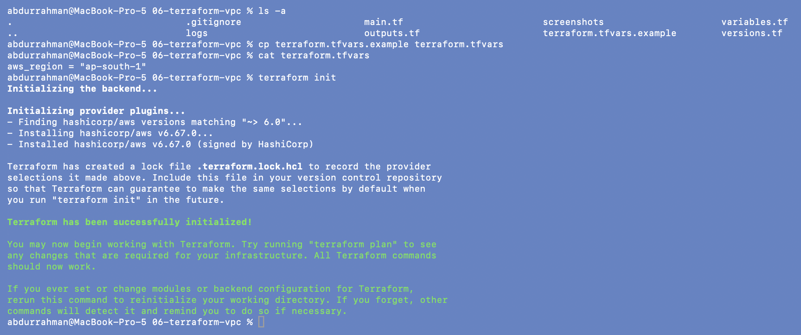
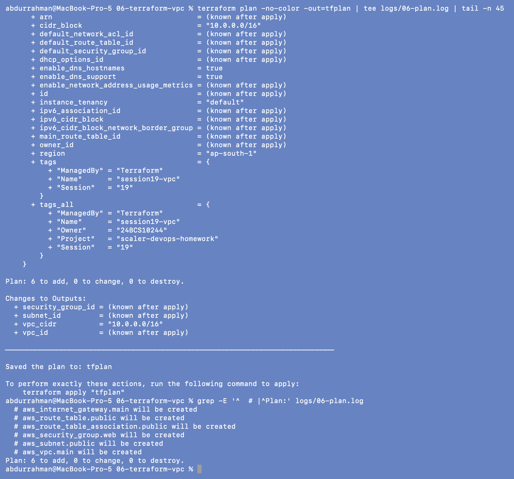
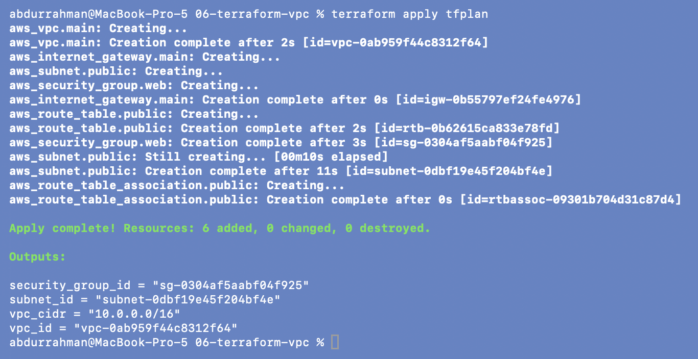
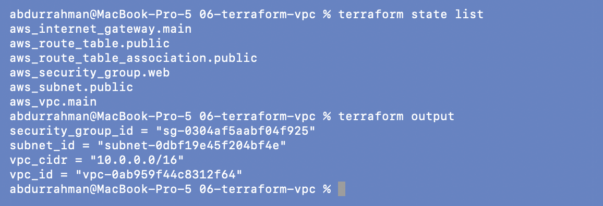
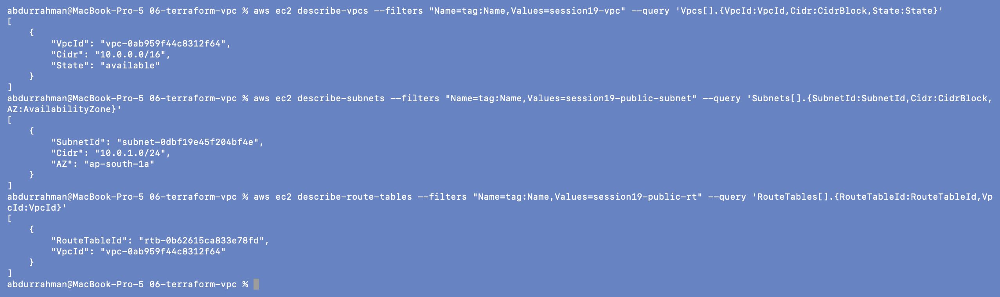
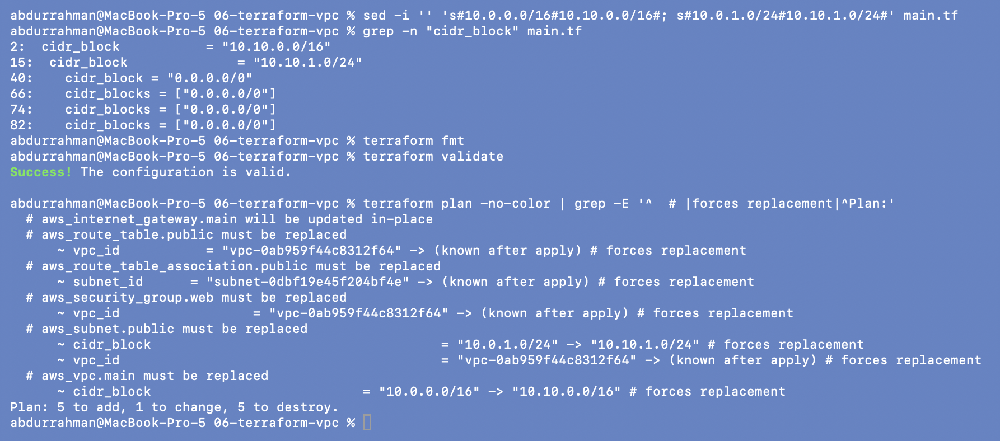
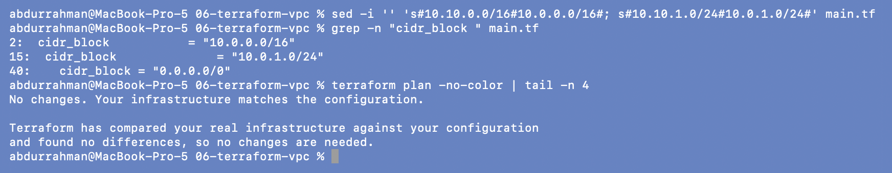
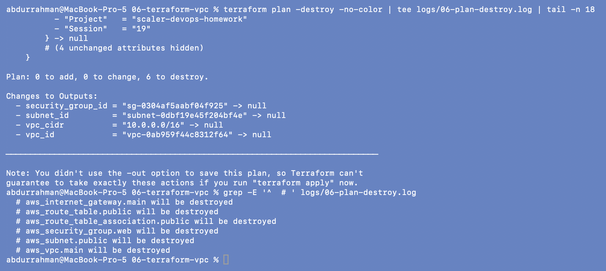
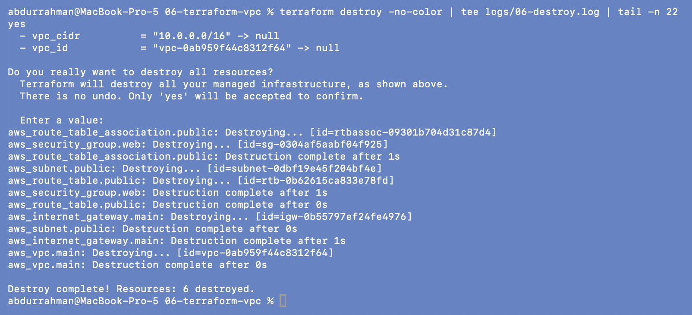
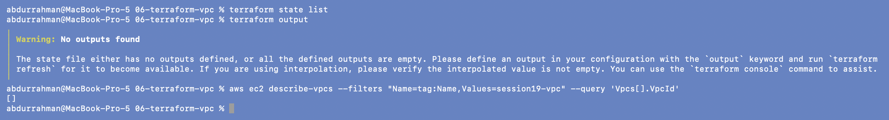

# 06 - Terraform VPC Lab

**Name:** Abdur Rahman Ibne Munir
**Enrollment number:** 24BCS10244

Terraform creates a VPC with one public subnet, an Internet Gateway, a public route table
with its association, and a web security group. That's six resources and no EC2, so this
lab costs nothing. Everything was created in my AWS account (`ap-south-1`) and destroyed
again at the end of the lab.

```text
06-terraform-vpc/
├── versions.tf               terraform + provider block (I added default_tags)
├── variables.tf              aws_region
├── main.tf                   the 6 resources
├── outputs.tf                vpc_id, vpc_cidr, subnet_id, security_group_id
├── terraform.tfvars.example  copied to terraform.tfvars (git-ignored by the lecture's .gitignore)
├── .gitignore                from the lecture
├── .terraform.lock.hcl       written by terraform init
└── screenshots/
```

**My one change to the lecture code:** a `default_tags` block in the provider, so every
resource also gets `Project = scaler-devops-homework`, `Session = 19`, `Owner = 24BCS10244`.
That's how I can prove at the end that nothing of mine is left in the account.

```hcl
provider "aws" {
  region = var.aws_region

  default_tags {
    tags = {
      Project = "scaler-devops-homework"
      Session = "19"
      Owner   = "24BCS10244"
    }
  }
}
```

---

## Step 1-2: variables and `terraform init`

```bash
cp terraform.tfvars.example terraform.tfvars
cat terraform.tfvars
terraform init
```



`init` found `hashicorp/aws` **v6.67.0** for the constraint `~> 6.0` and wrote
`.terraform.lock.hcl` to pin that exact version.

## Step 3-4: `fmt` and `validate`

```bash
terraform fmt
terraform validate
```


`fmt` printed nothing, which means every file was already formatted (including my
`default_tags` block). The notes allow for either case.

## Step 5: `terraform plan`

```bash
terraform plan -no-color -out=tfplan | tee logs/06-plan.log | tail -n 45
grep -E '^  # |^Plan:' logs/06-plan.log
```



The full plan is over 200 lines, too long for one screenshot, so I show the end
of it plus the list of resource headers. It says
**`Plan: 6 to add, 0 to change, 0 to destroy`**, as the notes expect. In `tags_all` you can
see my three default tags merged with the lecture's `Name`/`Session`/`ManagedBy` tags.

I also saved the plan to a file (`-out=tfplan`). Applying a saved plan runs exactly what
I reviewed and doesn't ask for `yes` again. The interactive `yes` prompt from the notes is
shown in [07](../07-terraform-workflow/) and in the destroy step below.

## Step 6: `terraform apply`

```bash
terraform apply tfplan
```



**`Apply complete! Resources: 6 added`.** The notes say "5 added" here, but the plan,
the state and the destroy all say 6, so that line in the notes is a typo.

The order shows Terraform working out dependencies from references: the VPC first, then
the IGW, subnet and security group in parallel (they only need `aws_vpc.main.id`), then
the route table (needs the IGW), and the association last (needs the subnet *and* the
route table). The subnet took 11 s, so the association had to wait for it.

## Step 7-8: state and outputs

```bash
terraform state list
terraform output
```



Six resources in the state, exactly the list in the notes, and the four outputs with the
real IDs.

## Step 9: verify with the AWS CLI

```bash
aws ec2 describe-vpcs \
  --filters "Name=tag:Name,Values=session19-vpc" \
  --query 'Vpcs[].{VpcId:VpcId,Cidr:CidrBlock,State:State}'
aws ec2 describe-subnets \
  --filters "Name=tag:Name,Values=session19-public-subnet" \
  --query 'Subnets[].{SubnetId:SubnetId,Cidr:CidrBlock,AZ:AvailabilityZone}'
aws ec2 describe-route-tables \
  --filters "Name=tag:Name,Values=session19-public-rt" \
  --query 'RouteTables[].{RouteTableId:RouteTableId,VpcId:VpcId}'
```



AWS reports the same IDs as `terraform output`: VPC `10.0.0.0/16`, subnet `10.0.1.0/24`
in `ap-south-1a`, and the route table in my VPC.

## Student exercise: change the CIDR, plan only

The notes say to change the VPC to `10.10.0.0/16` and the subnet to `10.10.1.0/24`, then
run `fmt`, `validate` and `plan`, but not apply. I did it while the VPC still existed, so
the plan compares against real infrastructure.

```bash
sed -i '' 's#10.0.0.0/16#10.10.0.0/16#; s#10.0.1.0/24#10.10.1.0/24#' main.tf
grep -n "cidr_block" main.tf
terraform fmt
terraform validate
terraform plan -no-color | grep -E '^  # |forces replacement|^Plan:'
```



**`Plan: 5 to add, 1 to change, 5 to destroy`.** A VPC's CIDR can't be changed in place,
so the VPC `must be replaced`. That ripples down: the subnet, route table and security
group all get a new `vpc_id` (`# forces replacement`), and the association gets a new
`subnet_id`. The Internet Gateway is the only one "updated in-place", because an IGW can
be detached from one VPC and attached to another. This is why the notes say not to apply
blindly: a two-number edit would recreate almost the whole network.

Then I put the original values back and confirmed nothing would change:

```bash
sed -i '' 's#10.10.0.0/16#10.0.0.0/16#; s#10.10.1.0/24#10.0.1.0/24#' main.tf
grep -n "cidr_block " main.tf
terraform plan -no-color | tail -n 4
```



## Step 10: destroy

```bash
terraform plan -destroy -no-color | tee logs/06-plan-destroy.log | tail -n 18
grep -E '^  # ' logs/06-plan-destroy.log
```



`Plan: 0 to add, 0 to change, 6 to destroy`, and every output goes to `null`.

```bash
terraform destroy -no-color | tee logs/06-destroy.log | tail -n 22
yes
```



**`Destroy complete! Resources: 6 destroyed`**, matching the notes. The order is the
reverse of the apply: association and security group first, the VPC last. The `yes` shows
up right under the command because the output goes through `tee | tail`. The terminal
echoes what I type straight away, but `tail` only prints the prompt and the result once
Terraform has finished.

**Added check (not in the notes):** state and AWS are both empty.

```bash
terraform state list
terraform output
aws ec2 describe-vpcs --filters "Name=tag:Name,Values=session19-vpc" --query 'Vpcs[].VpcId'
```



---

## What I understood

- Terraform builds a dependency graph from references like `aws_vpc.main.id`, so I never
  wrote the creation order myself, and destroy simply runs it backwards.
- `plan` is the safety net. It showed that one CIDR edit means "destroy and recreate
  five resources", which I'd never guess from the diff of `main.tf`.
- The state file is how Terraform knows which real IDs belong to this folder. After the
  destroy it's empty, and `terraform output` has nothing left to show.
- Notes can be wrong in small ways ("5 added"). The plan summary and the state list are
  what to trust.
