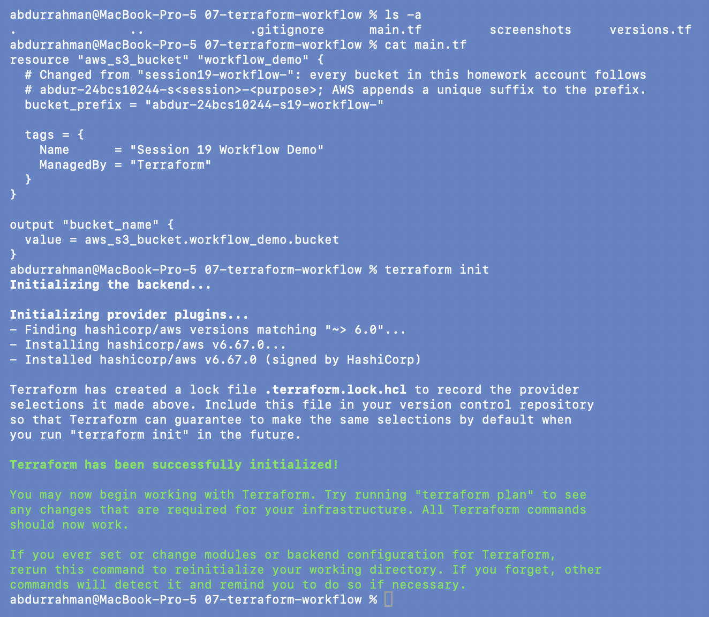
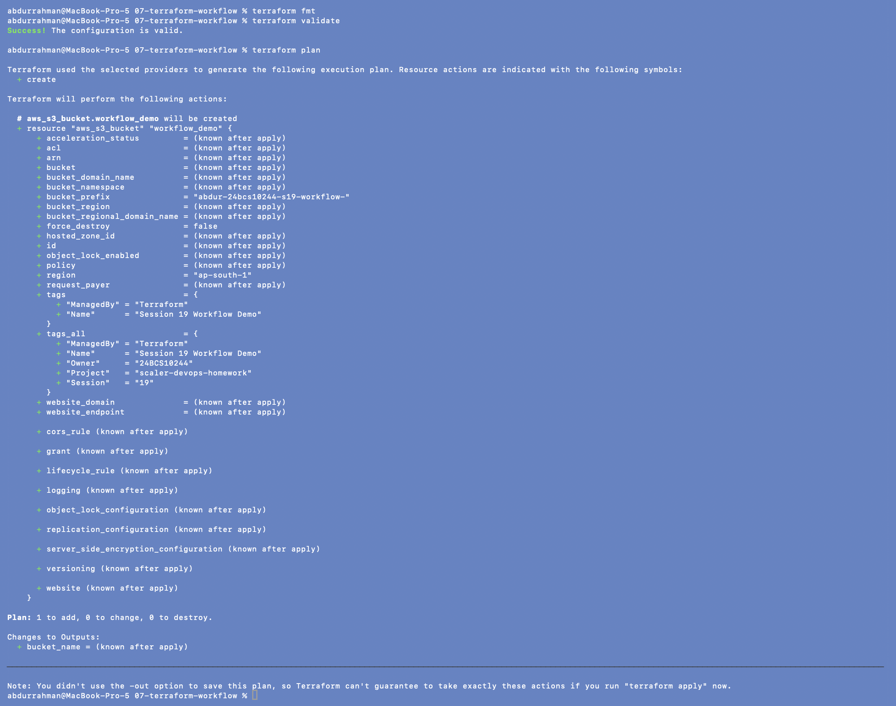
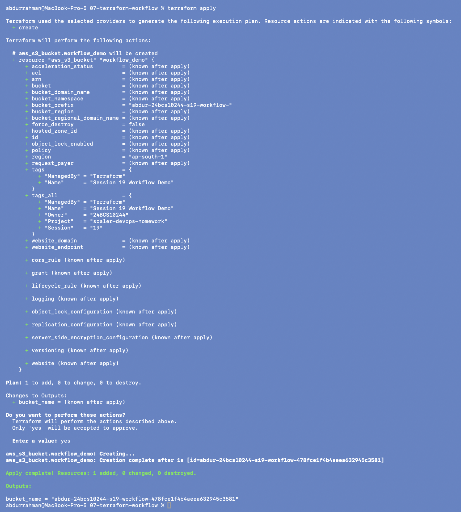
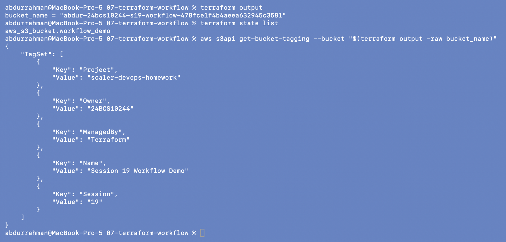
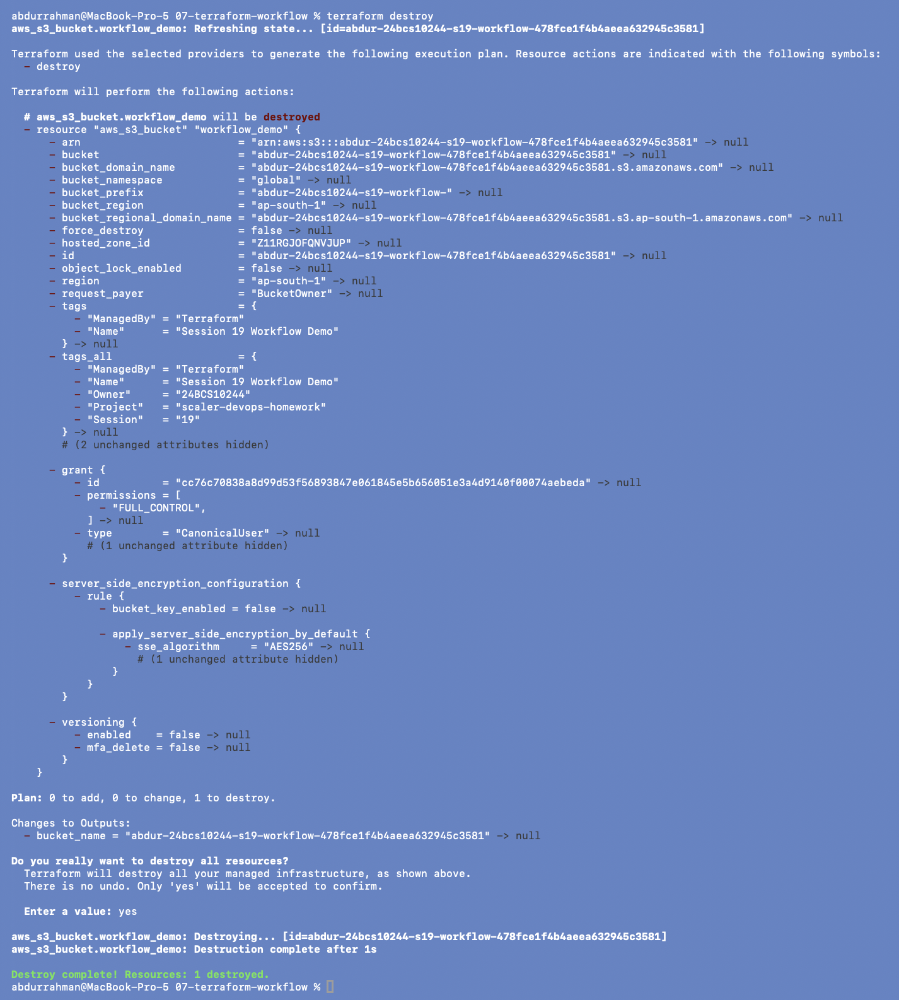
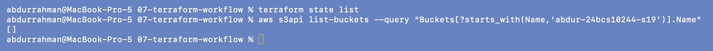

# 07 - Terraform Workflow

**Name:** Abdur Rahman Ibne Munir
**Enrollment number:** 24BCS10244

The whole Terraform lifecycle on the smallest possible example: **one S3 bucket**.
Here I ran `apply` and `destroy` the way the notes show, typing `yes` at the prompt.

```text
init -> fmt -> validate -> plan -> apply -> output / state list -> destroy
```

| Command | What it does |
|---|---|
| `terraform init` | prepares the folder, downloads the providers, writes the lock file |
| `terraform fmt` | rewrites `.tf` files into the standard layout |
| `terraform validate` | checks syntax and references without calling AWS |
| `terraform plan` | compares code with state and real infrastructure, shows `+ ~ - -/+` |
| `terraform apply` | does it (asks for `yes` unless given a saved plan) |
| `terraform output` | prints the `output` blocks from the state |
| `terraform state list` | lists the resources Terraform tracks |
| `terraform destroy` | deletes everything in the state (also asks for `yes`) |

**Changes to the lecture files** (both marked with a comment in the code):

- `bucket_prefix` was `session19-workflow-`. I changed it to
  `abdur-24bcs10244-s19-workflow-`, the naming convention I use for every bucket in this
  account. AWS adds a unique suffix either way, so the original wouldn't have collided;
  the change just makes the bucket obviously mine.
- `default_tags` in the provider block (Project / Session / Owner), same as in 06.

---

## init

```bash
ls -a
cat main.tf
terraform init
```



This folder has no `variables.tf` or tfvars: the region is hardcoded in `versions.tf`.

## fmt, validate, plan

```bash
terraform fmt
terraform validate
terraform plan
```



**`Plan: 1 to add`**, as in the notes. `bucket` is `(known after apply)` because only
the prefix is fixed; the final name is generated when the bucket is created. The note at
the bottom is Terraform saying that without `-out` there's no guarantee `apply` will do
exactly this, since it plans again.

## apply, with `yes`

```bash
terraform apply
yes
```



`apply` printed the same plan again and waited at `Enter a value:`. After `yes` the
bucket was created in 1 s as `abdur-24bcs10244-s19-workflow-478fce1f4b4aeea632945c3581`.

## output and state

```bash
terraform output
terraform state list
aws s3api get-bucket-tagging --bucket "$(terraform output -raw bucket_name)"
```



**Small mismatch with the notes:** they show `aws_s3_bucket.demo` in `terraform state list`,
but the resource in `main.tf` is called `workflow_demo`, so the real address is
`aws_s3_bucket.workflow_demo`. Nothing to fix, the notes just use a different name.

I added the tagging call to check the provider's `default_tags` really reached AWS: the
bucket has my `Project`, `Owner` and `Session` tags next to `Name` and `ManagedBy` from the
resource.

## destroy, with `yes`

```bash
terraform destroy
yes
```



Terraform refreshed the bucket, showed the plan (`1 to destroy`), asked
`Do you really want to destroy all resources?`, and deleted it after `yes`. An empty
bucket deletes without `force_destroy`. A bucket with objects in it would fail here, which
is why I set `force_destroy = true` on the bucket in [09](../09-final-project/).

**Added check:**

```bash
terraform state list
aws s3api list-buckets --query "Buckets[?starts_with(Name,'abdur-24bcs10244-s19')].Name"
```



Empty state, and no bucket with my session prefix left in the account.

---

## Practice answers

1. Downloads providers: `terraform init`
2. Formats code: `terraform fmt`
3. Checks syntax and consistency: `terraform validate`
4. Shows changes without applying: `terraform plan`
5. Creates resources: `terraform apply`
6. Removes resources: `terraform destroy`

## What I understood

- `plan` and `apply` are separate on purpose: `plan` is the review, `apply` is the change.
  Without a saved plan, `apply` re-plans and asks again, so the `yes` is the last chance to
  read what is about to happen.
- `bucket_prefix` lets AWS pick a globally unique name, which avoids S3's "name already
  taken" problem, but the name only exists after `apply`. `terraform output` is how
  scripts get it back.
- `terraform state list` uses the resource's address (`type.name` from my code), not the
  AWS name. That address is what `state show`, `-replace` and `-target` take.
