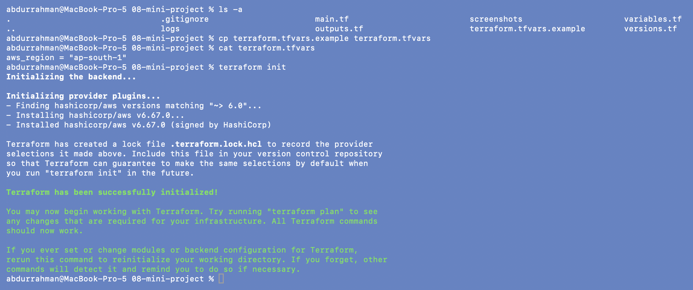
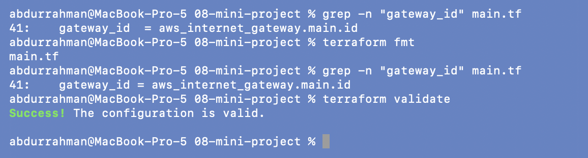
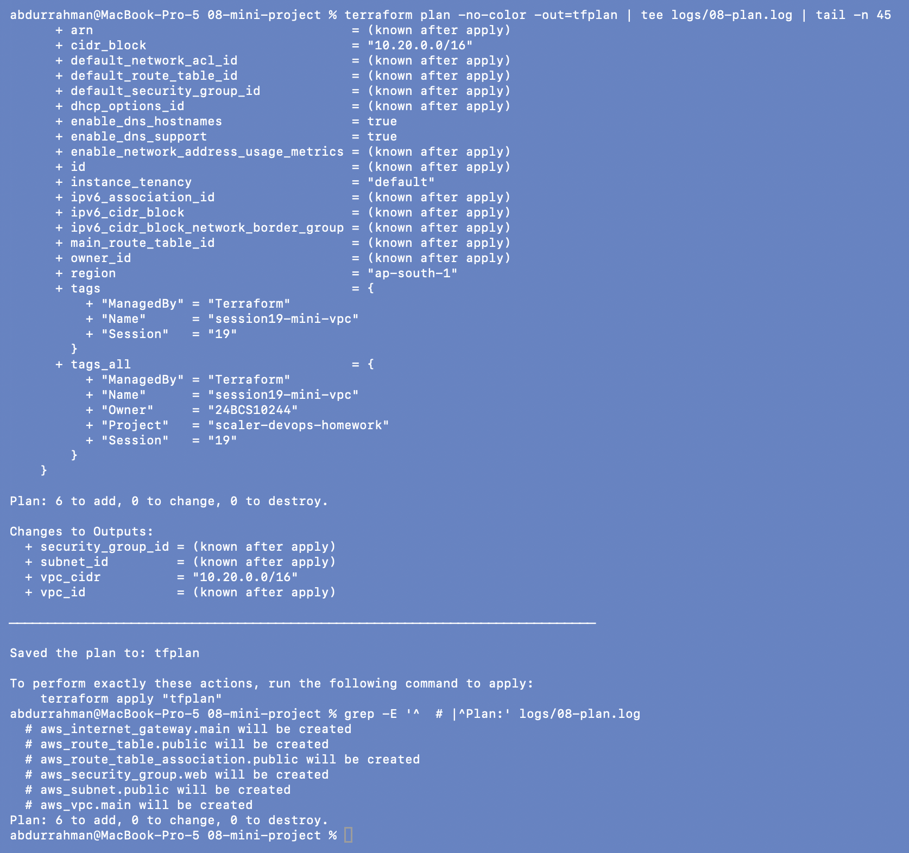
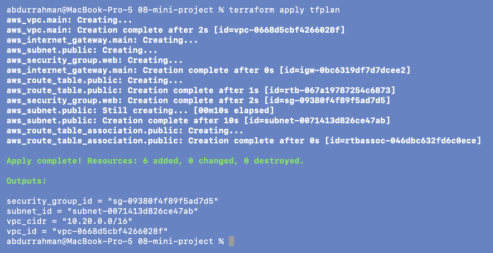
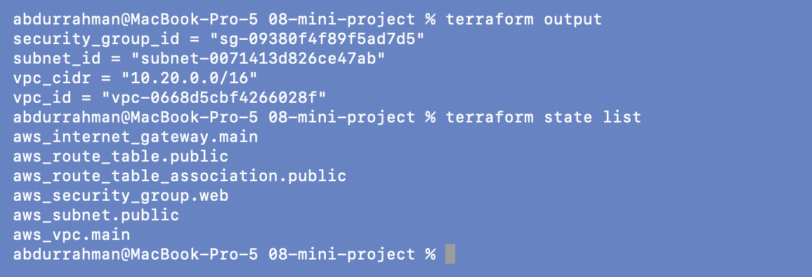
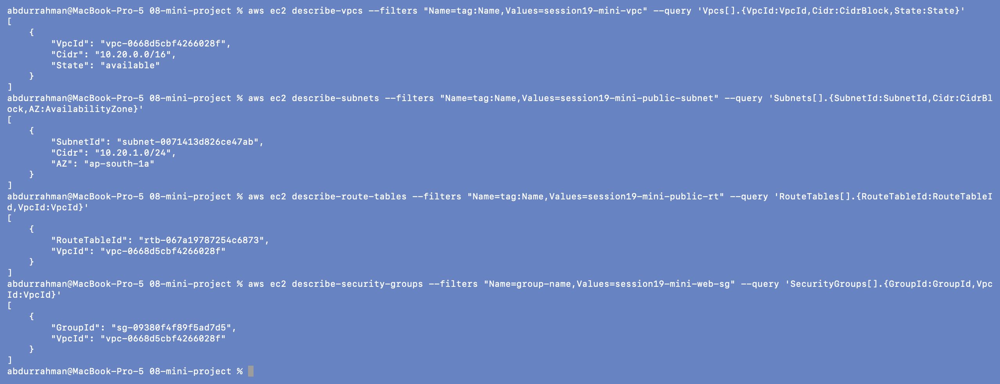
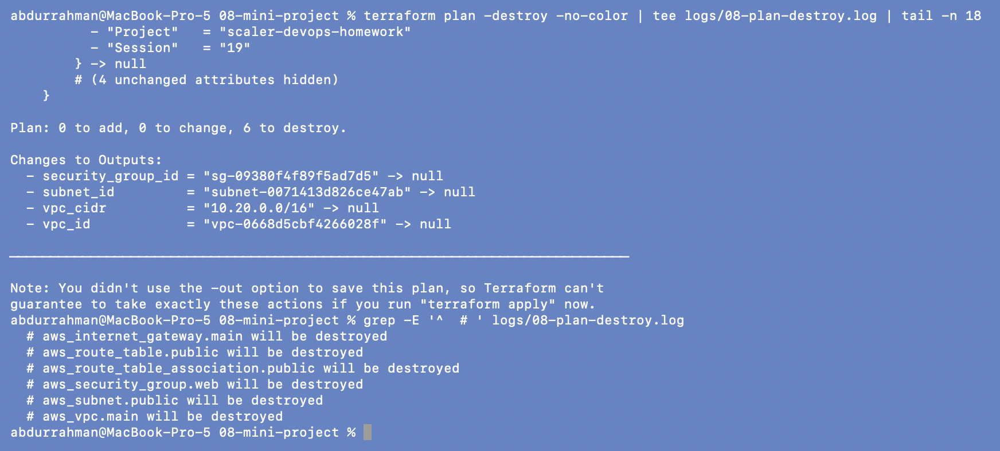
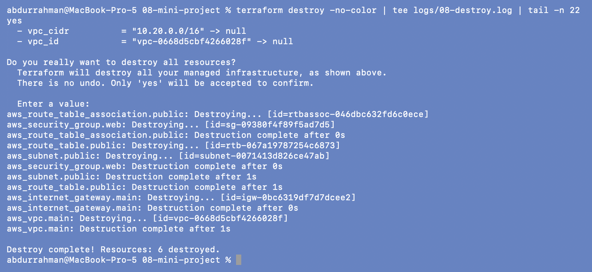
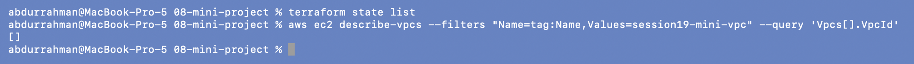

# 08 - Session 19 Mini Project

**Name:** Abdur Rahman Ibne Munir
**Enrollment number:** 24BCS10244

The lecture's mini project: the same network as 06, but in its own range,
`10.20.0.0/16`, with names prefixed `session19-mini-`.

```text
AWS Region ap-south-1
   |
   v
VPC 10.20.0.0/16 (session19-mini-vpc)
   +-- Public Subnet 10.20.1.0/24 (ap-south-1a)
   +-- Internet Gateway
   +-- Public Route Table (0.0.0.0/0 -> IGW)
   +-- Route Table Association
   +-- Web Security Group (HTTP 80 + HTTPS 443 from anywhere)
```

I destroyed the 06 VPC before applying this one, so I only ever had one VPC of my own at a
time. The account has a limit of 5 VPCs per region, and other homework sessions were
running in the same account. The only change to the lecture code is the same
`default_tags` block as in 06. The EC2 extension the notes suggest at the end is in
[09-final-project](../09-final-project/).

---

## Copy variables, init

```bash
cp terraform.tfvars.example terraform.tfvars
cat terraform.tfvars
terraform init
```



## Format and validate: `fmt` fixes the lecture file

```bash
grep -n "gateway_id" main.tf
terraform fmt
grep -n "gateway_id" main.tf
terraform validate
```



Unlike 06, `terraform fmt` printed **`main.tf`** here, meaning it rewrote that file. The
`grep` before and after shows why: the route block in the lecture's `main.tf` had
`gateway_id  =` with two spaces, and `fmt` aligned it to `gateway_id =`. It's only
whitespace (the file was valid before too), so I let `fmt` do its job.

## Plan

```bash
terraform plan -no-color -out=tfplan | tee logs/08-plan.log | tail -n 45
grep -E '^  # |^Plan:' logs/08-plan.log
```



`Plan: 6 to add`, now with `cidr_block = "10.20.0.0/16"` and the `session19-mini-vpc` name.
As in 06, the screenshot shows the tail of the plan.

## Apply

```bash
terraform apply tfplan
```



**`Apply complete! Resources: 6 added`**, created in the same dependency order as in 06.

## Verify: outputs and state

```bash
terraform output
terraform state list
```



Matches the "Expected" blocks in the notes: `vpc_cidr = "10.20.0.0/16"` and the same six
resource addresses.

## AWS CLI verification

```bash
aws ec2 describe-vpcs \
  --filters "Name=tag:Name,Values=session19-mini-vpc" \
  --query 'Vpcs[].{VpcId:VpcId,Cidr:CidrBlock,State:State}'
aws ec2 describe-subnets \
  --filters "Name=tag:Name,Values=session19-mini-public-subnet" \
  --query 'Subnets[].{SubnetId:SubnetId,Cidr:CidrBlock,AZ:AvailabilityZone}'
aws ec2 describe-route-tables \
  --filters "Name=tag:Name,Values=session19-mini-public-rt" \
  --query 'RouteTables[].{RouteTableId:RouteTableId,VpcId:VpcId}'
aws ec2 describe-security-groups \
  --filters "Name=group-name,Values=session19-mini-web-sg" \
  --query 'SecurityGroups[].{GroupId:GroupId,VpcId:VpcId}'
```



All four lookups find exactly one object, all in VPC `vpc-0668d5cbf4266028f`, the same ID
Terraform reported. The security group lookup filters on `group-name` instead of the
`Name` tag. It works because the lecture gives the group the same name and tag.

## Cleanup

```bash
terraform plan -destroy -no-color | tee logs/08-plan-destroy.log | tail -n 18
grep -E '^  # ' logs/08-plan-destroy.log
```



```bash
terraform destroy -no-color | tee logs/08-destroy.log | tail -n 22
yes
```



**`Destroy complete! Resources: 6 destroyed`**, as the notes expect.

**One hiccup, not a lecture bug.** My first `terraform destroy` here stopped straight
away with `Error: Plugin did not respond ... ConfigureProvider call`. The AWS provider
process failed while it was starting up, before it had touched anything, so the state still
listed all six resources and they still existed in AWS. The machine was busy with other
sessions at the time. I ran the exact same command again and it worked; the screenshot is from
that second run. Lesson: always check `state list` after a
destroy instead of assuming it worked.

```bash
terraform state list
aws ec2 describe-vpcs --filters "Name=tag:Name,Values=session19-mini-vpc" --query 'Vpcs[].VpcId'
```



---

## Interview questions from the notes

| Topic | My answer |
|---|---|
| IaaS vs PaaS vs SaaS | how much of the stack I manage: VM and up (EC2), only my code (Beanstalk), only my data (Gmail) |
| Region vs AZ | a region is a geographic area (`ap-south-1`); AZs are isolated locations inside it (`ap-south-1a/b/c`) |
| VPC vs subnet | a VPC is my private network with a CIDR range; a subnet is a slice of that range in one AZ |
| Public vs private subnet | public = its route table has `0.0.0.0/0 -> Internet Gateway`; private = no such route |
| Route table | the rules that decide where packets from a subnet go next |
| Internet Gateway | the VPC's connection to the internet; useless until a route points at it |
| Security group | stateful allow-list firewall on a resource (ports, protocols, sources) |
| Terraform | a tool that turns `.tf` files describing infrastructure into API calls, and tracks what it created |
| `plan` vs `apply` | `plan` shows the changes, `apply` makes them (and re-plans unless given a saved plan) |
| Terraform state | the record mapping each resource address to its real ID; how Terraform knows what exists |
| `destroy` | deletes everything in the state, in reverse dependency order |

## What I understood

- The mini project is the 06 lab with a different CIDR and names. Because everything is
  code, building a second, separate network took one `cp` and a few edits.
- `terraform fmt` isn't just cosmetic: a team keeps diffs clean by never arguing about
  alignment, and `fmt -check` can enforce it in CI.
- A failed command can leave everything exactly as it was. `terraform state list` and an
  AWS CLI query are a quick way to know for sure instead of guessing.
