# 09 - Final Project: VPC + EC2 + S3 with Terraform

**Name:** Abdur Rahman Ibne Munir
**Enrollment number:** 24BCS10244

**Addition (not in the lecture).** The homework asks for an end-to-end project with the
architecture *Terraform -> VPC, Subnet, Security Group, EC2, S3*. The lecture stops at the
network (08) and leaves EC2 as an "optional extension", so this folder takes the 08 mini
project and adds:

- one **EC2** `t3.micro` running Amazon Linux 2023, with a web page installed through
  `user_data`,
- one **S3** bucket, `abdur-24bcs10244-s19-final-project`,
- variables for everything that changes between environments, a **data source** for the
  AMI, an **explicit dependency**, and more outputs.

It was applied, checked with the AWS CLI and `curl`, and destroyed. The EC2 instance
existed for about **two minutes** (apply finished 01:19:27, destroy finished 01:21:30).

## Architecture

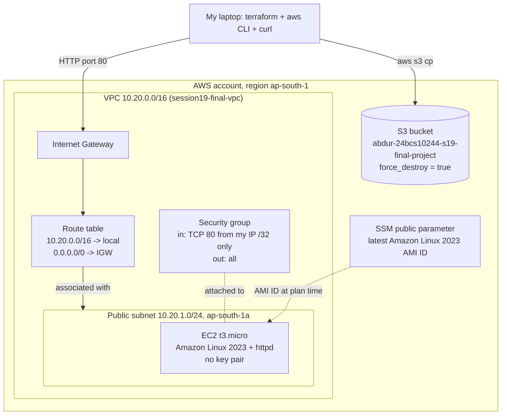

The same thing in plain text, in case Mermaid doesn't render:

```text
                          Internet
                              |
               only <my public IP>/32, TCP 80
                              |
                    +------------------+
                    | Internet Gateway |
                    +---------+--------+
                              |
 +----------------------------+-------------------------------+
 | VPC 10.20.0.0/16  (session19-final-vpc)                    |
 |                                                            |
 |   Route table:  10.20.0.0/16 -> local                      |
 |                 0.0.0.0/0    -> Internet Gateway           |
 |         | associated with                                  |
 |   +-----+--------------------------------------------+     |
 |   | Public subnet 10.20.1.0/24  (ap-south-1a)        |     |
 |   |                                                  |     |
 |   |   [ EC2 t3.micro | Amazon Linux 2023 | httpd ]   |     |
 |   |     security group: IN  TCP 80 from my IP/32     |     |
 |   |                     OUT all (for dnf at boot)    |     |
 |   |     no SSH rule, no key pair                     |     |
 |   +--------------------------------------------------+     |
 +------------------------------------------------------------+

 S3 bucket abdur-24bcs10244-s19-final-project   (regional service, not inside the VPC)
 AMI ID  <-  SSM /aws/service/ami-amazon-linux-latest/al2023-ami-kernel-default-x86_64
```

## Files

```text
09-final-project/
├── versions.tf               terraform block + aws provider with default_tags
├── variables.tf              7 variables (2 with validation, 1 sensitive)
├── main.tf                   VPC, subnet, IGW, route table + association, SG,
│                             SSM data source, EC2 instance, S3 bucket
├── outputs.tf                9 outputs (network IDs, AMI, instance, URL, bucket)
├── terraform.tfvars.example  region, name prefix, instance type, bucket name
├── .gitignore                from the lecture (ignores *.tfvars, state, .terraform/)
├── .terraform.lock.hcl       provider version lock (hashicorp/aws 6.67.0)
└── screenshots/
```

## How the homework requirements map to the code

| Requirement | Where |
|---|---|
| Provider | `versions.tf`: `hashicorp/aws ~> 6.0`, region from `var.aws_region`, `default_tags` |
| Variables | `variables.tf`: `aws_region`, `project_name`, `vpc_cidr`, `public_subnet_cidr`, `instance_type` (validated: only `t3.micro`/`t3.nano`), `bucket_name`, `my_ip_cidr` (sensitive, must end in `/32`) |
| Resources | `main.tf`: 8 managed resources |
| Data source | `data.aws_ssm_parameter.al2023`: the AMI ID is looked up, not hardcoded |
| Outputs | `outputs.tf`: `vpc_id`, `vpc_cidr`, `subnet_id`, `security_group_id`, `ami_id`, `instance_id`, `instance_public_ip`, `web_url`, `bucket_name` |
| Implicit dependencies | references such as `vpc_id = aws_vpc.main.id`, `subnet_id = aws_subnet.public.id` |
| Explicit dependency | `depends_on = [aws_route_table_association.public]` on the instance |
| State | local `terraform.tfstate`, shown with `state list` and `ls -l` |
| plan / apply / destroy | steps 3, 6 and 11 below |

### Why the explicit `depends_on`

```hcl
resource "aws_instance" "web" {
  ...
  subnet_id              = aws_subnet.public.id
  vpc_security_group_ids = [aws_security_group.web.id]
  user_data = <<-EOT
    #!/bin/bash
    dnf install -y httpd
    ...
  EOT

  depends_on = [aws_route_table_association.public]
}
```

The instance only *references* the subnet and the security group, so on its own Terraform
could launch it as soon as those two exist, possibly before the route to the Internet
Gateway is in place. But `user_data` runs `dnf install` on first boot, and that needs the
internet. Terraform can't see that dependency inside a shell script, so I declared it.
Because the association depends on the route table, which depends on the IGW, this one
line covers the whole internet path.

### Security choices

- **No SSH at all**: no port 22 rule and no `key_name`. The server sets itself up through
  `user_data`, so nobody needs to log in.
- **HTTP only from my own IP**, as a `/32`. The lecture's 08 group allowed 80 and 443
  from `0.0.0.0/0`; I removed 443 (nothing listens on it) and narrowed 80.
- **My IP stays out of the repo and the screenshots.** `my_ip_cidr` is marked
  `sensitive = true`, so Terraform prints `(sensitive value)` instead of it. The value lives
  in `myip.auto.tfvars`, which is git-ignored, and I deleted it after the destroy.
- **Cost guard**: the `instance_type` validation refuses anything except `t3.micro` or
  `t3.nano`.

---

## Step 1: variables and my IP

```bash
cp terraform.tfvars.example terraform.tfvars
cat terraform.tfvars
echo "my_ip_cidr = \"$(curl -s https://checkip.amazonaws.com)/32\"" > myip.auto.tfvars
sed -E 's/[0-9]+\.[0-9]+\.[0-9]+\.[0-9]+/<my-public-ip>/' myip.auto.tfvars
```

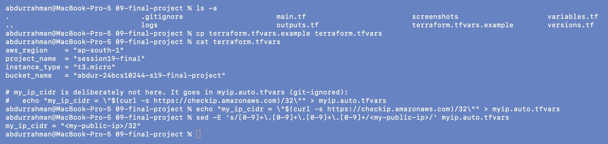

`terraform.tfvars` holds the non-secret values. `myip.auto.tfvars` is filled in from
`checkip.amazonaws.com`. Terraform loads any `*.auto.tfvars` file automatically. The
`sed` shows the file's shape with the address masked.

## Step 2: init, fmt, validate

```bash
terraform init
terraform fmt
terraform validate
```

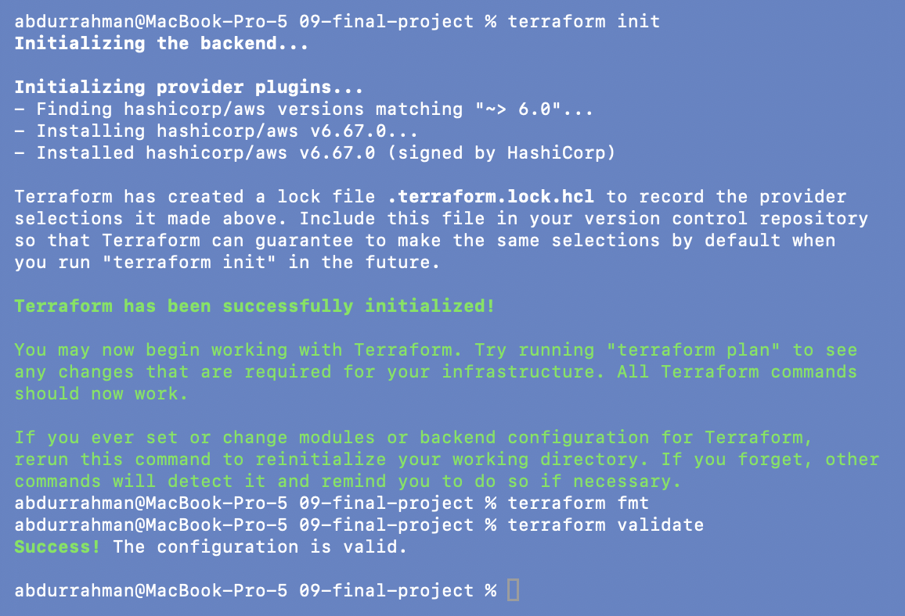

## Step 3: plan

```bash
terraform plan -no-color -out=tfplan | tee logs/09-plan.log | grep -E "data\.|^  # |^Plan:|^Saved"
```

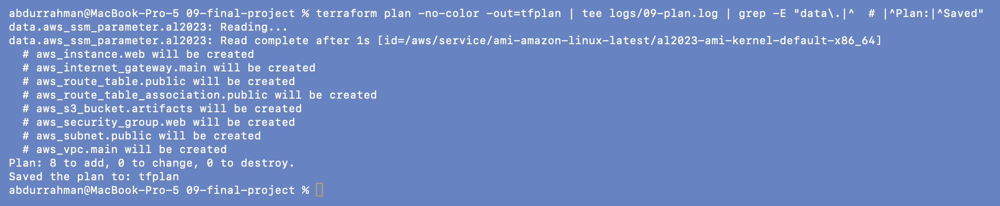

First the data source is read (`data.aws_ssm_parameter.al2023: Read complete`), then
**`Plan: 8 to add`**: the six network resources from 08 plus the instance and the bucket.
The full plan is about 340 lines, so the screenshot filters it.

## Step 4: the interesting parts of the plan

```bash
sed -n '/# aws_instance.web will/,/user_data_base64/p' logs/09-plan.log | grep -v 'known after apply'
sed -n '/# aws_s3_bucket.artifacts will/,/force_destroy/p' logs/09-plan.log | grep -v 'known after apply'
grep -E '# aws_security_group|description  |ingress  ' logs/09-plan.log
```

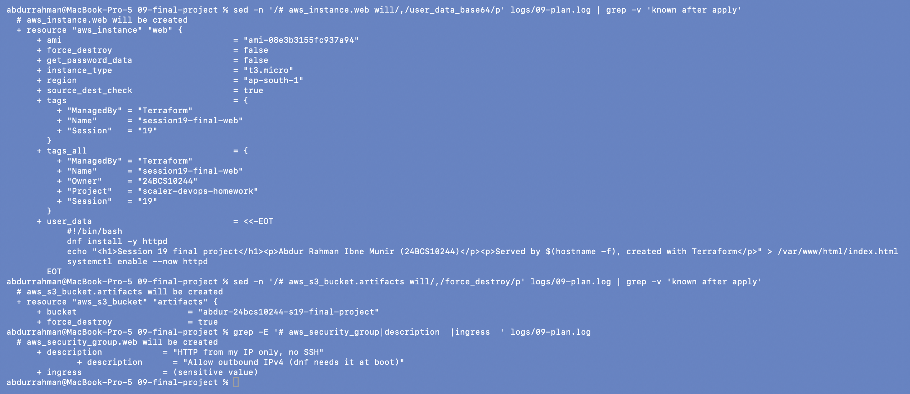

- `ami = "ami-08e3b3155fc937a94"` is already known at plan time, because data sources
  are read during the plan. That's the current AL2023 x86_64 image in `ap-south-1`.
- `instance_type = "t3.micro"`, the default tags are merged into `tags_all`, and
  `user_data` is shown in full.
- The bucket has its fixed name and `force_destroy = true`.
- The security group's whole `ingress` block shows as `(sensitive value)`, because one
  field in it (my IP) comes from a sensitive variable.

## Step 5: the dependency graph

```bash
terraform graph | head -n 25
```

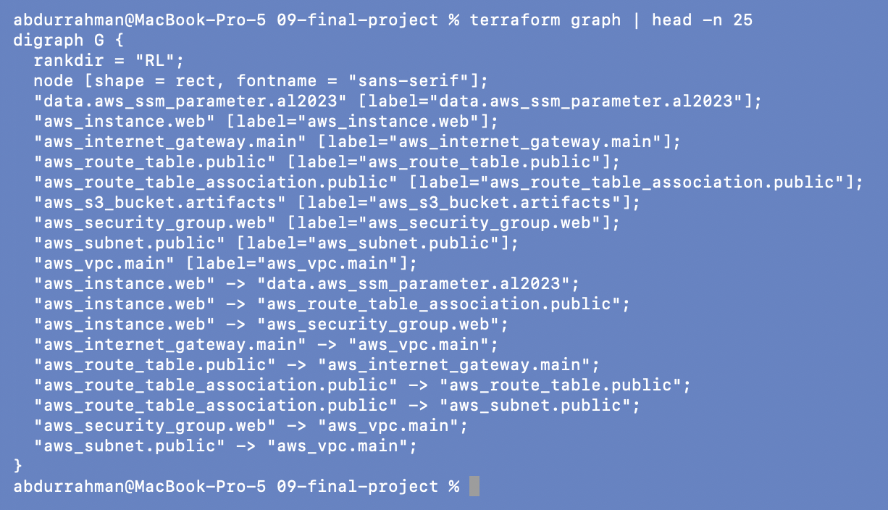

Each `A -> B` line means "A depends on B". The instance has three edges: the SSM data
source and the security group (implicit, from references) and the route table
association (my explicit `depends_on`). The bucket has no edges at all, so Terraform can
create it in parallel with everything else. (Graphviz isn't installed on this machine, so
I didn't render the DOT output as an image; the diagram above shows the same structure.)

```text
data.aws_ssm_parameter.al2023 ─────────────────────────────┐
aws_vpc.main ─┬─ aws_subnet.public ──────────────┐         │
              ├─ aws_internet_gateway.main       │         │
              │     └─ aws_route_table.public ───┴─ aws_route_table_association.public
              │                                              └─(depends_on)─┐
              └─ aws_security_group.web ────────────────────────────────────┴─ aws_instance.web
aws_s3_bucket.artifacts   (independent)
```

## Step 6: apply

```bash
terraform apply tfplan
```

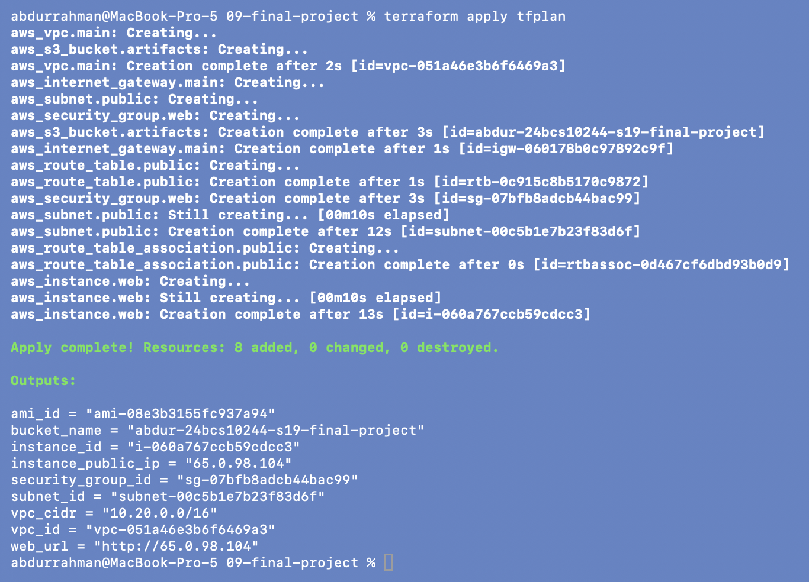

**`Apply complete! Resources: 8 added`.** The order follows the graph: the VPC and the
bucket start together, the instance starts only after the route table association
completes, and it is created last (13 s). The outputs give the public IP and `web_url`.

## Step 7: outputs and state

```bash
terraform output
terraform state list
ls -l terraform.tfstate
```

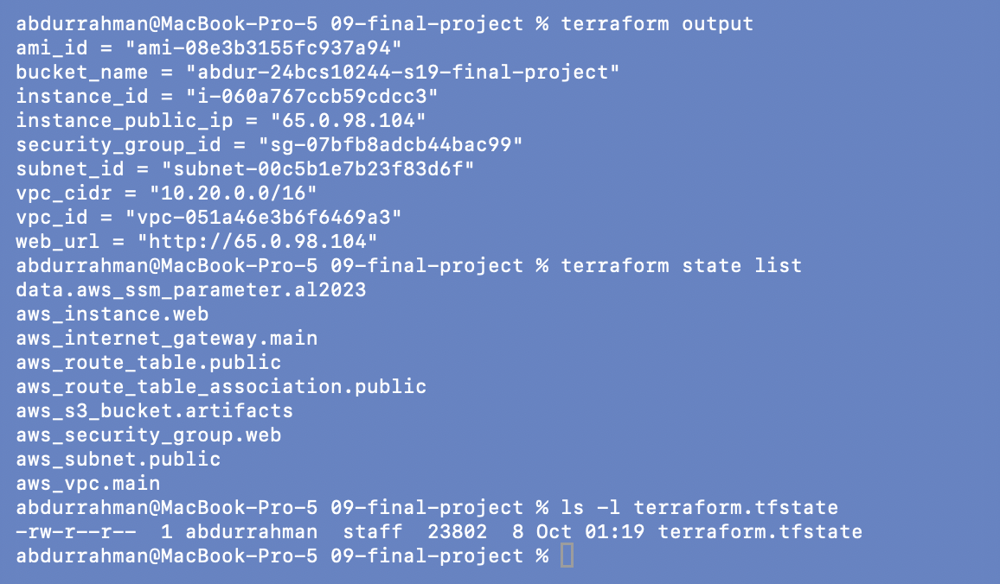

The state tracks the data source plus the 8 resources. It's a local JSON file of about
24 KB, and it is git-ignored: it contains every real ID, and in this project also my IP
in plain text. A sensitive variable is only hidden in the CLI output, not in the state.

## Step 8: check it in AWS

```bash
aws ec2 describe-instances --instance-ids "$(terraform output -raw instance_id)" \
  --query 'Reservations[].Instances[].{Id:InstanceId,Type:InstanceType,State:State.Name,AZ:Placement.AvailabilityZone,Ami:ImageId,KeyPair:KeyName,PublicIp:PublicIpAddress,PrivateIp:PrivateIpAddress}' \
  --output table
aws ec2 describe-security-groups --group-ids "$(terraform output -raw security_group_id)" \
  --query 'SecurityGroups[].IpPermissions[].{Proto:IpProtocol,From:FromPort,To:ToPort,Source:IpRanges[0].CidrIp}' \
  --output table | sed -E 's#[0-9]+\.[0-9]+\.[0-9]+\.[0-9]+/32#<my-public-ip>/32#'
aws s3api list-buckets --query "Buckets[?starts_with(Name,'abdur-24bcs10244-s19')].Name"
```

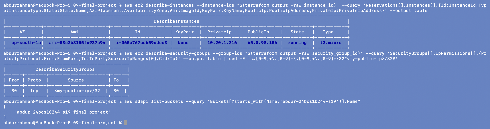

The instance is `running`, `t3.micro`, in `ap-south-1a`, launched from the SSM-resolved
AMI, with **KeyPair `None`**, private IP `10.20.1.216` (inside my subnet) and a public IP.
The security group has exactly one inbound rule: TCP 80 from a single `/32` (masked with
`sed`, as the command shows). The bucket exists.

## Step 9: is the web server reachable, and is SSH closed?

```bash
curl -s "$(terraform output -raw web_url)"
curl -s -o /dev/null -w 'HTTP %{http_code}\n' "$(terraform output -raw web_url)"
nc -z -G 5 "$(terraform output -raw instance_public_ip)" 22; echo "port 22 exit code: $?"
```

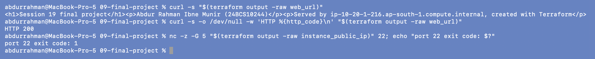

The page from `user_data` comes back with **HTTP 200**, and it says it was served by
`ip-10-20-1-216.ap-south-1.compute.internal`, the instance's private hostname in my
subnet. So the whole path works: IGW, route, security group, instance, and `dnf` reaching
the internet at boot. Port 22 fails with exit code 1 after the 5-second timeout, because
there is no rule for it and the security group silently drops the packets.

## Step 10: put something in the bucket

```bash
echo "uploaded by 24BCS10244 to test force_destroy" | aws s3 cp - "s3://$(terraform output -raw bucket_name)/hello.txt"
aws s3 ls "s3://$(terraform output -raw bucket_name)/"
```

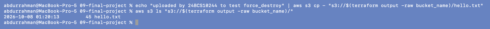

I put one object into the bucket on purpose so that the destroy has to deal with a
non-empty bucket. Terraform doesn't know about this object; it was created outside it.

## Step 11: destroy, straight away

```bash
terraform destroy -no-color | tee logs/09-destroy.log | tail -n 40
yes
```

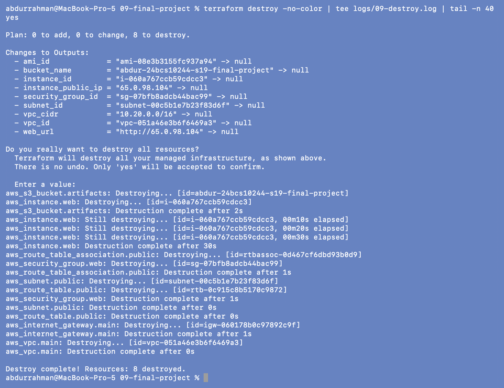

**`Destroy complete! Resources: 8 destroyed`.** Two things worth pointing out:

- The bucket was deleted in 2 s **even though `hello.txt` was in it**. That is
  `force_destroy = true` at work: the provider empties the bucket first. Without it,
  S3 refuses to delete a non-empty bucket and the destroy would stop with an error.
- The order is the graph in reverse. The route table association waited until the
  instance was terminated (30 s), because of my `depends_on`. After that, the security
  group, subnet and route table, then the IGW, then the VPC.

(The `yes` is echoed under the command because the output goes through `tee | tail`, as
in 06.)

## Step 12: confirm nothing is left

```bash
terraform state list
aws ec2 describe-instances --instance-ids i-060a767ccb59cdcc3 \
  --query 'Reservations[].Instances[].{Id:InstanceId,State:State.Name}' --output table
aws s3api list-buckets --query "Buckets[?starts_with(Name,'abdur-24bcs10244-s19')].Name"
aws ec2 describe-vpcs --filters "Name=tag:Name,Values=session19-final-vpc" --query 'Vpcs[].VpcId'
```

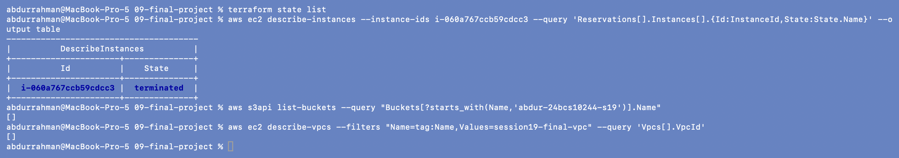

Empty state, the instance is `terminated` (AWS keeps showing terminated instances for a
while, but they don't run or cost anything), no bucket, no VPC. Its root EBS volume was
deleted with it (`delete_on_termination` is the default for the root volume). The final
account-wide check is in the [session README](../README.md#cleanup-verification).

## Answers to the notes' EC2 questions (08, "Optional Extension")

1. **Which subnet should the EC2 instance use?** The public subnet, because that is the one
   with the IGW route.
2. **Which security group?** The project's own group, `session19-final-web-sg`, not the
   VPC's `default` group.
3. **Why does a public subnet need a route to the IGW?** Without it, replies to my
   requests (and the instance's own downloads) have no way out of the VPC.
4. **What else is needed to reach the instance from the internet?** A public IP
   (`map_public_ip_on_launch`), a security group rule for the port, and a process actually
   listening on it (httpd).
5. **Why not open SSH to `0.0.0.0/0`?** Every bot on the internet would start guessing
   passwords and keys. Here I didn't need SSH at all.

## What I understood

- Data sources are read during `plan`, so the AMI ID was known before anything existed.
  Using the SSM parameter means the code keeps working when Amazon publishes a new image
  or when I switch regions.
- Most dependencies come from references for free; `depends_on` is for the ones Terraform
  can't see, such as "my boot script needs the internet". It affects both create order and
  destroy order.
- `sensitive = true` hides a value in the CLI output but not in the state file, so the
  state has to be protected (git-ignored here, a locked-down remote backend in real teams).
- `force_destroy` is what makes a bucket disposable. Without it, an object someone
  uploads outside Terraform would block the destroy.
- With real money involved, the order is: plan, apply, verify, destroy, and then check
  `state list` and the AWS CLI. Two minutes of a `t3.micro` was enough to prove everything.
