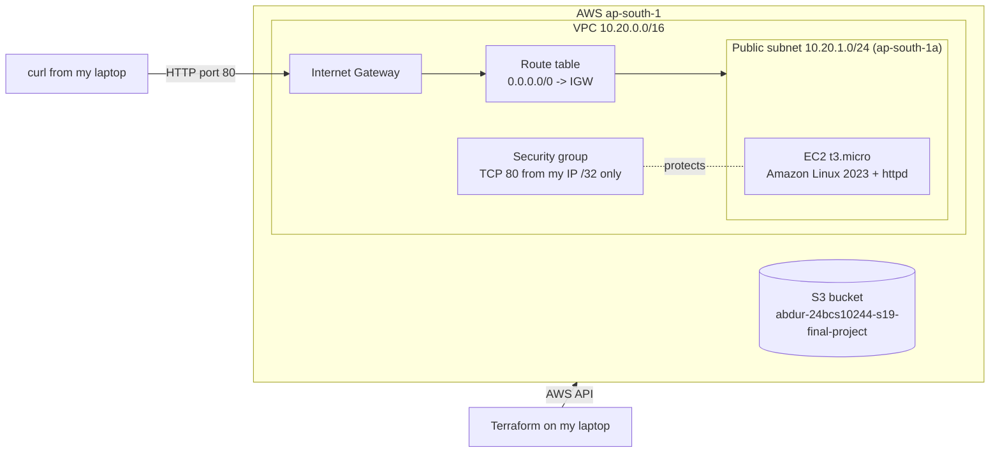
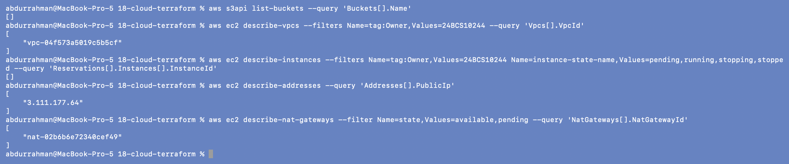

# Session 19 - Cloud & Terraform in Action

**Name:** Abdur Rahman Ibne Munir
**Enrollment number:** 24BCS10244

This session connects cloud basics (service models, regions and AZs, VPCs, subnets, route
tables, internet gateways, security groups) with Terraform. I read the concepts against my
real AWS account using the read-only `aws ec2 describe-*` commands from the notes, then
ran the three Terraform labs from the lecture (a VPC, the init-to-destroy workflow on an S3
bucket, and the mini project). For the homework's end-to-end project I extended the mini
project with an EC2 web server and an S3 bucket (folder 09). Every apply ended with a
`terraform destroy` and a check that nothing was left. All screenshots are my own
terminal on my Mac, against AWS region `ap-south-1`.

## Homework task -> where to find it

| Homework asks for | Where |
|---|---|
| Providers | `versions.tf` in 06, 07, 08, 09 (`hashicorp/aws ~> 6.0`, resolved to v6.67.0) |
| Variables | `variables.tf` + `terraform.tfvars` in 06/08; 7 variables with validation and a sensitive one in [09](09-final-project/) |
| Resources | VPC, subnet, IGW, route table, association, SG (06, 08, 09); S3 (07, 09); EC2 (09) |
| Outputs | `outputs.tf` in 06/08/09, inline output in 07; shown with `terraform output` |
| Dependencies | implicit references everywhere; explicit `depends_on` and `terraform graph` in [09](09-final-project/#why-the-explicit-depends_on) |
| AWS infrastructure | created, verified with the AWS CLI, then destroyed: [06](06-terraform-vpc/), [07](07-terraform-workflow/), [08](08-mini-project/), [09](09-final-project/) |
| Terraform state | `terraform state list` in every lab; state file and what it contains in [09 step 7](09-final-project/#step-7-outputs-and-state) |
| `plan`, `apply`, `destroy` | every lab; interactive `yes` in [07](07-terraform-workflow/); `plan -destroy` in 06/08 |
| Architecture diagram | [below](#architecture-of-the-final-project) and in [09](09-final-project/#architecture) (Mermaid + ASCII) |
| Screenshots | `screenshots/` in each folder (43 in total) |
| Terraform commands | [list below](#terraform-commands-i-used) |
| README | this file + one per folder |

## Folder structure

```text
18-cloud-terraform/
├── 01-cloud-service-models/              notes only (no commands in the lecture)
├── 02-regions-and-availability-zones/    aws configure get region, sts get-caller-identity, AZ list
├── 03-vpc-and-subnets/                   describe-vpcs, describe-subnets
├── 04-route-tables-and-internet-gateway/ describe-route-tables
├── 05-security-groups/                   describe-security-groups
├── 06-terraform-vpc/                     lecture lab: VPC + subnet + IGW + RT + SG (+ CIDR exercise)
├── 07-terraform-workflow/                lecture lab: init -> destroy on one S3 bucket
├── 08-mini-project/                      lecture mini project: 10.20.0.0/16 network
├── 09-final-project/                     addition: 08 + EC2 web server + S3 bucket
├── screenshots/                          final cleanup verification
├── .gitignore                            .terraform/, state, plans, crash logs, my IP file
└── README.md
```

For the long commands (plan, plan -destroy, destroy) the screenshots show the end of the
output.

## Architecture of the final project



```text
Terraform ──> AWS ap-south-1
              ├── S3 bucket  abdur-24bcs10244-s19-final-project  (force_destroy)
              └── VPC 10.20.0.0/16
                  ├── Internet Gateway
                  ├── Route table  0.0.0.0/0 -> IGW  ── associated with ──┐
                  ├── Public subnet 10.20.1.0/24 (ap-south-1a) <──────────┘
                  │     └── EC2 t3.micro (AL2023 AMI from SSM, httpd via user_data, no key pair)
                  └── Security group: in TCP 80 from my IP/32, out all, no SSH
```

## Terraform commands I used

```bash
terraform init                      # download the aws provider, write .terraform.lock.hcl
terraform fmt                       # format (rewrote 08/main.tf; nothing to do elsewhere)
terraform validate                  # syntax + references
terraform plan                      # preview (07)
terraform plan -out=tfplan          # preview and save the plan (06, 08, 09)
terraform apply                     # apply with the interactive yes prompt (07)
terraform apply tfplan              # apply exactly the saved plan (06, 08, 09)
terraform output                    # outputs; terraform output -raw <name> inside commands
terraform state list                # what Terraform tracks
terraform graph                     # dependency graph in DOT format (09)
terraform plan -destroy             # preview the destroy (06, 08)
terraform destroy                   # delete everything in the state, with yes (all labs)
```

## Environment note

- **AWS:** account `187004426521`, IAM user `homework-terraform`, region **`ap-south-1`**
  only. Credentials come from the AWS CLI's default profile. I never ran `aws configure` on
  screen (it would prompt for keys) and no keys appear in any file or screenshot.
- **Tools:** Terraform v1.16.5, AWS provider v6.67.0, AWS CLI 2.34.48 on macOS (Apple
  Silicon).
- **Provider cache:** every terminal had `TF_PLUGIN_CACHE_DIR` set, so the ~700 MB AWS
  provider was downloaded once and shared by all four Terraform folders instead of once per
  folder. `.terraform/` directories were deleted at the end.
- **AWS CLI pager:** the terminal had `AWS_PAGER=""`, so CLI output prints directly
  instead of opening in `less`.
- **Tags:** I added a `default_tags` block to every provider, so every resource got
  `Project = scaler-devops-homework`, `Session = 19`, `Owner = 24BCS10244` on top of the
  lecture's own tags. That is what the cleanup check below filters on.
- **Bucket names:** all follow `abdur-24bcs10244-s19-<purpose>`. I didn't use the lecture's
  `session19-workflow-` prefix (see 07).
- **One VPC at a time:** other sessions of this homework were using the same account,
  and AWS allows 5 VPCs per region. I destroyed 06 before applying 08, and 08 before 09.
- **Kubernetes / ports:** this session doesn't use minikube, so no namespace or local port
  was involved.
- **Long output:** Terraform plans here are 200-400 lines. For those I ran
  `-no-color | tee logs/<name>.log | tail` (or `grep` for the resource list). The
  screenshot shows the important end. When I typed `yes` into
  a piped `destroy`, the terminal echoes it right under the command, because `tail` only
  prints the prompt after Terraform finishes.
- **Git:** the lecture's per-folder `.gitignore` files ignore `*.tfvars` and
  `.terraform.lock.hcl`, so those stay local; `terraform.tfvars.example` is what to copy.
  The session `.gitignore` adds state files, saved plans and my IP file.

## Where the notes and reality differed

| Where | Notes say | What actually happened | What I did |
|---|---|---|---|
| 06 README, step 6 | `Apply complete! Resources: 5 added` | `6 added` (6 in plan, state and destroy) | nothing, typo in the notes |
| 07 README, state list | `aws_s3_bucket.demo` | `aws_s3_bucket.workflow_demo` (the name in `main.tf`) | nothing, naming mismatch |
| 07 `main.tf` | `bucket_prefix = "session19-workflow-"` | works, but doesn't follow my account's naming | changed to `abdur-24bcs10244-s19-workflow-`, with a comment |
| 08 `main.tf` (and the 04 snippet) | `gateway_id  =` (two spaces) | valid; `terraform fmt` printed `main.tf` and realigned it | let `fmt` fix it, shown before/after |
| 06/08/09 subnet | `availability_zone = "${var.aws_region}a"` | fine in `ap-south-1` | kept; it assumes every region has an `a` zone |
| 08 destroy | (none) | first run: `Plugin did not respond` (provider crashed at start-up, nothing deleted) | re-ran the same command, it worked; checked state and AWS |

None of these were bugs that stopped a lab, so there is no failing-then-fixed screenshot.

## Cleanup verification

After the last destroy, run from this folder:

```bash
aws s3api list-buckets --query 'Buckets[].Name'
aws ec2 describe-vpcs --filters Name=tag:Owner,Values=24BCS10244 --query 'Vpcs[].VpcId'
aws ec2 describe-instances --filters Name=tag:Owner,Values=24BCS10244 Name=instance-state-name,Values=pending,running,stopping,stopped --query 'Reservations[].Instances[].InstanceId'
aws ec2 describe-addresses --query 'Addresses[].PublicIp'
aws ec2 describe-nat-gateways --filter Name=state,Values=available,pending --query 'NatGateways[].NatGatewayId'
```



- **S3:** no buckets at all, so both of my buckets (07 and 09) are gone.
- **Instances:** none pending, running or stopped with my Owner tag. The 09 instance is
  terminated.
- **The VPC, Elastic IP and NAT gateway that do show up are not from this session.** They
  belong to the `taskboard-vpc` stack from Session 21 (the final project's EKS cluster),
  which runs in the same account and also carries `Owner = 24BCS10244`, but has
  `Session = 21`. I checked their tags and left them alone. None of my three VPCs
  (`session19-vpc`, `session19-mini-vpc`, `session19-final-vpc`) exist any more, as each
  folder's "after destroy" screenshot shows.
- `terraform state list` is empty in 06, 07, 08 and 09.

## Pending: needs the student

- Commit and push this folder (`18-cloud-terraform/`). Nothing else is left to do in AWS
  for this session.
