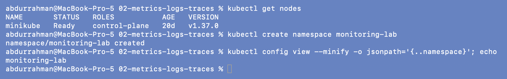
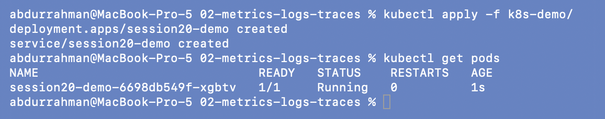
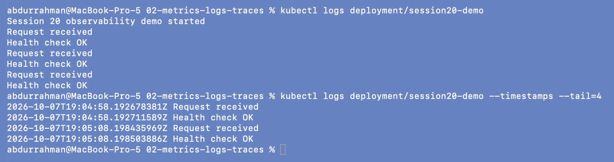
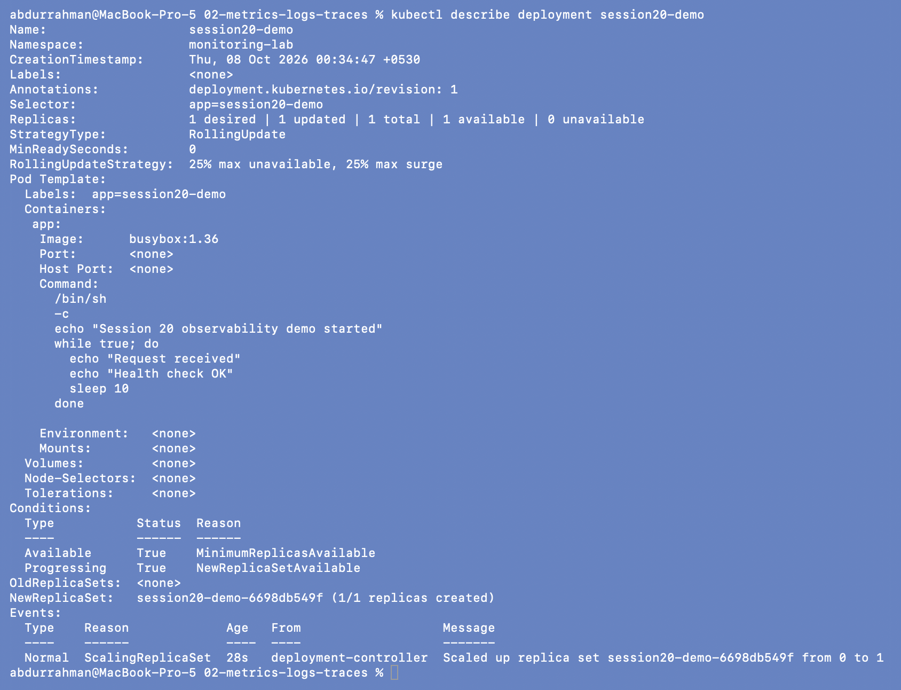
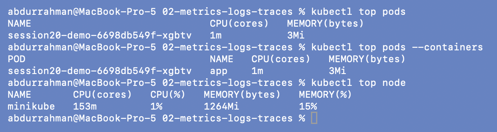
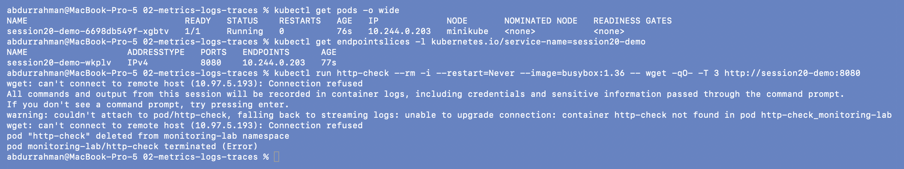
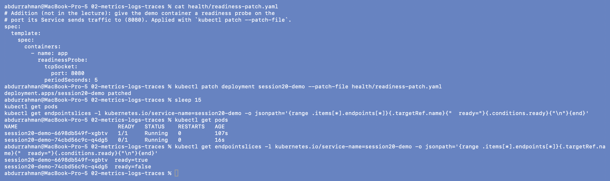
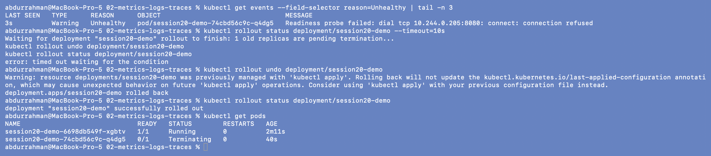
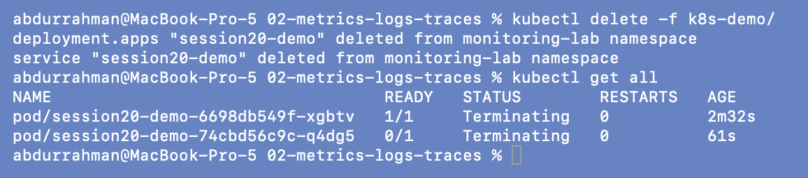

# Metrics, Logs and Traces: Kubernetes demo

**Name:** Abdur Rahman Ibne Munir
**Enrollment number:** 24BCS10244

The lecture's Kubernetes demo: a busybox Deployment that writes log lines, plus a Service.
I ran it as written, then added three small steps for the monitoring task: CPU and
memory with `kubectl top`, and application health with a readiness probe. The meaning of
the three signals is written up in [`01-monitoring-vs-observability`](../01-monitoring-vs-observability/README.md).

```text
02-metrics-logs-traces/
├── k8s-demo/
│   ├── deployment.yaml        busybox:1.36, prints a log line pair every 10 s
│   └── service.yaml           port 8080 → targetPort 8080
├── health/
│   └── readiness-patch.yaml   addition: readiness probe on port 8080
└── screenshots/
```

## 1. Cluster and namespace

The notes start with `kind create cluster --name session20`. I used my existing minikube
cluster instead, so the first command is just a check. The notes use the `default`
namespace. I ran this demo in `monitoring-lab`, set as this terminal's default
namespace, so every plain `kubectl` command below goes there.

```bash
kubectl get nodes
kubectl create namespace monitoring-lab
kubectl config view --minify -o jsonpath='{..namespace}'; echo
```



## 2. Apply the demo

```bash
kubectl apply -f k8s-demo/
kubectl get pods
```



The Pod was `Running` after 1 s because `busybox:1.36` was already on the node. The name
`session20-demo-6698db549f-xgbtv` is the Deployment name, then the ReplicaSet's
pod-template hash, then a random suffix.

## 3. Logs: *what happened*

```bash
kubectl logs deployment/session20-demo
kubectl logs deployment/session20-demo --timestamps --tail=4
```



Exactly the lines the notes expect: one `Session 20 observability demo started`, then a
`Request received` / `Health check OK` pair every 10 s. `--timestamps` adds the time the
kubelet recorded for each line (19:04:58, 19:05:08), which is how you line logs up with a
metric spike. These are only `echo` lines. The "Health check OK" text doesn't check
anything, as section 6 shows.

## 4. Describe the workload

```bash
kubectl describe deployment session20-demo
```



`describe` shows the labels and selector, `Replicas: 1 desired | 1 updated | 1 total | 1
available`, the image and the full shell command, the `Available` / `Progressing`
conditions, and the event `Scaled up replica set … from 0 to 1`. The Pod template has no
probes at all (`Port: <none>`, no Liveness/Readiness lines). That matters in section 6.

## 5. Addition: CPU and memory with `kubectl top`

The notes describe CPU and memory as metrics but don't measure them. metrics-server is
already enabled in my minikube, so:

```bash
kubectl top pods
kubectl top pods --containers
kubectl top node
```



The demo Pod uses `1m` CPU (1/1000 of a core) and `3Mi` memory, since it sleeps most of
the time. The node is at `153m` CPU (1 %) and `1264Mi` memory (15 %). `top` is a current
snapshot from metrics-server with no history. For history you need Prometheus, as in
[`03-prometheus`](../03-prometheus/).

## 6. Addition: application health with a readiness probe

**Running is not the same as serving.** The Service sends traffic to port 8080, but the
container is a shell loop that never opens a port. Kubernetes still considers it ready:

```bash
kubectl get pods -o wide
kubectl get endpointslices -l kubernetes.io/service-name=session20-demo
kubectl run http-check --rm -i --restart=Never --image=busybox:1.36 -- wget -qO- -T 3 http://session20-demo:8080
```



The Pod is `1/1 Ready` and the Service's EndpointSlice lists it (`10.244.0.203:8080`), yet
a request from inside the cluster gets `Connection refused`. Without a readiness probe a
container counts as ready as soon as it starts. (The `couldn't attach` warning is because
`wget` finished before `kubectl run -i` could attach, so kubectl printed the output from
the logs instead.)

**Add a readiness probe** on the port the Service uses:

```yaml
# health/readiness-patch.yaml
spec:
  template:
    spec:
      containers:
        - name: app
          readinessProbe:
            tcpSocket:
              port: 8080
            periodSeconds: 5
```

```bash
kubectl patch deployment session20-demo --patch-file health/readiness-patch.yaml
sleep 15
kubectl get pods
kubectl get endpointslices -l kubernetes.io/service-name=session20-demo \
  -o jsonpath='{range .items[*].endpoints[*]}{.targetRef.name}{"  ready="}{.conditions.ready}{"\n"}{end}'
```



The patch changes the Pod template, so a rollout starts. The new Pod
(`…74cbd56c9c-q4dg5`) stays `0/1`, and the EndpointSlice marks it `ready=false`, so the
Service won't send it traffic. The old Pod keeps running, because with 1 replica the
default `maxUnavailable: 25%` rounds down to 0: Kubernetes won't remove the old Pod until
the new one is ready.

```bash
kubectl get events --field-selector reason=Unhealthy | tail -n 3
kubectl rollout status deployment/session20-demo --timeout=10s
kubectl rollout undo deployment/session20-demo
kubectl rollout status deployment/session20-demo
kubectl get pods
```



The event gives the reason: `Readiness probe failed: dial tcp 10.244.0.205:8080: connect:
connection refused`. The rollout is stuck (`1 old replicas are pending termination`,
timeout). `rollout undo` goes back to the previous template and the stuck Pod is removed.
The warning about `last-applied-configuration` means the file in `k8s-demo/` no longer
matches what is running. That is fine here, because the next step deletes everything.

So the readiness probe is what turned "the app doesn't answer on 8080" into a signal
Kubernetes acts on: no traffic to the broken Pod, and the rollout stopped.

## 7. Clean up

```bash
kubectl delete -f k8s-demo/
kubectl get all
```



The Pods stay in `Terminating` for about 30 s. The container's main process is `/bin/sh`,
which as PID 1 ignores SIGTERM. The kubelet therefore waits the full
`terminationGracePeriodSeconds` (30 s) and then kills it. I skipped the optional
`kind delete cluster`. The namespace itself was deleted in the session's
[final cleanup](../README.md#final-cleanup).

## What I understood

- A log tells me **what** happened (`Request received`), a metric tells me **how much**
  (`1m` CPU, `3Mi` memory), and a trace would tell me **where** a request spent its time.
  This demo has no traces because nothing in it is instrumented.
- `kubectl logs` works without setup because Kubernetes captures stdout/stderr. The lines
  are lost with the Pod unless they are shipped somewhere.
- `kubectl top` is a quick live view from metrics-server. It has no history and no alerting.
- A Pod without a readiness probe is "Ready" as soon as its process starts, even if it
  can't serve anything. The readiness probe made the failure visible (`0/1`,
  `ready=false`, `Unhealthy` events) and protected the Service from the broken Pod.
