# Prometheus

**Name:** Abdur Rahman Ibne Munir
**Enrollment number:** 24BCS10244

Prometheus 3.5 in Docker Compose, scraping itself every 5 s. The notes do the queries in
the web UI. I sent the same PromQL to the HTTP API with `curl` (piped through `jq` to
make the JSON readable) and added one browser screenshot of the graph. After the
lecture part comes an **addition** for the alerting part of the homework: a rules file,
a second target, and an alert going pending → firing → resolved.

```text
03-prometheus/
├── docker-compose.yml       prom/prometheus:v3.5.0, port 9090
├── prometheus.yml           scrape_interval 5s, one job: prometheus:9090
├── alerting/                addition
│   ├── docker-compose.yml   same Prometheus + prom/node-exporter:v1.9.1
│   ├── prometheus.yml       copy of ../prometheus.yml + rule_files + job "node"
│   ├── alert-rules.yml      TargetDown: up == 0 for 30s
│   └── screenshots/
└── screenshots/
```

```text
Prometheus ──GET /metrics every 5s──▶ target (here: Prometheus itself)
     │
     └── stores each sample as a time series ──▶ PromQL (UI or /api/v1/query)
```

## 1. Start Prometheus

```bash
cat docker-compose.yml prometheus.yml
docker compose up -d
docker compose ps
```

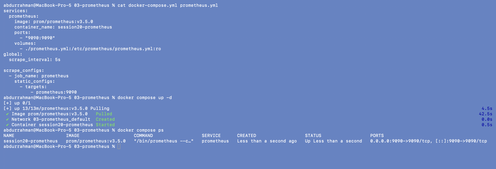

The image was pulled (about 43 s) and `session20-prometheus` is up with
`0.0.0.0:9090->9090/tcp`. The scrape target is written as `prometheus:9090`, the
Compose service name, because Prometheus resolves it on the Compose network and not
from my Mac.

## 2. The `/metrics` endpoint and `up`

```bash
curl -s http://localhost:9090/metrics | grep -E '^(# HELP|# TYPE)? ?(prometheus_http_requests_total|process_cpu_seconds_total|process_resident_memory_bytes)' | head -n 14
curl -s 'http://localhost:9090/api/v1/query?query=up' | jq
```

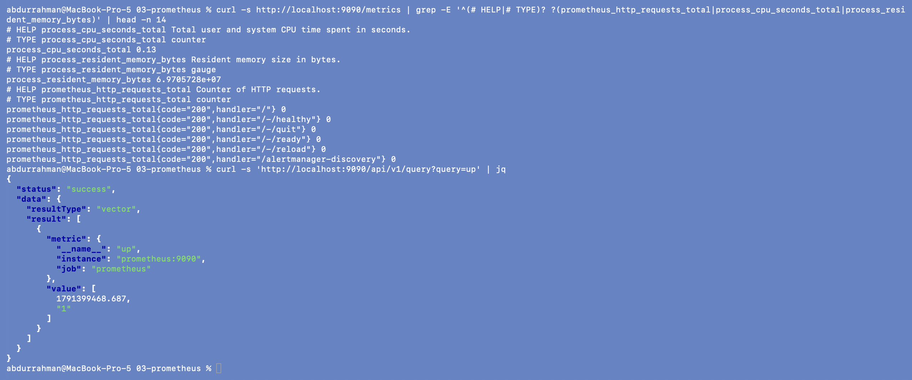

`/metrics` is plain text: a `# HELP` line, a `# TYPE` line (`counter` or `gauge`), then
`name{labels} value`. This is the format Prometheus scrapes from every target. The `up`
query returns exactly what the notes expect: `up{instance="prometheus:9090",
job="prometheus"} 1`. Prometheus creates `up` itself for every target after each scrape:
`1` means the scrape worked, `0` means it failed.

## 3. The other lecture queries

```bash
curl -s 'http://localhost:9090/api/v1/query?query=prometheus_http_requests_total' \
  | jq -c '.data.result[] | select(.value[1] != "0") | {handler: .metric.handler, code: .metric.code, value: .value[1]}'
curl -s 'http://localhost:9090/api/v1/query?query=process_cpu_seconds_total' | jq -c '.data.result[] | {metric, value: .value[1]}'
curl -s 'http://localhost:9090/api/v1/query?query=sum(up)' | jq -c '.data.result'
```

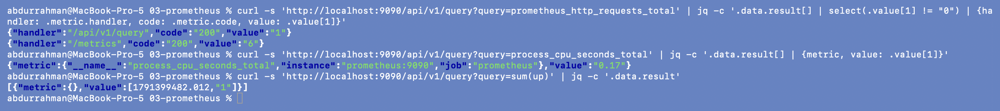

- `prometheus_http_requests_total` returns one series per handler and status code. I
  hid the ones still at 0. `/metrics` was at 6: Prometheus scraping itself every 5 s,
  plus my `curl` in step 2. `/api/v1/query` was at 1, from my previous query.
- `process_cpu_seconds_total` was 0.17: total CPU seconds the process has used since it
  started. It is a counter, so on its own it only grows.
- `sum(up)` adds all `up` series into one number with no labels: `1`, the number of
  healthy targets.

## 4. Addition: CPU and memory utilization

A raw CPU counter isn't utilization, but its rate is. These queries turn the two process
metrics into CPU % of one core and MiB, then fetch a minute of history:

```bash
curl -s -G http://localhost:9090/api/v1/query --data-urlencode 'query=rate(process_cpu_seconds_total[1m]) * 100' \
  | jq -c '.data.result[] | {job: .metric.job, cpu_percent_of_one_core: .value[1]}'
curl -s -G http://localhost:9090/api/v1/query --data-urlencode 'query=process_resident_memory_bytes / 1024 / 1024' \
  | jq -c '.data.result[] | {job: .metric.job, memory_MiB: .value[1]}'
curl -s -G http://localhost:9090/api/v1/query_range --data-urlencode 'query=process_resident_memory_bytes' \
  --data-urlencode "start=$(date -v-1M +%s)" --data-urlencode "end=$(date +%s)" --data-urlencode 'step=15s' \
  | jq -c '.data.result[].values[]'
```

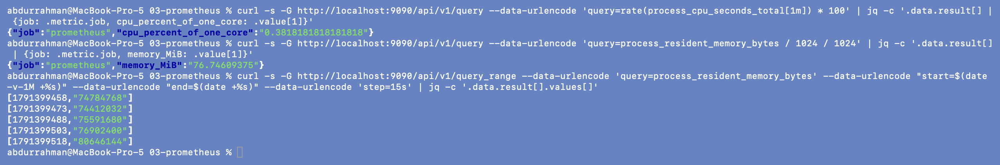

Prometheus used about 0.38 % of one core and 76.7 MiB of memory. The range query
returns `[timestamp, value]` pairs every 15 s (74.8 MB → 80.6 MB). This is the "values
over time" idea from the notes, and the data a graph is drawn from.

**Browser screenshot** of the same memory series in the Prometheus UI (Query → Graph, 5 m):

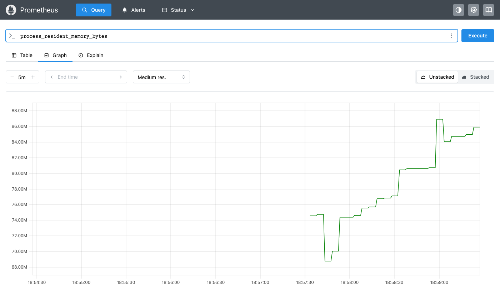

## 5. Stop

```bash
docker compose down
docker compose ps -a
```

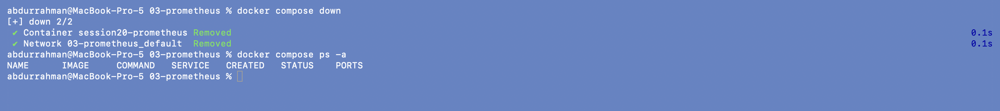

---

## Addition: an alerting rule that fires

The homework asks for alerts, and the lecture only mentions them
(`IF error_rate > 5% THEN alert`). The smallest real version is one Prometheus rule plus a
target I can switch off. Both files in `alerting/` are copies of the lecture setup with
these changes:

```yaml
# alerting/prometheus.yml (changes)
global:
  evaluation_interval: 5s          # how often rules are checked
rule_files:
  - /etc/prometheus/alert-rules.yml
scrape_configs:
  - job_name: node                 # second target: node-exporter
    static_configs:
      - targets: [node-exporter:9100]
```

### Start it

```bash
cat alert-rules.yml
docker compose up -d
docker compose ps
```

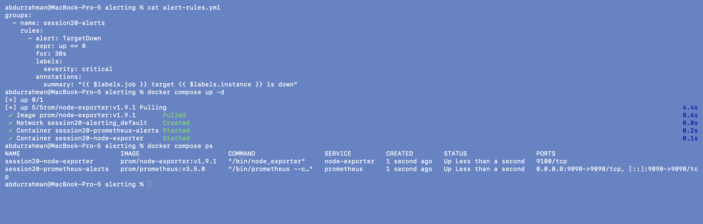

The rule says: if any target's `up` is 0 **for 30 s straight**, raise `TargetDown` with
severity `critical`. The `for` part keeps a single failed scrape from raising the alert.

### Rule loaded, both targets healthy

```bash
curl -s http://localhost:9090/api/v1/rules | jq '.data.groups[].rules[] | {name, query, duration, health, state}'
curl -s 'http://localhost:9090/api/v1/query?query=up' | jq -c '.data.result[] | {job: .metric.job, instance: .metric.instance, up: .value[1]}'
curl -s http://localhost:9090/api/v1/alerts | jq -c '.data.alerts'
```

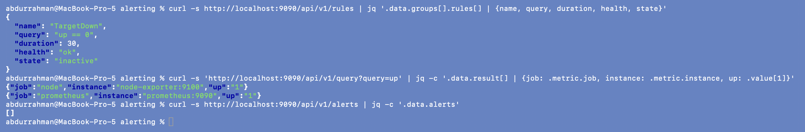

The rule loaded with `health: ok`, `duration: 30` and `state: inactive`. Both targets have
`up = 1`, and there are no alerts.

### Stop a target → pending

```bash
docker compose stop node-exporter
sleep 12
curl -s 'http://localhost:9090/api/v1/query?query=up' | jq -c '.data.result[] | {job: .metric.job, instance: .metric.instance, up: .value[1]}'
curl -s http://localhost:9090/api/v1/alerts | jq '.data.alerts[] | {alert: .labels.alertname, job: .labels.job, state, activeAt, summary: .annotations.summary}'
```

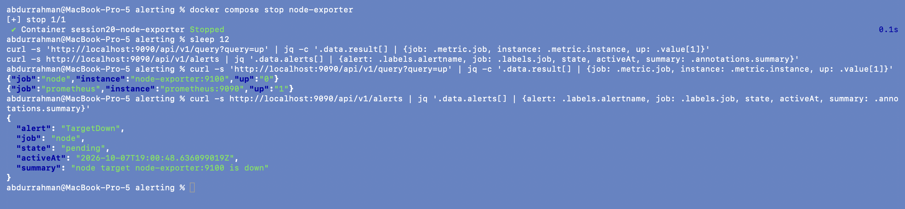

`up{job="node"}` dropped to `0` (the scrape of `node-exporter:9100` fails once the
container is gone). The alert exists but is **pending**: the condition is true, and
Prometheus is waiting out the 30 s `for` window from `activeAt` 19:00:48Z.

### 30 s later → firing

```bash
sleep 30
curl -s http://localhost:9090/api/v1/alerts | jq '.data.alerts[] | {alert: .labels.alertname, job: .labels.job, severity: .labels.severity, state, activeAt, summary: .annotations.summary}'
curl -s http://localhost:9090/api/v1/rules | jq -c '.data.groups[].rules[] | {name, state, health}'
```

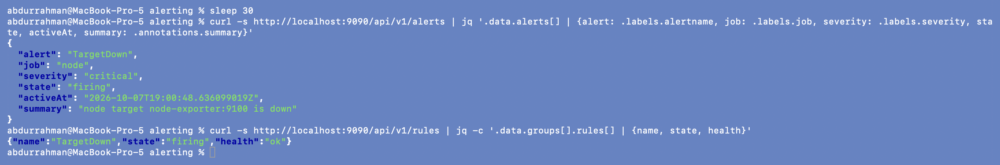

Now `state: firing`, with the templated summary `node target node-exporter:9100 is down`.
**Browser screenshot** of the Alerts page at the same moment:

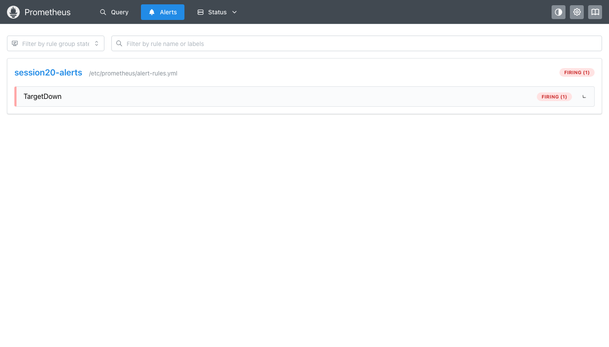

### Bring it back → resolved

```bash
docker compose start node-exporter
sleep 12
curl -s 'http://localhost:9090/api/v1/query?query=up' | jq -c '.data.result[] | {job: .metric.job, up: .value[1]}'
curl -s http://localhost:9090/api/v1/alerts | jq -c '.data.alerts'
docker compose down
```

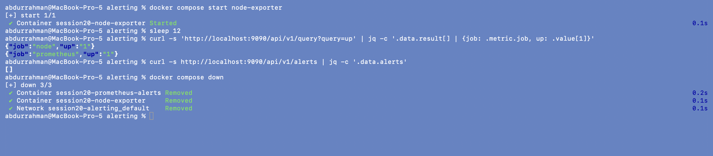

Both targets are back to `1` and the alert list is empty again. This setup has no
Alertmanager, so Prometheus only *evaluates* the rule. A real setup points Prometheus at
Alertmanager (`alerting.alertmanagers` in `prometheus.yml`), which groups alerts,
silences them and sends them to Slack, e-mail or PagerDuty.

## Practice answers (from the notes)

1. Prometheus collects **metrics** (numeric time series).
2. A **scrape** is one HTTP `GET /metrics` to a target, whose result is stored with a timestamp.
3. **`up`** is 1 if the last scrape of a target worked and 0 if it didn't. It is a basic
   health signal for every target.
4. **PromQL** is the query language: selecting series by name and labels, `rate()`, `sum()`, arithmetic.
5. Prometheus is primarily a **metrics** system, not a log store.

## What I understood

- Prometheus **pulls**. Targets only expose `/metrics`, and Prometheus decides how often to
  scrape and keeps the history. If a scrape fails, that is a signal in itself (`up = 0`).
- Counters need `rate()` before they mean anything. Gauges like memory can be read as they are.
- An alert is just a PromQL expression plus a `for` duration. *Pending* means the
  condition is true but not yet for long enough, and *firing* means it has stayed true.
  Prometheus decides when an alert fires, and Alertmanager decides who gets notified.
- Everything the UI shows comes from the same HTTP API, so anything I can click I can
  also script with `curl`.
