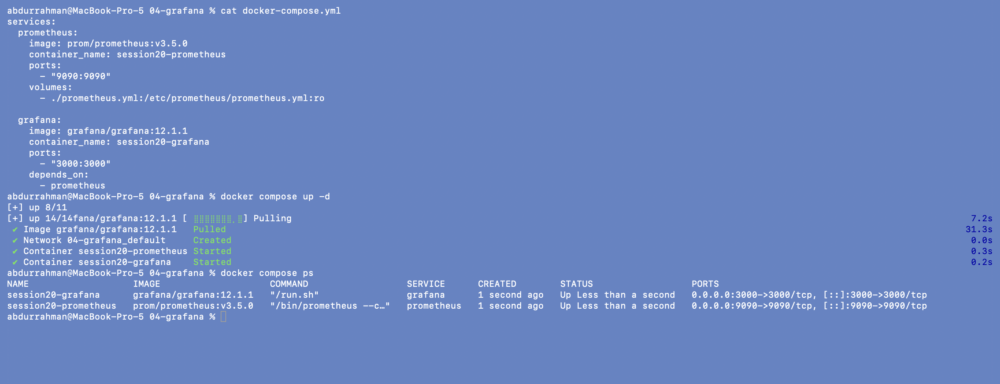
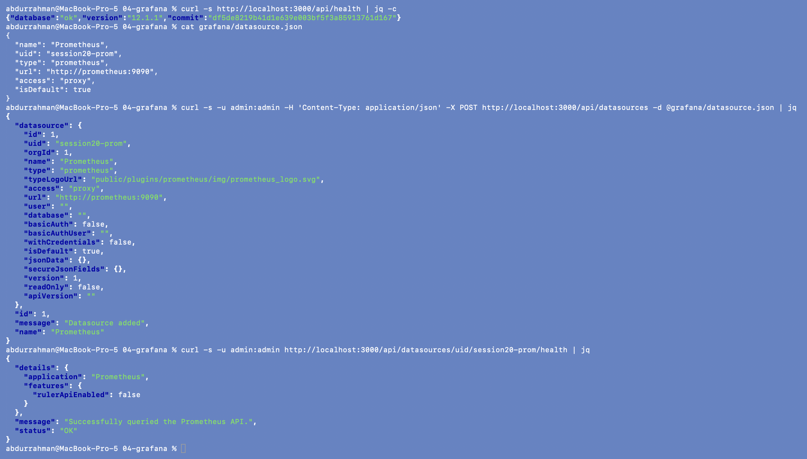
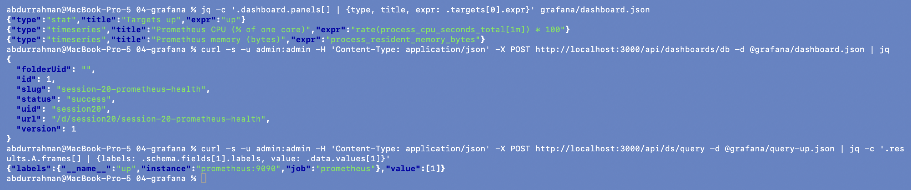
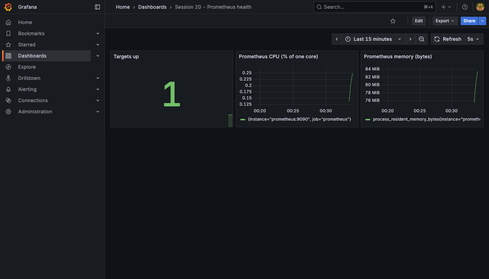
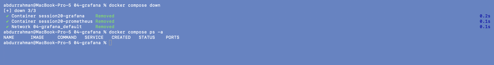

# Grafana

**Name:** Abdur Rahman Ibne Munir
**Enrollment number:** 24BCS10244

Prometheus stores the metrics and Grafana draws them. The lecture adds the Prometheus data
source and a Stat panel by clicking through the Grafana UI. I did both through Grafana's
HTTP API with `curl -u admin:admin` and kept the request bodies as files, so the setup can
be repeated. There is also one browser screenshot of the finished dashboard.

```text
04-grafana/
├── docker-compose.yml      prom/prometheus:v3.5.0 (9090) + grafana/grafana:12.1.1 (3000)
├── prometheus.yml          same as 03
├── grafana/
│   ├── datasource.json     the "Add data source → Prometheus" form as JSON
│   ├── dashboard.json      one Stat panel (up) + CPU and memory time series
│   └── query-up.json       a query sent through Grafana to Prometheus
└── screenshots/
```

## 1. Start both containers

```bash
cat docker-compose.yml
docker compose up -d
docker compose ps
```



Grafana 12.1.1 was pulled (about 31 s), and both `session20-prometheus` and
`session20-grafana` are up on 9090 and 3000.

## 2. Add the Prometheus data source ("Save & test")

`grafana/datasource.json` holds the same fields as the UI form:

```json
{ "name": "Prometheus", "uid": "session20-prom", "type": "prometheus",
  "url": "http://prometheus:9090", "access": "proxy", "isDefault": true }
```

```bash
curl -s http://localhost:3000/api/health | jq -c
cat grafana/datasource.json
curl -s -u admin:admin -H 'Content-Type: application/json' -X POST http://localhost:3000/api/datasources -d @grafana/datasource.json | jq
curl -s -u admin:admin http://localhost:3000/api/datasources/uid/session20-prom/health | jq
```



Grafana answered `"message": "Datasource added"`, and the health check (the API behind
the **Save & test** button) returned `"Successfully queried the Prometheus API."` with
`"status": "OK"`, the text the notes expect. The URL is `http://prometheus:9090`, not
`localhost:9090`. With `access: proxy` the Grafana *server* makes the request, and inside
the Grafana container `localhost` is Grafana itself. The Compose service name resolves to
the Prometheus container.

## 3. Dashboard with a Stat panel, plus CPU and memory

```bash
jq -c '.dashboard.panels[] | {type, title, expr: .targets[0].expr}' grafana/dashboard.json
curl -s -u admin:admin -H 'Content-Type: application/json' -X POST http://localhost:3000/api/dashboards/db -d @grafana/dashboard.json | jq
curl -s -u admin:admin -H 'Content-Type: application/json' -X POST http://localhost:3000/api/ds/query -d @grafana/query-up.json \
  | jq -c '.results.A.frames[] | {labels: .schema.fields[1].labels, value: .data.values[1]}'
```



The dashboard was saved (`status: success`, URL `/d/session20/session-20-prometheus-health`).
Besides the lecture's `up` Stat panel, I added two time-series panels for the CPU and memory
queries from 03. The last command asks Grafana to run `up` through the new data source, which
is what a panel does when it renders. The answer is `1` for `prometheus:9090`.

**Browser screenshot** of the dashboard after logging in as admin/admin (I skipped the
"change password" prompt):



The Stat panel shows **1**, which means the Prometheus target is up, as the notes expect.
The two graphs only start at the right edge because Prometheus had been running for about
a minute. The time axis is in local time (IST).

## 4. Stop

```bash
docker compose down
docker compose ps -a
```



`docker compose down` also deletes the Grafana container's data, including the data source
and dashboard I created. To keep them, you can mount a volume at `/var/lib/grafana`, or
*provision* the data source and dashboards from files under `/etc/grafana/provisioning/`.
Provisioning keeps dashboards in Git, which is GitOps applied to Grafana.

`admin/admin` is Grafana's default login and is fine only for a local classroom demo. A
real deployment sets `GF_SECURITY_ADMIN_PASSWORD` from a secret.

## What I understood

- Prometheus collects and stores, and Grafana only queries and visualises. Grafana
  keeps no metric data of its own and sends PromQL to the data source on every refresh.
- Inside Docker Compose, containers reach each other by service name. That is why the
  data source URL is `http://prometheus:9090`, while my browser and `curl` use
  `localhost:9090`.
- Everything in the Grafana UI is backed by an HTTP API. Data sources and dashboards are
  JSON, so they can be kept in Git and recreated instead of rebuilt by hand.
- One dashboard can put health (`up`), CPU and memory side by side. That is much quicker
  to read than three separate queries.
