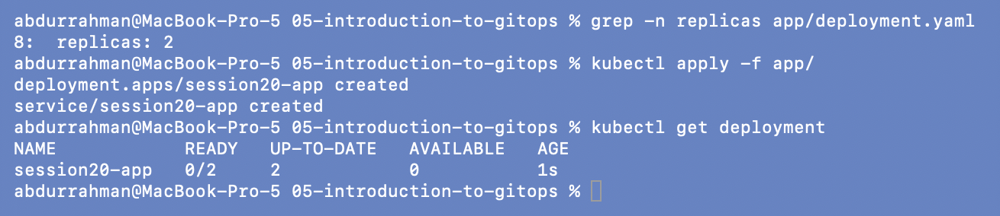
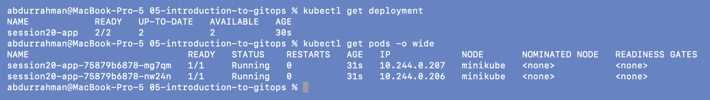
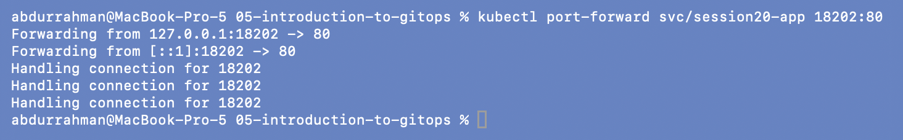
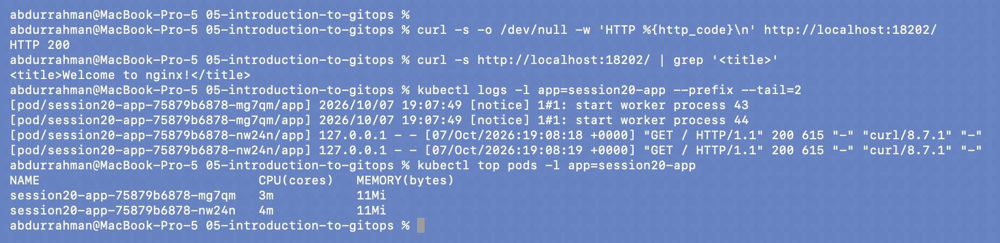
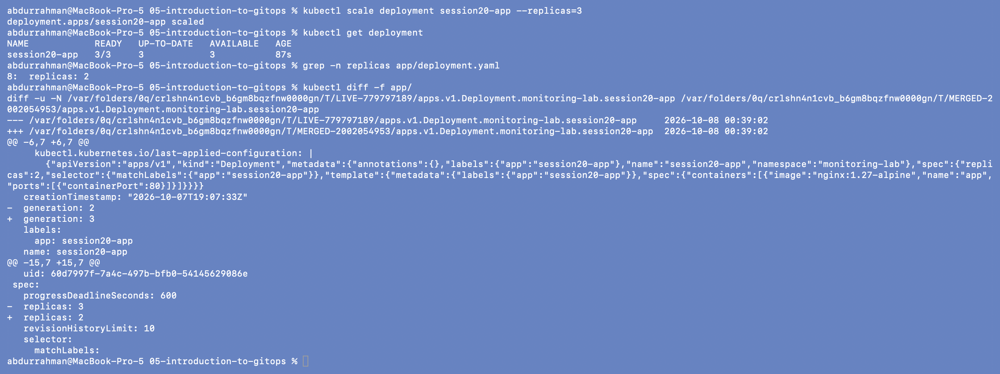
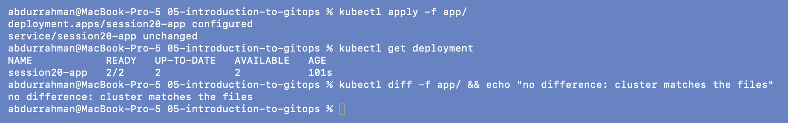
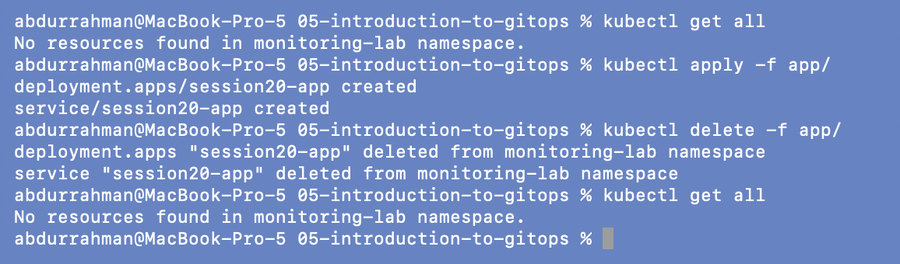

# Introduction to GitOps

**Name:** Abdur Rahman Ibne Munir
**Enrollment number:** 24BCS10244

Homework Task 3 write-up, and the lecture's "apply it manually once" demo. I ran the demo
in namespace `monitoring-lab` instead of `default`. After the lecture steps I added two
small things. One is a health check of the app, covering logs, CPU, memory and HTTP status
for the monitoring task. The other is a manual "drift" experiment that shows what goes
wrong *without* a GitOps controller, which 07 then fixes.

```text
05-introduction-to-gitops/
├── app/
│   ├── deployment.yaml     session20-app, nginx:1.27-alpine, replicas: 2
│   └── service.yaml        port 80
└── screenshots/
```

## GitOps in my own words

**What GitOps is.** A way of running deployments where a Git repository holds the
complete desired state of the system, and a controller inside the cluster keeps making the
cluster match it. People change the system by changing Git (a commit, usually through a
pull request), not by running `kubectl` against the cluster.

**Git as the source of truth.** If Git and the cluster disagree, Git wins. Because every
change is a commit, Git gives you what a deployment process needs for free: history (what
the cluster looked like on Monday), review (a PR before anything reaches production),
diffs (exactly what changed), authorship (who changed it, see `git blame` in
[06](../06-git-as-source-of-truth/README.md)), and rollback (revert the commit).

**Declarative configuration.** The files say *what* should exist ("a Deployment called
`session20-app` with 2 replicas of nginx:1.27-alpine"), not *how* to get there
("create, then scale up by one"). Kubernetes manifests are already declarative, which is
why Kubernetes and GitOps fit so well. A controller can compare a declaration with reality,
but it couldn't do that with a list of imperative commands.

**Continuous reconciliation.** The controller runs a loop: read desired state from Git,
read actual state from the cluster, compute the difference, apply it, repeat. It runs on a
timer (Argo CD checks Git every 3 minutes) and also whenever the live objects change. That
second trigger is why Argo CD undid my manual `kubectl scale` within about a second in
[07](../07-argocd/README.md#gitops-without-a-push-self-heal).

**The workflow.**

```text
developer edits YAML ─▶ commit / pull request ─▶ review + merge to main
                                                        │
                       Argo CD (in the cluster) polls / is notified of the new commit
                                                        │
                        compares Git (desired) with the cluster (actual) ─▶ applies the diff
                                                        │
                             cluster == Git again; drift is reverted the same way
```

**Kubernetes + GitOps.** The controller runs *inside* the cluster and pulls from Git, so
CI never needs cluster credentials, and nobody needs `kubectl` write access to production
for routine changes. Argo CD and Flux are the two common controllers. Argo CD models each
deployed thing as an `Application` (repo + path + revision → cluster + namespace) and
reports it as `Synced`/`OutOfSync` and `Healthy`/`Degraded`.

## 1. Apply it manually once

```bash
grep -n replicas app/deployment.yaml
kubectl apply -f app/
kubectl get deployment
```



The file asks for `replicas: 2`. Right after `apply` the Deployment showed `0/2`, because
nginx:1.27-alpine was not yet on the node and the pull took about 14 s. A few seconds
later:

```bash
kubectl get deployment
kubectl get pods -o wide
```



`2/2`, the shape the notes expect.

## 2. Addition: is the app healthy? (HTTP, logs, CPU, memory)

The notes stop at `get deployment`. To check the application itself, I port-forwarded the
Service to local port **18202** and sent it requests:

```bash
kubectl port-forward svc/session20-app 18202:80        # separate terminal, left running
```



```bash
curl -s -o /dev/null -w 'HTTP %{http_code}\n' http://localhost:18202/
curl -s http://localhost:18202/ | grep '<title>'
kubectl logs -l app=session20-app --prefix --tail=2
kubectl top pods -l app=session20-app
```



The app answers `HTTP 200` with the nginx welcome page. The requests appear in the nginx
access log (`"GET / HTTP/1.1" 200 615 "-" "curl/8.7.1"`, from 127.0.0.1 because
port-forward connects inside the Pod's network namespace). Each replica uses about 3–4 m
CPU and 11 Mi of memory.

## 3. Addition: what happens without a GitOps controller

The notes say routine changes should not be made "by manually editing the cluster". To see
why, I made one:

```bash
kubectl scale deployment session20-app --replicas=3
kubectl get deployment
grep -n replicas app/deployment.yaml
kubectl diff -f app/
```



The cluster now runs 3 replicas while the file still says 2. `kubectl diff` shows the drift
exactly: `- replicas: 3` (live) vs `+ replicas: 2` (file). Nothing will ever fix this by
itself. The file is no longer an accurate description of production, and anyone reading it
would be wrong.

```bash
kubectl apply -f app/
kubectl get deployment
kubectl diff -f app/ && echo "no difference: cluster matches the files"
```



Re-applying the files puts it back to `2/2`, and `diff` is empty. I just did one
reconciliation by hand. A GitOps controller does exactly this in a loop, against Git
instead of my local folder (see 07).

## 4. Clean up

```bash
kubectl delete -f app/
kubectl get all
```



My first capture of this step came out blank, so I retook it. The namespace was already
empty at that point, so the retake starts with `get all`, applies the app again and
deletes it again on screen.

## Practice (from the notes)

```text
Git     = desired state   → app/deployment.yaml says replicas: 2
Cluster = actual state    → kubectl get deployment showed 3/3 after my manual scale
Argo CD = keeps them synchronized → here I had to run kubectl apply myself to get back to 2
```

## What I understood

- In GitOps, Git holds the desired state, the cluster holds the actual state, and a
  controller makes the actual state match. Every change goes through Git.
- Declarative files are what make this work: a controller can only reconcile if the file
  says *what* should exist.
- `kubectl diff` is a one-off desired-vs-actual comparison and `kubectl apply` a one-off
  reconciliation. Argo CD does both all the time.
- A manual change without a controller just stays there. The cluster drifts and the
  files stop describing reality, which is exactly the problem GitOps solves.
