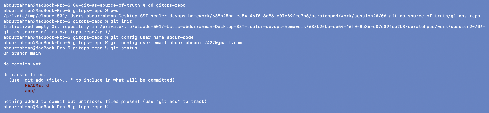
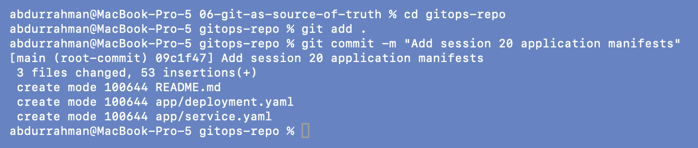
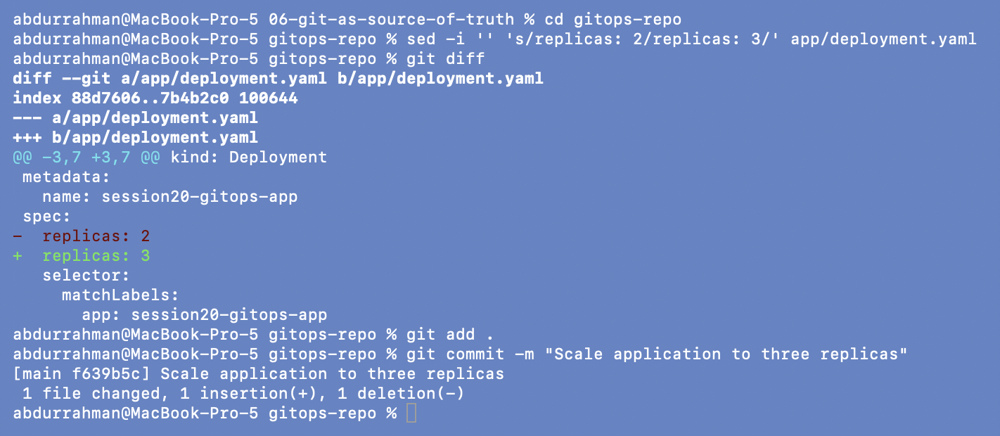
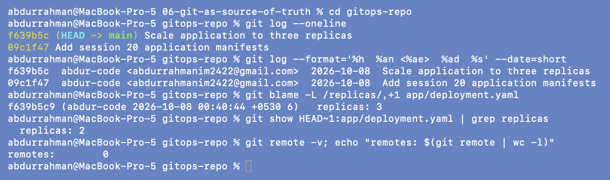

# Git as Source of Truth

**Name:** Abdur Rahman Ibne Munir
**Enrollment number:** 24BCS10244

The lecture turns `gitops-repo/` into a Git repository, commits the manifests, changes the
desired replica count and commits again, so the history records who wanted what and when.

```text
06-git-as-source-of-truth/
├── gitops-repo/            the lecture's example repo, unchanged (replicas: 2)
│   ├── README.md
│   └── app/
│       ├── deployment.yaml session20-gitops-app, nginx:1.27-alpine
│       └── service.yaml
└── screenshots/
```

**Where I ran it.** This homework folder is itself inside my homework Git repository, so
running `git init` here would have created a nested repo. I ran the steps in a scratch copy
of `gitops-repo/` outside the homework repo (the full path is visible in the first
screenshot). I set a repo-local Git identity and added no remote, so nothing was pushed
anywhere. The copy kept in this folder is the starting state (`replicas: 2`). The two
commits exist only in the scratch copy.

## 1. Create the repository

```bash
cd gitops-repo
pwd
git init
git config user.name abdur-code
git config user.email abdurrahmanim2422@gmail.com
git status
```



An empty repository on branch `main`. `git status` lists `README.md` and `app/` as
untracked: Git sees the files, but none of them are part of the history yet.

## 2. First commit: the initial desired state

```bash
git add .
git commit -m "Add session 20 application manifests"
```



`[main (root-commit) 09c1f47]`. The notes expect `2 files changed`, but mine says `3 files
changed` because `gitops-repo/` also contains its own `README.md`, which `git add .` picks
up. The hash is different on every repository, as the notes say.

## 3. Change the desired state and commit it

```bash
sed -i '' 's/replicas: 2/replicas: 3/' app/deployment.yaml     # the "open and edit" step
git diff
git add .
git commit -m "Scale application to three replicas"
```



`git diff` shows exactly the change the notes predict, `-  replicas: 2` / `+  replicas:
3`, before anything is committed. That is the moment a reviewer would look at in a pull
request. The commit `f639b5c` records it. (`sed -i ''` is the macOS form of in-place
edit. On Linux it is `sed -i`.)

## 4. Addition: asking the history questions from the notes

The notes say Git can answer "Who changed the deployment?" and "What changed?". I asked it:

```bash
git log --oneline
git log --format='%h  %an <%ae>  %ad  %s' --date=short
git blame -L /replicas/,+1 app/deployment.yaml
git show HEAD~1:app/deployment.yaml | grep replicas
git remote -v; echo "remotes: $(git remote | wc -l)"
```



- **Who and when:** both commits by `abdur-code` on 2026-10-08. `git blame` points the
  `replicas: 3` line at commit `f639b5c9`, at 00:40:44 IST.
- **Rollback point:** `git show HEAD~1:…` still has `replicas: 2`. Going back is
  `git revert f639b5c`, which is a new commit, so even the rollback is recorded.
- **Not pushed:** `remotes: 0`. In real GitOps this repo would be pushed to GitHub and
  Argo CD would watch it. That is 07 (instructor's repo) and 08 (my own repo, pending).

## Practice (from the notes)

Why is Git useful as a source of truth? I saw each of these in the steps above: **version
history** (`git log`), **review** (the `git diff` before committing), **diff** (`-2 +3`),
**auditability** (`git blame` names the author and time of the replica change),
**collaboration** (a shared remote + pull requests), and a **rollback point**
(`HEAD~1` still has the old state).

## What I understood

- Git stores the *desired* state, and Kubernetes holds the *actual* state. They are
  different things, and Argo CD connects them.
- Each change to the desired state is a commit, so the history of the system is the
  history of the repository: who, what, when and why (the message).
- Rolling back is reverting a commit, not remembering which `kubectl` command to run.
- A commit alone changes nothing in the cluster. Something has to read Git and apply it,
  and that is the controller's job in 07.
