# GitOps Demo with Argo CD

**Name:** Abdur Rahman Ibne Munir
**Enrollment number:** 24BCS10244

Argo CD is installed in the cluster and pointed at the instructor's public repo
[`Nency-Ravaliya/gitops-demo`](https://github.com/Nency-Ravaliya/gitops-demo). It deploys
whatever is in that repo's `app/` folder into namespace `session20` and keeps it that way.
I followed the steps in order with three differences:

- **Cluster:** my existing minikube instead of `kind create cluster --name session20`.
- **Ports:** Argo CD on local **18200** (notes: 8080) and the app on **18201** (notes:
  9090, which Prometheus uses in 03).
- **Step 7 (git push):** not possible, because the repo belongs to the instructor and I
  only read it. Instead I show the reconciliation loop without a push: I changed the
  cluster by hand and Argo CD put it back (self-heal).

```text
07-argocd/app/
├── argocd-application.yaml   the Application (our copy has two fixes, see the end)
├── deployment.yaml           copy of what is in the instructor's repo: nginx, replicas: 5
└── service.yaml              copy of what is in the instructor's repo
```

The `deployment.yaml` and `service.yaml` here are never applied with `kubectl`. Argo CD
reads them from GitHub. I only apply `argocd-application.yaml`.

## Step 1: Cluster

```bash
kubectl cluster-info
kubectl get nodes
```

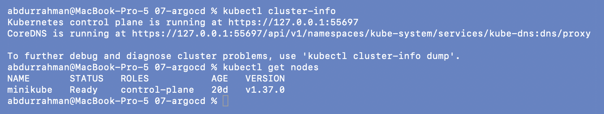

## Step 2: Install Argo CD

```bash
kubectl create namespace argocd
kubectl apply -n argocd --server-side --force-conflicts -f https://raw.githubusercontent.com/argoproj/argo-cd/stable/manifests/install.yaml
```

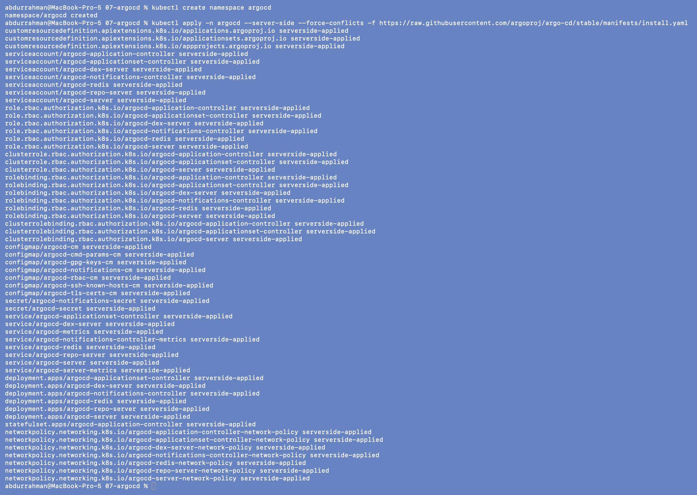

Every object shows `serverside-applied`: 3 CRDs (`applications`, `applicationsets`,
`appprojects`), service accounts and RBAC, config maps, services, 6 Deployments plus the
`argocd-application-controller` StatefulSet, and network policies. Server-side apply
matters here: 08's client-side version of this command fails on the ApplicationSet CRD
(see [08](../08-mini-project/README.md#problem-found-step-2-install-fails-on-the-applicationset-crd)).

```bash
kubectl get pods -n argocd -w
```

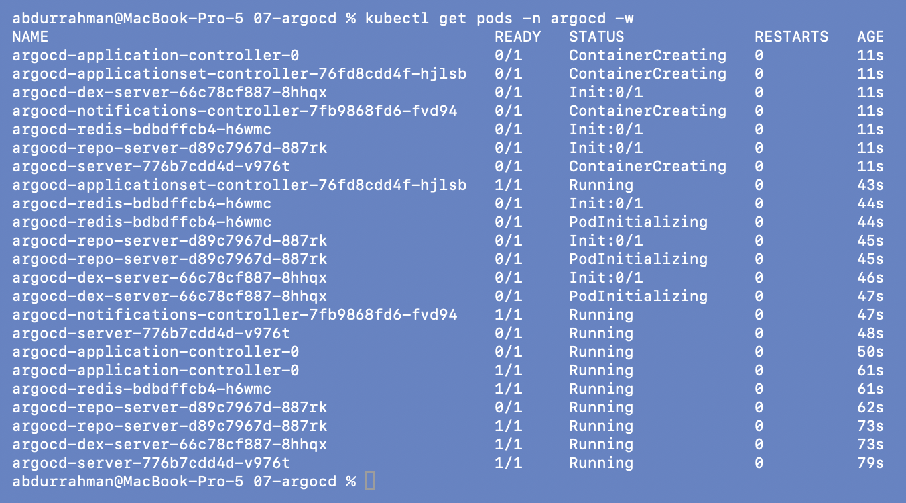

All 7 Pods went from `ContainerCreating`/`Init` to `1/1 Running` in about 80 s (I stopped
the watch after 150 s). The notes predicted 2–5 minutes, but the images were small enough
to pull quickly.

## Step 3: Access Argo CD (port 18200 instead of 8080)

```bash
kubectl port-forward svc/argocd-server -n argocd 18200:443      # separate terminal, left running
```

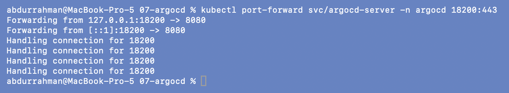

```bash
kubectl -n argocd get secret argocd-initial-admin-secret -o jsonpath="{.data.password}" | base64 -d && echo
curl -sk https://localhost:18200/api/version | jq -c '{Version, KubectlVersion}'
PASS=$(kubectl -n argocd get secret argocd-initial-admin-secret -o jsonpath="{.data.password}" | base64 -d)
curl -sk https://localhost:18200/api/v1/session -H 'Content-Type: application/json' \
  -d "{\"username\":\"admin\",\"password\":\"$PASS\"}" | jq '{login_ok: has("token")}'
```

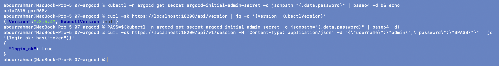

The first command prints the generated admin password. It is visible here because this was
a throwaway local install that has since been deleted. Instead of opening the UI in a
browser, I used the API the UI is built on: the server is Argo CD **v3.5.4**, and logging in
as `admin` with that password returns a session token (`login_ok: true`), the same thing
the UI login form does. `-k` is needed because Argo CD serves a self-signed certificate,
which is the "Advanced → Proceed" warning the notes mention.

## Step 4: Register the app with Argo CD

```bash
cat app/argocd-application.yaml
kubectl apply -f app/argocd-application.yaml
kubectl get applications -n argocd
```

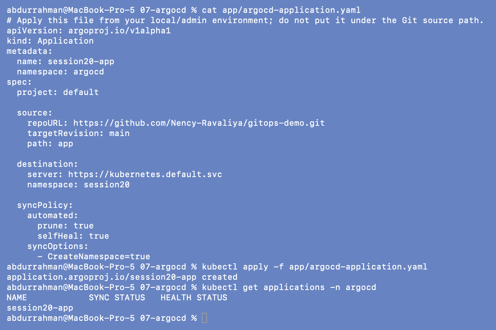

This is the lecture's file, still without my later fixes. Right after `apply`, the
Application has no sync or health status yet because Argo CD hasn't looked at the repo.

## Step 5: Verify

```bash
kubectl get pods -n session20
kubectl get deployment session20-gitops-app -n session20
kubectl get applications -n argocd
kubectl get application session20-app -n argocd \
  -o jsonpath='{.status.sync.revision}{"\n"}{range .status.resources[*]}{.kind}/{.name} ({.namespace}): {.status}{"\n"}{end}'
```

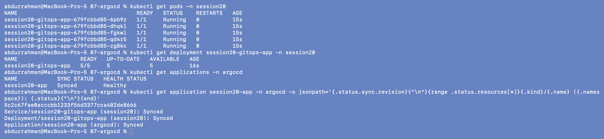

Within seconds Argo CD created namespace `session20`, the Deployment (`5/5`, since the
repo says `replicas: 5`) and the Service, and reports `Synced` / `Healthy`. The synced
revision `5c2c67f…` is the current `main` of the instructor's repo, so the cluster matches
a specific commit. The resource list has a third entry I didn't expect,
`Application/session20-app (argocd)`. The repo keeps `argocd-application.yaml` *inside*
`app/`, so Argo CD also manages its own Application object. This caused the second problem
at the end.

## Step 6: Open the app (port 18201 instead of 9090)

```bash
kubectl port-forward svc/session20-gitops-app -n session20 18201:80   # separate terminal
```

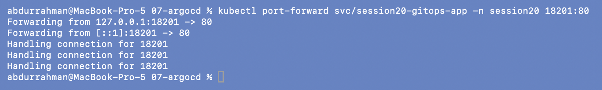

```bash
curl -s http://localhost:18201/ | head -n 15
curl -s -o /dev/null -w 'HTTP %{http_code}\n' http://localhost:18201/
```

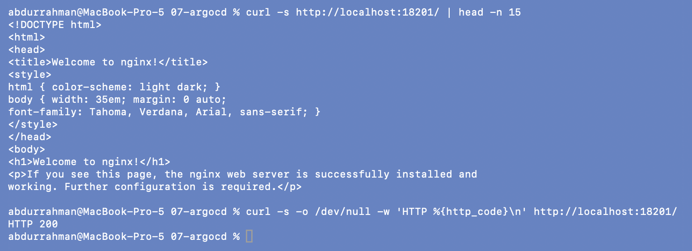

The nginx welcome page and `HTTP 200`: the app Argo CD deployed from GitHub is serving.

## Step 7: Scale by committing to Git (not possible here)

The notes edit `app/deployment.yaml` in the repo, commit, `git push`, and watch Argo CD
scale the Pods. I can't push to `Nency-Ravaliya/gitops-demo` (it isn't my repo), so I did
not do this step. In that flow, Argo CD would notice the new commit on its next poll
(every 3 minutes), see `Desired = 2, Actual = 5`, and scale the Deployment. The same flow
on my own repo is prepared in [08](../08-mini-project/README.md) and listed as pending
there.

### GitOps without a push: self-heal

What I *can* show is the other half of the loop. The Application has `selfHeal: true`, so
if the cluster drifts away from Git, Argo CD puts it back. I scaled the Deployment by hand:

```bash
kubectl scale deployment session20-gitops-app -n session20 --replicas=2
kubectl get deployment session20-gitops-app -n session20 -w
```

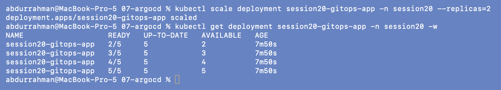

By the time `get -w` printed its first line, the desired count was already back to 5. The
`READY` column climbs `2/5 → 3/5 → 4/5 → 5/5` as the replacement Pods start. The
events show what happened in between:

```bash
kubectl get events -n session20 --field-selector involvedObject.kind=Deployment
kubectl get events -n argocd --field-selector involvedObject.name=session20-app \
  -o custom-columns=TIME:.lastTimestamp,REASON:.reason,MESSAGE:.message | tail -n 6
kubectl get application session20-app -n argocd -o json \
  | jq -c '.status.operationState | {phase, message, startedAt, initiatedBy: .operation.initiatedBy}'
kubectl get applications -n argocd
```

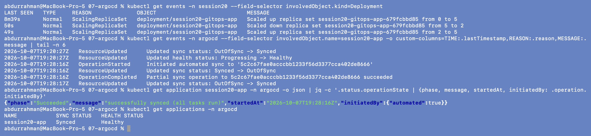

- The Deployment events show my `Scaled down … from 5 to 2` and, one second later,
  `Scaled up … from 2 to 5`.
- Argo CD's events at 19:28:16Z: `Synced -> OutOfSync`, then `Initiated automated sync to
  '5c2c67f…'`, then `succeeded`, then `OutOfSync -> Synced`.
- `operationState.initiatedBy: {"automated": true}`. Argo CD started this sync itself.
  Nobody asked it to.

It reacted in about a second, not 3 minutes, because Argo CD watches the live objects it
manages. The 3-minute timer is only for noticing new commits in Git. The troubleshooting
command `kubectl patch application … '{"operation":{"sync":{}}}'` (manual sync) wasn't
needed, because automated sync and self-heal both worked.

## Clean up

### Problem found: deleting the Application does not delete the app

The notes say `kubectl delete -f app/argocd-application.yaml` *"also removes your app from
the cluster"*. As written:

```bash
kubectl delete -f app/argocd-application.yaml
kubectl get applications -n argocd
sleep 10
kubectl get all -n session20
```

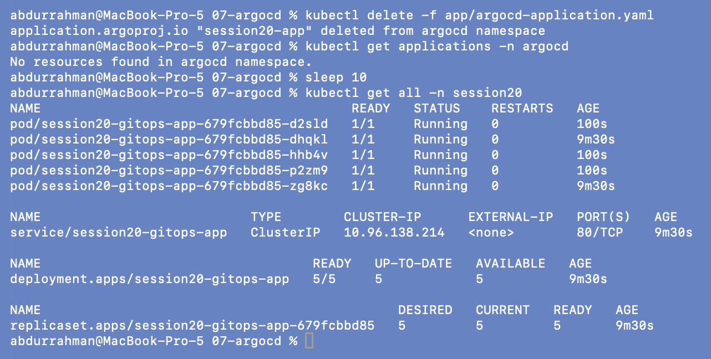

The Application is gone, but the Deployment, its 5 Pods and the Service are still running.
Three Pods are 100 s old: they are the ones self-heal created.

**Root cause.** Argo CD only deletes an Application's resources (a *cascading* delete) if
the Application carries the finalizer `resources-finalizer.argocd.argoproj.io`. Without
it, deleting the Application just removes the Argo CD object, and Kubernetes knows nothing
about the link. The Argo CD UI and `argocd app delete` add that finalizer for you, but a
plain `kubectl delete` doesn't.

**Fix.** Add the finalizer to our copy of the file:

```yaml
metadata:
  name: session20-app
  namespace: argocd
  finalizers:
    - resources-finalizer.argocd.argoproj.io
```

```bash
head -n 11 app/argocd-application.yaml
kubectl apply -f app/argocd-application.yaml
sleep 20
kubectl get applications -n argocd
kubectl get application session20-app -n argocd -o jsonpath='{.metadata.finalizers}{"\n"}'
```

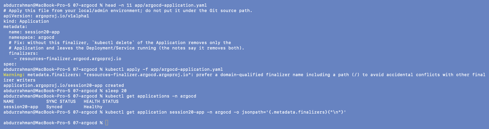

### Second problem: the Application manages itself

The Application came back `Synced`/`Healthy` and adopted the running Deployment, but the
finalizer I just applied was **gone** (the last command prints an empty line).

**Root cause.** This is the extra `Application/session20-app` resource from Step 5. The
instructor's repo has `argocd-application.yaml` *inside* `app/`, the path the Application
watches. On its first sync Argo CD applied the Git copy of the Application over mine (the
sync result for it was `application.argoproj.io/session20-app configured`), and the Git
copy has no finalizer. The file's own first line says *"do not put it under the Git source
path"*, and this is the reason. Git always wins, including over local fixes to the
Application.

**Fix.** I can't move the file in someone else's repo, so in our copy I tell Argo CD not to
render it:

```yaml
  source:
    repoURL: https://github.com/Nency-Ravaliya/gitops-demo.git
    targetRevision: main
    path: app
    directory:
      exclude: argocd-application.yaml
```

```bash
sed -n '/source:/,/destination:/p' app/argocd-application.yaml
kubectl apply -f app/argocd-application.yaml
sleep 20
kubectl get applications -n argocd
kubectl get application session20-app -n argocd \
  -o jsonpath='finalizers: {.metadata.finalizers}{"\n"}{range .status.resources[*]}managed: {.kind}/{.name}{"\n"}{end}'
```

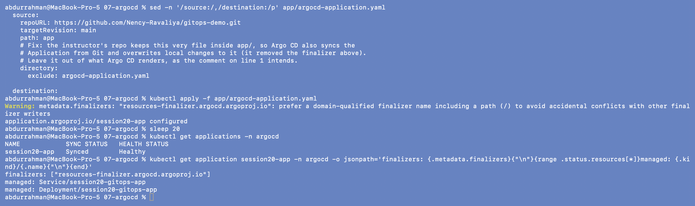

Now the finalizer stays, and the Application manages only the Service and the Deployment.
(The yellow `Warning` is the API server's naming hint for finalizers without a `/`. It is
Argo CD's official finalizer name, so I ignored it.)

### Cleanup with the fixed file

```bash
kubectl delete -f app/argocd-application.yaml
kubectl get applications -n argocd
sleep 10
kubectl get all -n session20
```

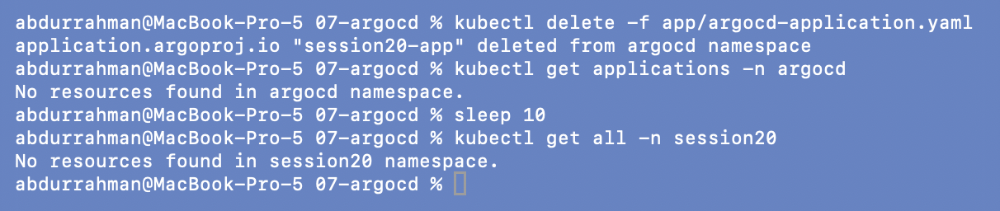

`No resources found in session20 namespace`: the delete now cascades the way the notes
describe. I didn't run `kind delete cluster`. Argo CD itself stayed installed for 08 and
was removed in the [final cleanup](../README.md#final-cleanup).

## What I understood

- An Argo CD `Application` is the only thing I apply by hand. It says *which repo, which
  path, which revision* goes to *which cluster and namespace*. Argo CD does the rest and
  reports `Synced/OutOfSync` and `Healthy/Degraded`.
- Reconciliation runs in both directions. A new commit changes the desired state (polled
  every 3 min), and a manual change to the cluster is detected immediately and reverted
  when `selfHeal` is on. I saw the second one happen in about a second.
- Git really is the source of truth, even for the Application object itself. That is why
  my local fix disappeared until I excluded the file from the watched path.
- Deleting an Application is not the same as deleting the app. You need the resources
  finalizer, or the UI/CLI, for a cascading delete.
