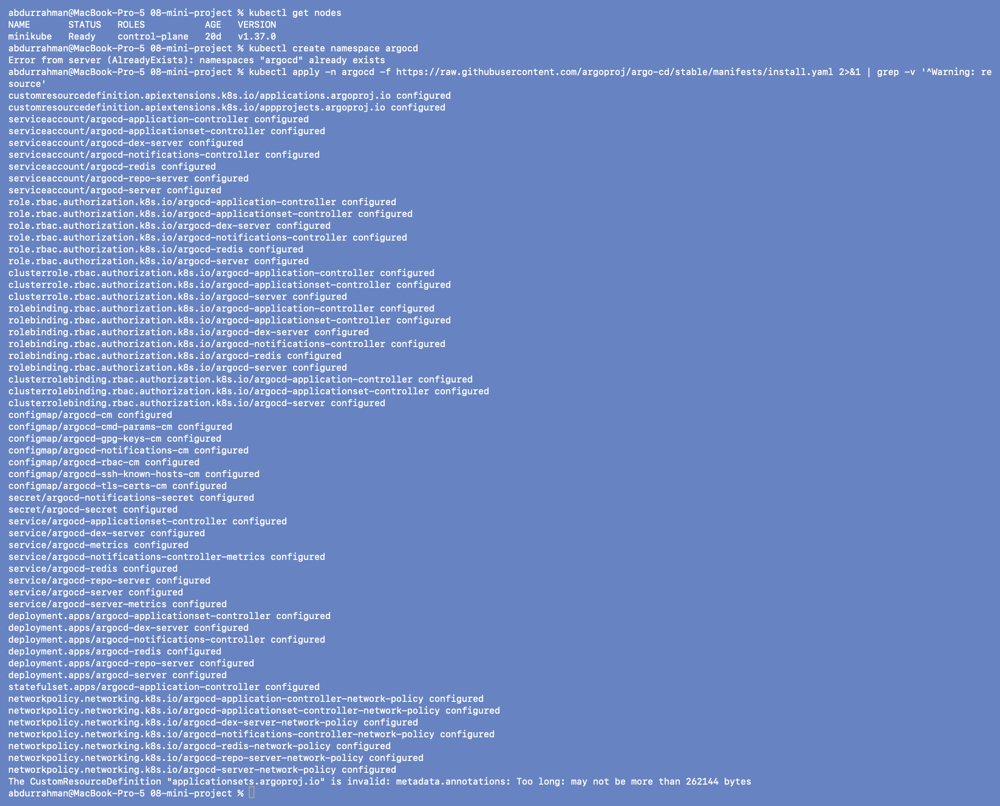
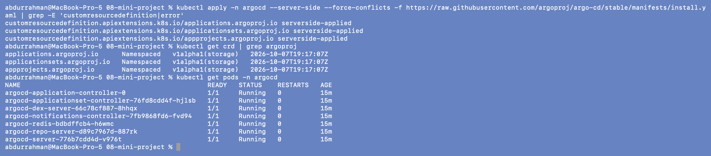
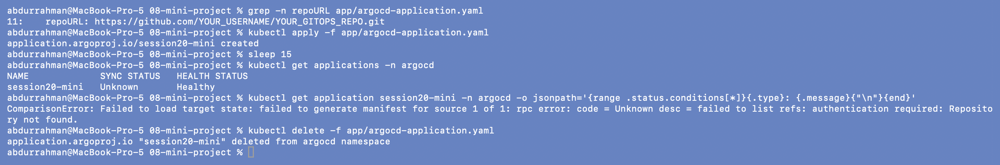
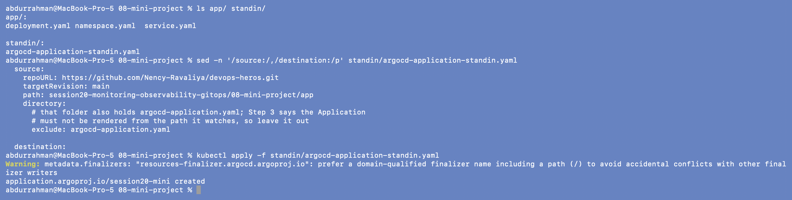
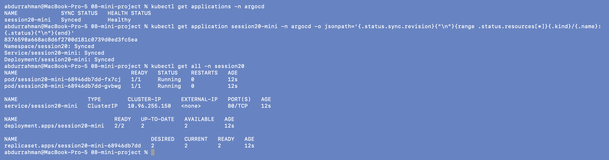
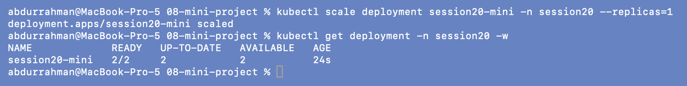
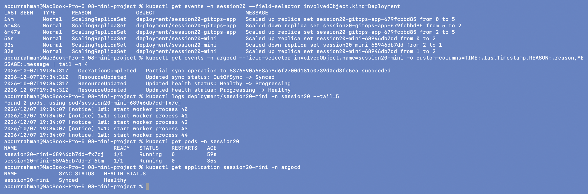
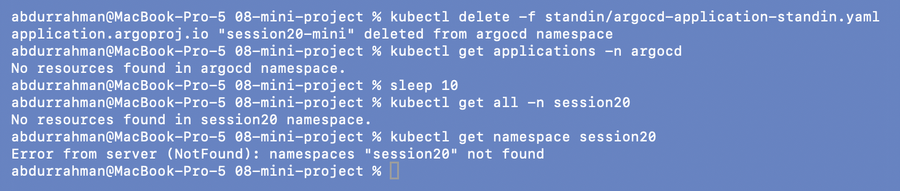

# Session 20 Mini Project: Kubernetes + Git + Argo CD

**Name:** Abdur Rahman Ibne Munir
**Enrollment number:** 24BCS10244

Goal from the notes: a Namespace, Deployment (2 replicas) and Service kept in a Git
repository, deployed and kept in sync by an Argo CD Application.

```text
Git repo (desired state) ──▶ Argo CD (reconciles) ──▶ Kubernetes (actual state)
```

The mini project needs **my own GitHub repository**, which I could not create from here.
So this README has three parts:

1. everything that works locally, run in order (Steps 1, 2, 5 as written, 6, 8, 9);
2. a **stand-in** for my repo: the same three manifests read (read-only) from the public
   course repo, so Steps 5–9 run against something real;
3. the exact commands for the parts that need GitHub (Steps 3, 4, 7), listed as pending
   in the [session README](../README.md#pending-needs-the-student).

```text
08-mini-project/
├── app/                                  ← what goes into my Git repo (Step 3)
│   ├── namespace.yaml                    session20
│   ├── deployment.yaml                   session20-mini, nginx:1.27-alpine, replicas: 2
│   └── service.yaml                      session20-mini, port 80
├── argocd-application.yaml               moved out of app/, repoURL → abdur-code/session20-gitops
├── standin/
│   └── argocd-application-standin.yaml   addition: same app/ read from the course repo
└── screenshots/
```

## Step 1–2: Cluster and Argo CD, as written

```bash
kubectl get nodes
kubectl create namespace argocd
kubectl apply -n argocd -f https://raw.githubusercontent.com/argoproj/argo-cd/stable/manifests/install.yaml 2>&1 | grep -v '^Warning: resource'
```



`kind create cluster` is replaced by my minikube cluster, as in 07. Argo CD was still
installed from 07, so `create namespace argocd` says `AlreadyExists`. The install command
is 08's version, a plain (client-side) `kubectl apply`. Because the objects had been
created server-side in 07, kubectl printed one long warning per object about a missing
`last-applied-configuration` annotation, which it then adds. I filtered those lines out
with `grep -v` to keep the output readable.

### Problem found: Step 2 install fails on the ApplicationSet CRD

The last line is the error:

```text
The CustomResourceDefinition "applicationsets.argoproj.io" is invalid:
metadata.annotations: Too long: may not be more than 262144 bytes
```

**Root cause.** Client-side `kubectl apply` stores a full copy of every object it applies
in the annotation `kubectl.kubernetes.io/last-applied-configuration`, so that the next
`apply` can work out what was removed. Kubernetes limits all of an object's annotations
together to 256 KiB (262144 bytes), and the ApplicationSet CRD is bigger than that on its
own. It is the only object that fails: everything else says `configured`. On a fresh
cluster the CRD would be missing, which leads to the
`argocd-applicationset-controller` CrashLoopBackOff described in 07's troubleshooting
section.

**Fix.** Use server-side apply, which is exactly 07's install command. The API server
tracks field ownership in `managedFields` and no annotation is written.

```bash
kubectl apply -n argocd --server-side --force-conflicts -f https://raw.githubusercontent.com/argoproj/argo-cd/stable/manifests/install.yaml \
  | grep -E 'customresourcedefinition|error'
kubectl get crd | grep argoproj
kubectl get pods -n argocd
```



All three CRDs are `serverside-applied` and present, and all 7 Argo CD Pods are still
`Running` (the client-side attempt only added annotations, so no Pod restarted). I
filtered the output to the CRD lines. The full list of objects looks like 07's.

## Step 3–4: Git repository and repoURL (pending)

These steps need a new GitHub repository, so they are left for me to do by hand. The exact
commands are in the [session README](../README.md#pending-needs-the-student). What I
prepared here:

- `app/` holds only the three workload manifests, the files that go into the repo.
- **Step 3 vs the lecture files:** Step 3 says *"Keep this teaching project's
  `argocd-application.yaml` outside the Git `app/` path"*, but the lecture ships it inside
  `app/`. 07 shows what goes wrong otherwise: the Application ends up managing itself. I
  moved it to `08-mini-project/argocd-application.yaml`.
- **Step 4:** in that file `repoURL` is now `https://github.com/abdur-code/session20-gitops.git`
  instead of the placeholder. I also added the `resources-finalizer.argocd.argoproj.io`
  finalizer, so the cleanup at the end of the notes really removes the app (the problem
  found in [07](../07-argocd/README.md#problem-found-deleting-the-application-does-not-delete-the-app)).

## Step 5 as written: the placeholder URL

Before changing anything, I applied the lecture's file with its placeholder URL to see
what Argo CD does with it:

```bash
grep -n repoURL app/argocd-application.yaml
kubectl apply -f app/argocd-application.yaml
sleep 15
kubectl get applications -n argocd
kubectl get application session20-mini -n argocd -o jsonpath='{range .status.conditions[*]}{.type}: {.message}{"\n"}{end}'
kubectl delete -f app/argocd-application.yaml
```



`SYNC STATUS: Unknown` and a `ComparisonError`: `failed to list refs: authentication
required: Repository not found`. GitHub returns "authentication required" for a repository
that doesn't exist. Nothing was deployed, and I deleted the Application. (This screenshot
was taken before I moved the file out of `app/`, which is why the path is
`app/argocd-application.yaml`.) My own repo URL would give the same error until the repo
is created and pushed. That is the pending part.

## Addition: a stand-in repository for Steps 5–9

To run the rest of the project against a real Git repo, the stand-in Application reads the
same `08-mini-project/app` folder from the public course repo
([`Nency-Ravaliya/devops-heros`](https://github.com/Nency-Ravaliya/devops-heros/tree/main/session20-monitoring-observability-gitops/08-mini-project/app)),
read-only. The manifests Argo CD deploys are therefore identical to the ones in my `app/`.
That folder also contains the placeholder Application, so I excluded it, for the reason
explained in Step 3:

```bash
ls app/ standin/
sed -n '/source:/,/destination:/p' standin/argocd-application-standin.yaml
kubectl apply -f standin/argocd-application-standin.yaml
```



## Step 5–6: Application synced, Kubernetes resources created

```bash
kubectl get applications -n argocd
kubectl get application session20-mini -n argocd \
  -o jsonpath='{.status.sync.revision}{"\n"}{range .status.resources[*]}{.kind}/{.name}: {.status}{"\n"}{end}'
kubectl get all -n session20
```



`session20-mini  Synced  Healthy`, the shape Step 5 expects. Argo CD synced commit
`8376590…` (the course repo's `main`) and manages exactly the three objects from `app/`:
`Namespace/session20`, `Service/session20-mini`, `Deployment/session20-mini`. Step 6's
list matches: the deployment `2/2`, two `session20-mini-…` Pods, the Service and its
ReplicaSet.

## Step 7: Make a Git change (pending)

Changing `replicas: 2` to `3` needs a commit and a push to my repo, so it is pending (see
the session README). The Git side of this step (edit, `git diff`, commit) is shown in
[06](../06-git-as-source-of-truth/README.md). The Argo CD side (cluster pulled to match a
specific commit) is what Steps 5–6 just showed.

## Step 8: Self-healing

```bash
kubectl scale deployment session20-mini -n session20 --replicas=1
kubectl get deployment -n session20 -w
```



As in 07, Argo CD reverted it before my next command ran, so `get` already shows `2/2`
(Git here says 2, since Step 7 couldn't happen). The events in Step 9 show that the
scale really happened.

## Step 9: Observe the system

```bash
kubectl get events -n session20 --field-selector involvedObject.kind=Deployment
kubectl get events -n argocd --field-selector involvedObject.name=session20-mini \
  -o custom-columns=TIME:.lastTimestamp,REASON:.reason,MESSAGE:.message | tail -n 4
kubectl logs deployment/session20-mini -n session20 --tail=5
kubectl get pods -n session20
kubectl get application session20-mini -n argocd
```



- Deployment events: `Scaled down … from 2 to 1`, then one second later `Scaled up … from
  1 to 2`. (The older `session20-gitops-app` lines are from 07. The `session20` namespace
  was kept between the two parts, because `CreateNamespace=true` creates a namespace but
  deleting an Application never removes it.)
- Argo CD events: a sync to `8376590…` succeeded, then `OutOfSync -> Synced` and
  `Progressing -> Healthy` while the new Pod started.
- Logs: nginx's startup lines. With two Pods, `kubectl logs deployment/…` picks one and
  says so (`Found 2 pods, using pod/…`).
- Pods: one 59 s old (original) and one 35 s old (created by self-heal). The Application
  is `Synced` / `Healthy` again.

## Cleanup

The notes delete the Application and the kind cluster. I deleted the stand-in Application.
It carries the resources finalizer, so the delete cascades:

```bash
kubectl delete -f standin/argocd-application-standin.yaml
kubectl get applications -n argocd
sleep 10
kubectl get all -n session20
kubectl get namespace session20
```



Everything is gone, **including the namespace**. Here `namespace.yaml` is one of the files
in Git, so the Namespace is a resource the Application manages and the cascade deletes it
too. In 07 the namespace only came from `CreateNamespace=true` and survived. Argo CD itself
was removed in the session's [final cleanup](../README.md#final-cleanup).

## Final viva questions (in my own words)

1. **Monitoring vs observability:** monitoring tells me *that* something is wrong, using
   signals I chose in advance. Observability is having enough data (metrics, logs,
   traces) to find out *why*, even for a failure nobody predicted.
2. **Metrics vs logs vs traces:** numbers over time (how much, how often), event lines
   (what happened), and one request's path through services (where the time went).
3. **Prometheus:** a metrics database that scrapes `/metrics` from targets on a schedule,
   stores time series and answers PromQL queries. It also evaluates alert rules.
4. **Grafana:** a dashboard tool. It stores no metrics and sends queries to data sources
   like Prometheus, then draws the results.
5. **GitOps:** running deployments from Git. The repo holds the desired state and a
   controller in the cluster keeps the cluster equal to it. Changes are commits, not
   `kubectl` commands.
6. **Git as source of truth:** if Git and the cluster disagree, Git wins. Git also gives
   history, review, diffs, authorship and rollback for every change.
7. **Argo CD:** the GitOps controller. It watches a repo/path/revision, compares it with the
   cluster, applies the difference, and reports sync and health status.
8. **Desired state:** what the files in Git say should exist, e.g. `replicas: 2`.
9. **Actual state:** what is really running in the cluster right now, e.g. 1 Pod after my
   manual scale.
10. **Reconciliation:** the loop of comparing desired with actual and acting to remove the
    difference, run again and again.
11. **Self-healing:** with `selfHeal: true`, Argo CD reverts manual changes to managed
    resources. My `--replicas=1` went back to 2 within a second.
12. **Replicas 2 → 3 in Git:** after the commit is pushed, Argo CD sees the new revision on
    its next poll (≤ 3 min), marks the app `OutOfSync`, applies the Deployment with 3
    replicas, Kubernetes starts a third Pod, and the app returns to `Synced` / `Healthy`.

## What I understood

- The whole project is four objects: three manifests in Git, plus one Application that is
  applied by hand once and lives *outside* the path it watches.
- A wrong or missing repo URL doesn't break anything. Argo CD just reports
  `Unknown`/`ComparisonError` and deploys nothing.
- Self-heal makes `kubectl scale` pointless on a managed app. To change the replica count
  I have to change Git, which is exactly the point of GitOps.
- What gets deleted depends on what Git manages: the namespace went away here because it
  was a file in the repo, but not in 07, where Argo CD only created it.
