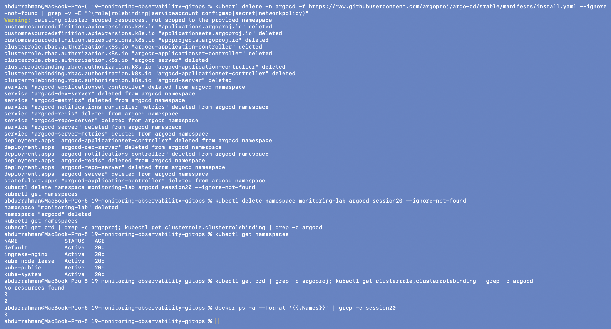

# Monitoring, Observability and GitOps

**Name:** Abdur Rahman Ibne Munir
**Enrollment number:** 24BCS10244

Class session 20. Lecture material: [`session20-monitoring-observability-gitops`](https://github.com/Nency-Ravaliya/devops-heros/tree/main/session20-monitoring-observability-gitops)
in the course repo. The session has two halves. The monitoring half runs Prometheus and
Grafana with Docker Compose and looks at metrics, logs, alerts, CPU, memory and health on a
Kubernetes workload. The GitOps half installs Argo CD on Kubernetes and lets it deploy an
app from a Git repository and keep it in the state Git describes. I ran every command
from the notes on my Mac, in order, and every terminal screenshot in this folder is my
own terminal. Where the homework asked for something the notes don't cover (alerts, CPU and
memory, application health), I added small extra steps; they are labelled **Addition** in
the sub-READMEs.

## Homework tasks → where they are

| Task | What was asked | Where |
|---|---|---|
| 1 Monitoring | Metrics | [`03-prometheus/`](03-prometheus/) (scraping, PromQL over the HTTP API), [`04-grafana/`](04-grafana/) (dashboard) |
| | Logs | [`02-metrics-logs-traces/`](02-metrics-logs-traces/) (`kubectl logs`), [`05-introduction-to-gitops/`](05-introduction-to-gitops/) (nginx access log) |
| | Alerts | [`03-prometheus/`](03-prometheus/README.md#addition-an-alerting-rule-that-fires) (`TargetDown` rule: inactive → pending → firing → resolved) |
| | CPU and memory utilization | `kubectl top` in [`02`](02-metrics-logs-traces/) and [`05`](05-introduction-to-gitops/); `rate(process_cpu_seconds_total[1m])` and `process_resident_memory_bytes` in [`03`](03-prometheus/) and [`04`](04-grafana/) |
| | Application health | `up` in [`03`](03-prometheus/); readiness probe in [`02`](02-metrics-logs-traces/README.md#6-addition-application-health-with-a-readiness-probe); HTTP check in [`05`](05-introduction-to-gitops/); Argo CD health status in [`07`](07-argocd/) |
| 2 Observability | The three pillars, why observability is needed, common tools, Kubernetes observability | [`01-monitoring-vs-observability/`](01-monitoring-vs-observability/) (write-up), [`02-metrics-logs-traces/`](02-metrics-logs-traces/) (demo) |
| 3 GitOps | What GitOps is, Git as the source of truth, declarative configuration, continuous reconciliation, workflow, Kubernetes + GitOps | [`05-introduction-to-gitops/`](05-introduction-to-gitops/README.md#gitops-in-my-own-words) (write-up and a manual-drift demo), [`06-git-as-source-of-truth/`](06-git-as-source-of-truth/), [`07-argocd/`](07-argocd/), [`08-mini-project/`](08-mini-project/) |
| Deliverables | Monitoring demo, observability documentation, GitOps demo, screenshots, README | 02–04, 01, 05–08, `screenshots/` in every folder, this file |

## Folder structure

```text
19-monitoring-observability-gitops/
├── 01-monitoring-vs-observability/   README.md (observability write-up, no commands in this part)
├── 02-metrics-logs-traces/           k8s-demo/{deployment,service}.yaml, health/readiness-patch.yaml (addition)
├── 03-prometheus/                    docker-compose.yml, prometheus.yml
│   └── alerting/                     docker-compose.yml, prometheus.yml, alert-rules.yml (addition)
├── 04-grafana/                       docker-compose.yml, prometheus.yml, grafana/*.json (API payloads)
├── 05-introduction-to-gitops/        app/{deployment,service}.yaml
├── 06-git-as-source-of-truth/        gitops-repo/ (README.md, app/{deployment,service}.yaml)
├── 07-argocd/                        app/{argocd-application (fixed),deployment,service}.yaml
├── 08-mini-project/                  app/{namespace,deployment,service}.yaml, argocd-application.yaml,
│                                     standin/argocd-application-standin.yaml (addition)
├── screenshots/                      01-final-cleanup
└── README.md
```

Each folder has its own `README.md` and `screenshots/` directory. The READMEs go through
the screenshots in the order I took them.

## Environment

- macOS (Apple Silicon), Docker Desktop, Docker Compose, minikube v1.39 on the docker
  driver (Kubernetes v1.37, one node, `metrics-server` addon already enabled), kubectl 1.37.
  Argo CD came out as **v3.5.4** from the `stable` install manifest.
- **minikube instead of kind.** The notes create a throwaway cluster with
  `kind create cluster --name session20` and remove it with `kind delete cluster`. I used
  the minikube cluster I already have for this course, so I skipped those two commands
  (`kubectl get nodes` shows `minikube` instead of `session20-control-plane`). Deleting
  the cluster at the end was replaced by deleting the namespaces and the Argo CD install.
- **Namespaces.** The 02 and 05 demos use the `default` namespace in the notes; I ran them
  in a namespace `monitoring-lab`, created on screen and set as the default namespace of
  that terminal's kubeconfig so these demos could run next to other work on the same
  cluster. The Argo CD parts use the lecture's own `argocd` and `session20` namespaces as
  written. All three were deleted at the end (below).
- **Ports.** The compose demos use 9090 (Prometheus) and 3000 (Grafana) as written. I ran
  them first and stopped them as soon as their screenshots were done. For port-forwards
  I used other local ports:

  | Notes | I used | What |
  |---|---|---|
  | `8080:443` | `18200:443` | Argo CD API/UI (07) |
  | `9090:80` | `18201:80` | the Argo CD-deployed nginx app (07); 9090 belongs to Prometheus anyway |
  | (none) | `18202:80` | HTTP health check of the 05 app (addition) |

- **Browser steps done in the terminal.** The notes click through the Prometheus UI, the
  Grafana UI and the Argo CD UI. I did the same things with `curl` against their HTTP
  APIs and screenshotted the terminal: PromQL through `/api/v1/query`, the Grafana data
  source and dashboard through `/api/datasources` and `/api/dashboards/db`, and the Argo
  CD login through `/api/v1/session` plus `kubectl get applications`. I also added three
  **browser screenshots**, named `browser-01-…`, taken with a headless Chromium: the
  Prometheus graph, the Prometheus alerts page and the Grafana dashboard. The Argo CD UI
  is served with a self-signed certificate, which the headless browser refused
  (`ERR_CERT_AUTHORITY_INVALID`), so Argo CD has terminal screenshots only.
- All image pulls (Prometheus, Grafana, node-exporter, nginx) came straight from Docker
  Hub; no mirror was needed.
- In a few screenshots that contain a `sleep`, the following command appears twice: once
  right under the `sleep` line and once after the next prompt. That is the terminal echoing
  input typed while `sleep` was still running, not a second run.

## Problems found in the lecture material

| Where | What happened | Fix |
|---|---|---|
| 07 cleanup | `kubectl delete -f app/argocd-application.yaml` is said to "also remove your app from the cluster", but the Deployment, its 5 Pods and the Service kept running | added `resources-finalizer.argocd.argoproj.io` to our copy of the Application ([details](07-argocd/README.md#problem-found-deleting-the-application-does-not-delete-the-app)) |
| 07, instructor's `gitops-demo` repo | `argocd-application.yaml` sits inside the `app/` path the Application watches, so the Application manages itself and Git overwrote my fix (the finalizer disappeared within 20 s) | `source.directory.exclude: argocd-application.yaml` in our copy ([details](07-argocd/README.md#second-problem-the-application-manages-itself)) |
| 08 Step 2 | client-side `kubectl apply -f install.yaml` fails: `CustomResourceDefinition "applicationsets.argoproj.io" is invalid: metadata.annotations: Too long` | server-side apply, the same command 07 uses ([details](08-mini-project/README.md#problem-found-step-2-install-fails-on-the-applicationset-crd)) |
| 08 Step 3 vs the files | Step 3 says to keep `argocd-application.yaml` outside the Git `app/` path, but the lecture ships it inside `app/` | moved it to `08-mini-project/argocd-application.yaml` |
| 08 Step 4 | `repoURL` is the placeholder `YOUR_USERNAME/YOUR_GITOPS_REPO`; applied as written Argo CD reports `Repository not found` | set to `https://github.com/abdur-code/session20-gitops.git`; the repo still has to be created (below) |
| 06 | the notes expect `2 files changed` on the first commit; it is 3, because `gitops-repo/` also contains its own `README.md` | nothing to fix |

## Pending: needs the student

These steps need my GitHub account, so they were not done here. Everything for them is
prepared in [`08-mini-project/`](08-mini-project/).

1. **08 Steps 3–4: create the GitOps repository.** Create a public repo
   `abdur-code/session20-gitops` on the personal account (at https://github.com/new while
   signed in as `abdur-code`, with no README). The `gh` CLI on this Mac is logged in to
   the work account, so don't use `gh repo create` unless you first run
   `gh auth switch -u abdur-code`. Then push only the three workload files:

   ```bash
   mkdir -p ~/Desktop/SST/session20-gitops && cd ~/Desktop/SST/session20-gitops
   git init -b main
   git config user.name abdur-code
   git config user.email abdurrahmanim2422@gmail.com
   mkdir app
   cp ~/Desktop/SST/scaler-devops-homework/19-monitoring-observability-gitops/08-mini-project/app/*.yaml app/
   git add app
   git commit -m "Add session 20 mini project manifests"
   git remote add origin git@github-personal:abdur-code/session20-gitops.git
   git push -u origin main
   ```

2. **08 Steps 5–8 against that repo.** I uninstalled Argo CD at the end, so it has to be
   installed again first:

   ```bash
   kubectl create namespace argocd
   kubectl apply -n argocd --server-side --force-conflicts \
     -f https://raw.githubusercontent.com/argoproj/argo-cd/stable/manifests/install.yaml
   kubectl wait --for=condition=Ready pods --all -n argocd --timeout=300s

   cd ~/Desktop/SST/scaler-devops-homework/19-monitoring-observability-gitops/08-mini-project
   kubectl apply -f argocd-application.yaml          # Step 5
   kubectl get applications -n argocd               # expect session20-mini  Synced  Healthy
   kubectl get all -n session20                     # Step 6: 2 pods

   cd ~/Desktop/SST/session20-gitops                # Step 7: change desired state in Git
   sed -i '' 's/replicas: 2/replicas: 3/' app/deployment.yaml
   git commit -am "Scale application to three replicas"
   git push
   kubectl get deployment -n session20 -w           # 3/3 within ~3 minutes (Argo CD polls Git every 3 min)

   kubectl scale deployment session20-mini -n session20 --replicas=1   # Step 8: self-heal back to 3
   kubectl get deployment -n session20
   ```

3. **Cleanup afterwards:**

   ```bash
   kubectl delete -f argocd-application.yaml        # the finalizer also removes namespace session20
   kubectl delete -n argocd -f https://raw.githubusercontent.com/argoproj/argo-cd/stable/manifests/install.yaml
   kubectl delete namespace argocd
   ```

Until this is done, 08 Step 7 (the change travelling from a Git push to the cluster) is
the one part of the session I could only show indirectly: 06 shows the Git side, and 07
and 08 show Argo CD reconciling the cluster against a public repo.

## Final cleanup

```bash
kubectl delete -n argocd -f https://raw.githubusercontent.com/argoproj/argo-cd/stable/manifests/install.yaml --ignore-not-found \
  | grep -v -E "^(role|rolebinding|serviceaccount|configmap|secret|networkpolicy)"
kubectl delete namespace monitoring-lab argocd session20 --ignore-not-found
kubectl get namespaces
kubectl get crd | grep -c argoproj; kubectl get clusterrole,clusterrolebinding | grep -c argocd
docker ps -a --format '{{.Names}}' | grep -c session20
```



Deleting with the install manifest removes the cluster-scoped objects that a namespace
delete would leave behind: the three Argo CD CRDs and the `argocd-*` ClusterRoles and
ClusterRoleBindings. I filtered the namespaced lines with `grep -v` to keep the output
short. `session20` was already gone (the 08 cleanup deleted it, see there), so
`--ignore-not-found` skipped it. The checks at the end count 0 Argo CD CRDs, 0 Argo CD
cluster roles and 0 `session20-*` containers.
