# §13 Terraform: evidence

**Name:** Abdur Rahman Ibne Munir
**Enrollment number:** 24BCS10244

This is the run-through of section 13 of the instructor's [TaskBoard README](https://github.com/Nency-Ravaliya/devops-heros/blob/main/session21-python/README.md)
and its [terraform/README.md](https://github.com/Nency-Ravaliya/devops-heros/blob/main/session21-python/terraform/README.md).
The commands come from those files and were run in order:

```bash
terraform init
terraform fmt -recursive
terraform validate
terraform plan
terraform apply
aws eks update-kubeconfig --region ap-south-1 --name taskboard-eks
terraform destroy
```

It runs against my own AWS account (`ap-south-1`, IAM user `homework-terraform`). The cluster
was created, checked, and then destroyed in the same sitting. The last screenshot proves
nothing was left behind.

Full command output was saved locally with `tee` while running; only the screenshots below
are kept in the repo.

---

## 1. `terraform init` as written: fails

```bash
terraform init
```

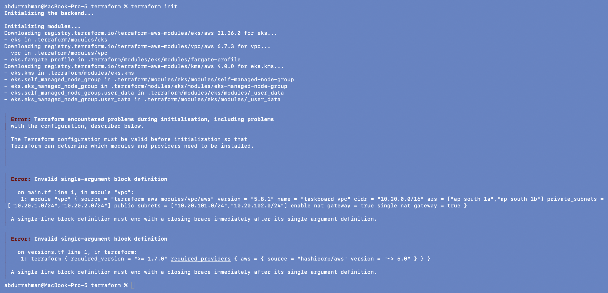

**Root cause.** `main.tf` and `versions.tf` put each block on a single line, e.g.
`terraform { required_version = ">= 1.7.0" required_providers { aws = { … } } }`. HCL only
allows a one-line block when it has exactly one argument. These have several, so the
configuration doesn't parse: `Invalid single-argument block definition`. Terraform validates
the configuration before installing anything, so `init` can't get past it.

**Fix.** I wrote the same blocks out one argument per line, with a comment at the top of
each file. While doing that, I made four more changes, each commented in the code:

| Change | Why |
|---|---|
| `cluster_version = "1.34"` instead of `"1.31"` | 1.31 is now in EKS *extended* support, which bills the control plane at a much higher hourly rate. 1.34 is the oldest version still in standard support (`aws eks describe-cluster-versions`). |
| `ami_type = "AL2023_x86_64_STANDARD"` on the node group | Amazon Linux 2 node images aren't published for recent Kubernetes versions; AL2023 is the replacement. |
| `create_kms_key = false`, `cluster_encryption_config = {}` | The module otherwise creates a customer-managed KMS key, which `destroy` can only schedule for deletion, so it would outlive the lab. EKS still encrypts secrets with an AWS-owned key. |
| `cluster_enabled_log_types = []`, `create_cloudwatch_log_group = false` | EKS can re-create the control-plane log group after Terraform deletes it, which leaves a leftover. |
| `default_tags` on the provider (`Project`, `Session`, `Owner`) | So that the final check can search the account for anything this stack created. |

## 2. `init`, `fmt`, `validate` after the fix

```bash
terraform init
terraform fmt -recursive
terraform validate
```

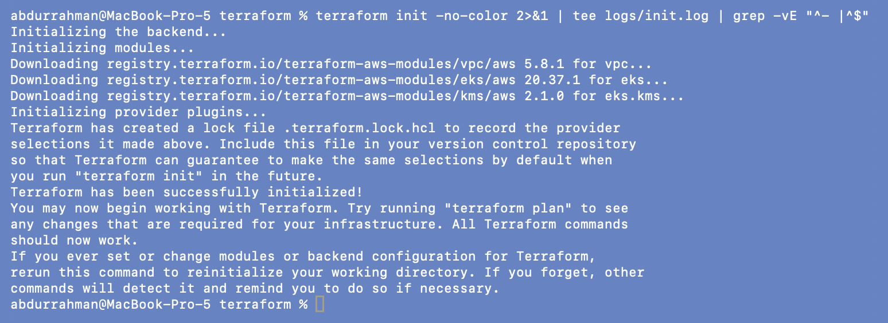


`init` downloads the two community modules (`terraform-aws-modules/vpc` 5.8.1 and
`terraform-aws-modules/eks` 20.37.1) and the AWS provider. Screenshot 04 is the same
validation, re-run after I added the logging settings above.

## 3. `terraform plan`

```bash
terraform plan -out=tfplan
```

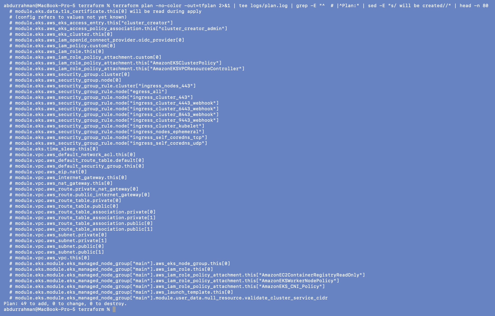

**49 resources to add.** That's a lot for two `module` blocks, and the list shows what
those modules hide:

- **VPC module:** the VPC, 2 public and 2 private subnets across `ap-south-1a`/`1b`, an
  internet gateway, one NAT gateway with its Elastic IP, route tables and associations.
- **EKS module:** the cluster and its IAM role, an OIDC provider, cluster and node security
  groups with about ten rules, an access entry giving my IAM user admin, and a managed node
  group (`t3.medium` × 2) with its own IAM role and launch template.

The plan was saved to `tfplan` (git-ignored) so that `apply` does exactly what was reviewed.

## 4. `terraform apply`: stuck on the node group

```bash
terraform apply tfplan
```

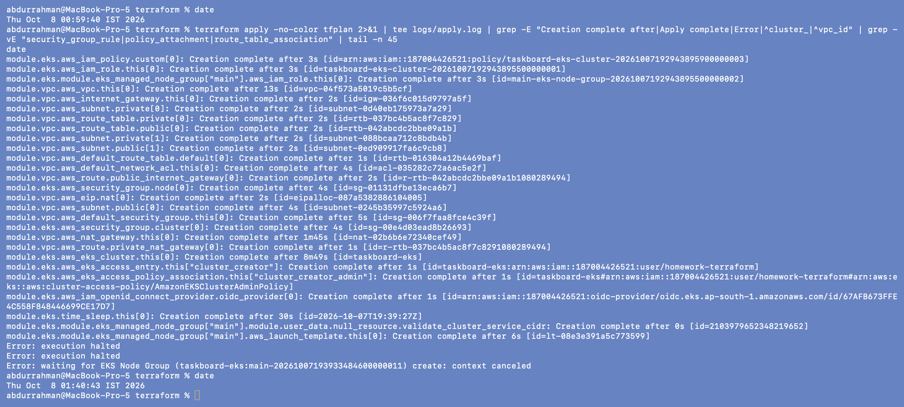

Everything up to the cluster went through: the VPC and subnets in seconds, the NAT gateway
in 1m45s, and the EKS control plane (`aws_eks_cluster`) in 8m49s. Then Terraform waited on
the managed node group, and after more than 30 minutes it was still `Still creating…`. Node
groups normally take 2–5 minutes, so I stopped the apply with Ctrl-C. Terraform shut down
gracefully, which is the `execution halted` / `context canceled` you see at the end.

### Problem found: the worker nodes were never allowed to launch

```bash
tail -n 4 logs/apply.log
aws eks describe-nodegroup --cluster-name taskboard-eks --nodegroup-name main-… --query "nodegroup.[status,instanceTypes[0]]"
aws autoscaling describe-scaling-activities --auto-scaling-group-name <node group's ASG> --max-items 1 --query 'Activities[0].StatusMessage'
aws ec2 describe-instance-types --filters Name=free-tier-eligible,Values=true --query "InstanceTypes[].InstanceType"
```

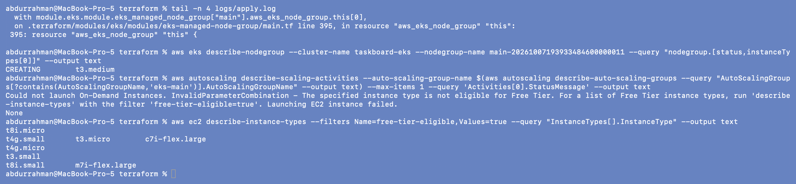

The node group was still `CREATING` with type `t3.medium`. A managed node group is backed
by an EC2 Auto Scaling group, and that group's activity log gave the real error:

> Could not launch On-Demand Instances. InvalidParameterCombination - The specified instance
> type is not eligible for Free Tier.

**Root cause.** My AWS account is a new account on the AWS **Free plan**, which only allows
Free-Tier-eligible instance types. `t3.medium` isn't one, so every launch was refused. EKS
kept retrying instead of failing the node group, which is why Terraform just kept waiting.
The last command lists the types the account *can* launch.

**Fix.** `instance_types = ["t3.small"]` in `main.tf`, with a comment. That's the
cheapest eligible type that can run the EKS system pods (2 vCPU, 2 GiB).
`c7i-flex.large` would match `t3.medium`'s 4 GiB but isn't needed for this lab.

## 5. Plan and apply again

```bash
terraform plan -out=tfplan
terraform apply tfplan
```

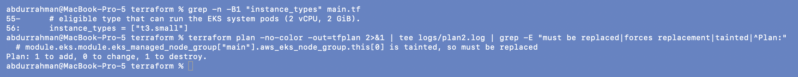
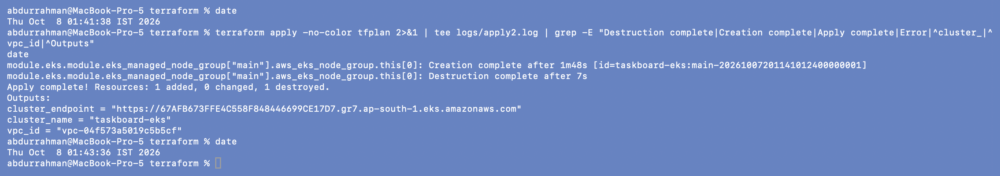

Because the interrupted node group had been left half-created, Terraform marked it
**tainted**: `is tainted, so must be replaced`. The plan is just `1 to add, 1 to destroy`.
Nothing else needed to change, because Terraform's state already recorded the other 48
resources. The new node group came up in **1m48s**, and the module deletes the old one only
after the new one exists (create-before-destroy). The outputs from `outputs.tf` are printed
at the end.

## 6. Connect `kubectl` and look at the cluster

```bash
terraform output
aws eks update-kubeconfig --region ap-south-1 --name taskboard-eks
kubectl config current-context
kubectl get nodes -o wide
kubectl get pods -A
```

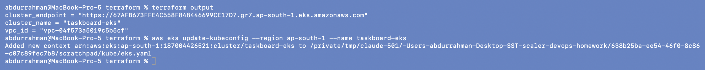
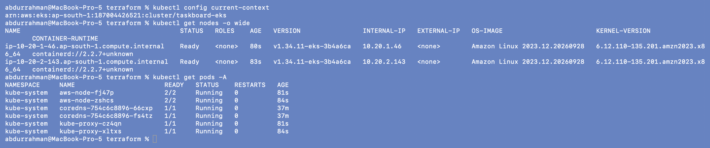

`update-kubeconfig` is the command from the README. I ran it with `KUBECONFIG` pointing at a
separate file (the path in the output), so it didn't overwrite the minikube context the rest
of this project uses.

- **Two nodes, `Ready`**, running Kubernetes `v1.34.11-eks` on Amazon Linux 2023.
- **Private IPs only** (`10.20.1.46`, `10.20.2.143`) and no external IP, because the module
  puts nodes in the *private* subnets. They reach the internet through the NAT gateway.
- **System pods all `Running`:** `aws-node` (the VPC CNI, which gives pods real VPC IPs),
  `kube-proxy` on each node, and two `coredns` replicas. The CoreDNS pods are 37 minutes
  old while the nodes are about 80 seconds old. EKS created those pods along with the
  cluster, they sat `Pending` with no nodes to run on, and they were scheduled as soon as
  the `t3.small` nodes joined. Pod age counts from creation, not from scheduling.

## 7. `terraform destroy`

```bash
terraform destroy -auto-approve
```

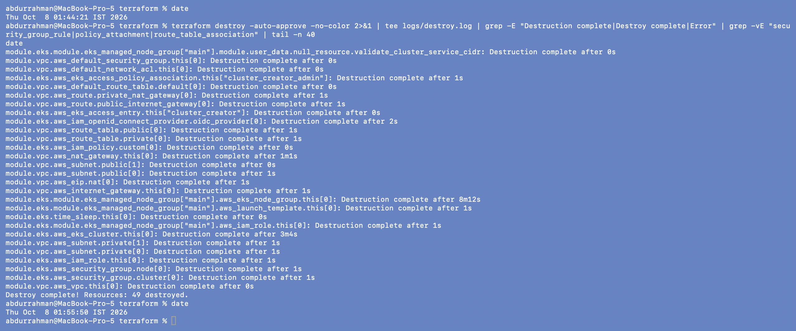

**`Destroy complete! Resources: 49 destroyed.`** I used `-auto-approve` instead of typing
`yes` at the prompt; the command is otherwise the same as in the README. Terraform destroys
in reverse dependency order: the node group first (8m12s, while it drains and terminates the
EC2 nodes), then the cluster (3m4s), and the subnets and VPC last.

## 8. Proof nothing was left behind

```bash
terraform state list | wc -l
aws eks list-clusters
aws ec2 describe-instances      # pending/running/stopping/stopped only
aws ec2 describe-nat-gateways   # available/pending/deleting only
aws ec2 describe-addresses
aws ec2 describe-vpcs
aws s3api list-buckets
aws kms list-aliases            # anything named taskboard
aws logs describe-log-groups --log-group-name-prefix /aws/eks
```

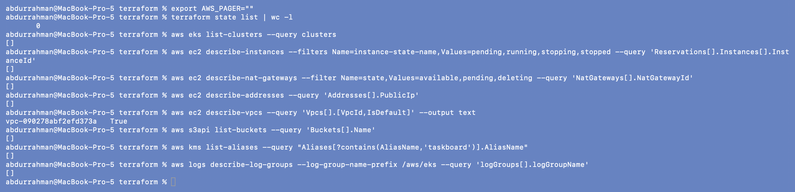

Every list is empty. The only VPC is the account's own default VPC (`IsDefault: True`), which
existed before this lab. There is no leftover KMS key or EKS log group either: those are the
two things the module would normally leave behind, and the settings in section 1 prevented
them. The cluster existed for about 55 minutes in total, most of it the stuck node group.

---

## What I understood

- **Terraform checks the whole configuration before doing anything.** A syntax error in one
  file stops even `init`. Formatting isn't cosmetic in HCL: a one-line block may only hold
  one argument.
- **Modules hide a lot.** Two `module` blocks became 49 real resources: IAM roles and
  policies, security group rules, an OIDC provider, a launch template. `plan` is where you
  see what you're actually paying for.
- **The cloud account is part of the environment.** The same code that works on a normal
  account hung on mine because of the Free plan's instance-type limit, and the error only
  showed up in the Auto Scaling group's activity log, not in Terraform's output.
- **State makes recovery cheap.** After the interrupted apply, Terraform knew exactly what
  existed. It marked the half-created node group *tainted* and the fix was a 1-resource
  replacement, not a rebuild.
- **Destroy and check.** `destroy` reporting success isn't the end. The final listing is
  what proves nothing is still billing.
